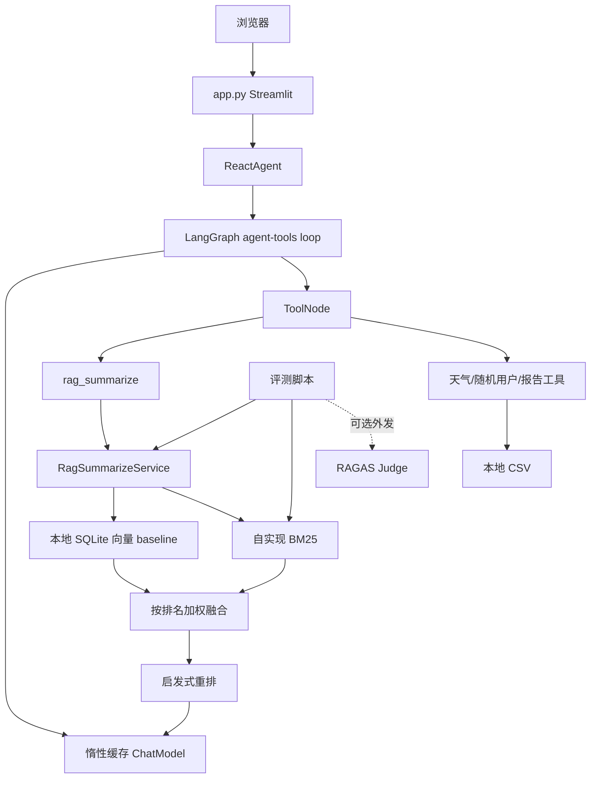
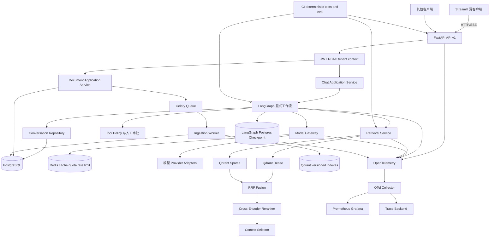
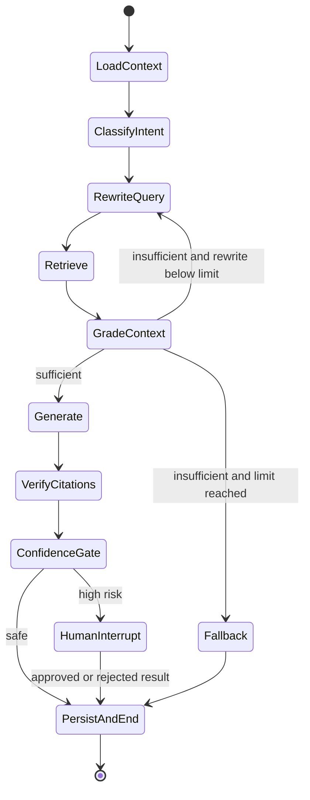

# 架构说明

## 架构原则

1. 以真实能力为准：本页把“当前架构”和“目标架构”分开，目标组件不代表已经实现。
2. 渐进迁移：先建立边界和兼容层，再替换基础设施；不一次移动全部目录或重写业务逻辑。
3. 模块化单体优先：API、Agent、RAG、持久化和 Worker 共享清晰的领域协议，部署上先保持少量进程。
4. 确定性控制优先于 Prompt：权限、租户、超时、次数、幂等、审批和数据出境必须由程序强制。
5. 默认可离线验证：单元、API 集成和确定性评测默认使用 fake model，不调用付费服务。

## 当前架构



当前边界的主要问题：

- UI 直接创建并调用 Agent，没有 application service 或 transport-neutral schema。
- `app`、模型工厂和工具模块已消除模型/RAG/本地向量库的 import-time 构造，并支持注入 fake model、工具、向量服务；默认实例通过有界缓存惰性创建。
- 环境变量由集中 Settings 校验，四份业务 YAML 由严格 schema 安全解析；运行路径统一锚定项目根目录，旧 dict 消费接口暂时保留。
- 首次 RAG 工具调用仍可能等待有界的本地 SQLite 扫描和入库；服务层已有 lifespan/readiness
  边界，但本地 baseline 不承担生产容量或多进程索引职责。
- API 会话、LangGraph checkpoint、人工审批和入库任务 lease 已持久化到 PostgreSQL；默认 local Streamlit session 仍是进程内兼容模式。
- 本地 SQLite/MD5/CSV 仅用于离线 baseline；生产 tenant、事务和 migration 由 PostgreSQL/Qdrant
  路径承担。
- Agent 图步骤与工具调用已有 Settings 驱动的代码级上限；同步调用仍没有统一 deadline/cancellation。
- 评测和运行日志无法关联 commit、trace、请求或成本。

## 目标架构

下面是路线图终态，不是当前能力声明。



### API 与客户端

- FastAPI 使用应用工厂和 lifespan 管理依赖；可注入 RAG 服务由 lifespan 单飞启动文档加载，readiness 不等待并在加载中/失败时失败关闭；`src/app/api/routes.py` 只做协议转换、请求断开检查和错误映射，业务编排位于 application service。
- API v1 首批提供 chat、conversation、live、ready 和 metrics；`/metrics` 返回 JSON 诊断快照，`/metrics/prometheus` 返回无 query/identity 标签的有界 HTTP、Worker、RAG retrieval 和模型聚合指标；SSE 事件为 `metadata`（含 conversation ID）、`token`、`citation`、`tool_status`、`completed`、`error`。
- Streamlit 支持显式配置 `STREAMLIT_MODE=http` 作为 FastAPI SSE 客户端；默认仍是 `local` 进程内兼容模式，待 HTTP/SSE、上游取消和背压在部署环境验证后再切换默认值。
- request ID 在入口生成或接受可信上游值，贯穿错误、日志和响应。

### 应用与领域边界

- `ChatApplicationService` 负责 deadline、取消、会话、Agent adapter 和事件序列，不依赖 FastAPI/Streamlit。
- `src/app/server.py:build_server_app()` 是可执行 API 的 composition root：只在显式 server 启动时构造 `ReactAgent`，测试和嵌入场景可注入 fake Agent；显式 RAG service 会同时绑定到 `rag_summarize` 工具和 readiness，避免两套实例。
- `ConversationRepository`、`AgentRunner`、`ModelGateway`、`Retriever`、`JobRepository` 都先定义协议，再提供内存/本地兼容实现和生产实现。
- 权限、tenant filter、工具 allowlist、审批和幂等由确定性代码强制，模型只提出意图。

### Agent 工作流

目标工作流从自由 ReAct 环迁移为显式、有界节点：



工作流必须保存 workflow version，并在代码中限制 rewrite、Agent step、工具次数、节点超时和全流程截止时间。高风险工具未经持久化审批不得执行；工具按 at-least-once + 业务幂等设计，不宣称 exactly-once。

### 数据与检索

- PostgreSQL 保存 tenant、用户、会话、消息、运行、工具执行、审批与知识版本；Alembic 是唯一 schema 迁移方式。
- LangGraph 使用与当前实际依赖兼容的 PostgreSQL checkpointer，`thread_id` 与 tenant/conversation 显式绑定。
- Redis 用于分布式缓存、配额、限流和 Celery broker；缓存键必须包含 tenant、prompt/model/index version 等隔离维度。
- Qdrant 1.18.3 查询在 adapter 内强制 tenant 与 index version filter，并支持 document version、product model、language 和 effective date；Dense/Sparse 命名向量经参数化 RRF 融合，再由可关闭且显式降级的 Cross-Encoder adapter 重排。SQLite/BM25 继续作为离线 baseline。
- 文档入库由 Celery Worker 执行，输入校验、内容哈希、有限重试、可取消状态机和蓝绿 alias 切换均可独立测试。

当前实现边界：`compose.yaml` 的 `workers` profile 提供 Redis 7.4 AOF、独立 Python 3.10
Celery worker 和 JSON-only task contract；默认 profile 不启动它们。任务先持久化 job 再
发布，worker 按 job ID claim 并使用 lease/fencing 完成或释放。解析/embedding/索引业务
handler 仍须在部署组合根显式注册，未注册 task type 安全失败。

### 模型网关

- 业务层只认识统一 request/response/usage/error，不依赖供应商对象。
- 每次调用设置连接和读取超时；只重试明确的暂时错误，次数有限且带 jitter。
- 路由、fallback、并发、token/cost budget、structured output 和缓存策略可配置、可记录、可测试。
- Provider 错误不得把响应正文、凭证或完整 Prompt 返回给客户端。

### 安全与可观测性

- JWT 验证 issuer、audience、expiration；RBAC 通过依赖和 policy 实现，401/403 稳定。
- tenant context 是数据库、向量、缓存、任务和评测 repository 的必填参数。
- 结构化日志默认脱敏，不记录 Authorization、Cookie、API key、完整 Prompt、私有全文或联系方式。
- OpenTelemetry span 覆盖 HTTP、Agent 节点、检索、重排、模型和工具；Prometheus label 不使用 user/conversation/query/document 等高基数字段。
- readiness 检查关键依赖，liveness 只证明进程事件循环可响应；关闭时停止接流量、取消/收敛任务并释放客户端。

## 渐进迁移路径

| 顺序 | 迁移内容 | 兼容策略 | 完成信号 |
|---:|---|---|---|
| 1 | 基础质量、依赖、TLS、配置、Agent 上限 | 保留现有入口和模块路径 | 干净环境可安装；主模块可导入；静态检查与测试有统一入口 |
| 2 | FastAPI、SSE、application service、内存会话接口 | Streamlit 可继续进程内，新增 HTTP 模式 | fake Agent API 测试覆盖超时、取消、错误和单次完成 |
| 3 | PostgreSQL 会话和 Alembic | 内存 repository 仅用于测试/开发 | 重启恢复、跨 tenant 拒绝、migration 可重复 |
| 4 | LangGraph checkpoint 与人工审批 | 原简单 Agent 作为受限 adapter | 可恢复 thread、步骤上限、审批后恢复和幂等测试通过 |
| 5 | Qdrant hybrid、RRF、Cross-Encoder | SQLite/BM25 保留 baseline adapter | 无泄漏 regression set 的消融报告可复现 |
| 6 | Celery 异步入库和蓝绿索引 | 本地同步入库仅作为开发迁移工具 | 请求不做长任务；重复投递和失败回滚可验证 |
| 7 | Model Gateway、Redis 缓存/限流/降级 | 现有 provider adapter 被网关包裹 | 超时、429、fallback、quota、cache tenant 测试通过 |
| 8 | OpenTelemetry 与 Prometheus/Grafana | 先埋接口层，再扩至 Worker | 请求可端到端追踪，指标可抓取且无高基数标签 |
| 9 | JWT/RBAC、多租户与安全加固 | 开发模式使用明确 fake principal | 全资源跨租户负向测试和日志脱敏通过 |
| 10 | 版本化评测、CI 质量门禁 | 现有 28 条集保留为 dev baseline | deterministic CI 无付费 API，报告记录 commit/dataset/config |
| 11 | Docker Compose、压测和发布 | 本地命令继续可用 | 一条命令启动，health 与 smoke 通过，真实压测产物可追溯 |

详细目标、风险、测试、验收与回滚见 [当前执行计划](exec-plans/active/000-engineering-upgrade.md)。

## 推荐目录结构

```text
src/
  app/
    api/                 # FastAPI factory、v1 routes、schemas、error mapping
    application/         # chat/document/job use cases
    domain/              # 稳定实体、值对象和 repository protocols
    infrastructure/      # PostgreSQL、Redis、Qdrant、provider adapters
    agent/               # LangGraph state、nodes、policies、adapter
    rag/                 # retriever/fusion/reranker/context interfaces
    evaluation/          # versioned runner、metrics、manifest
    security/            # auth、RBAC、tenant、redaction
    observability/       # logging、metrics、tracing
    workers/             # Celery app、tasks、ingestion state machine
tests/
  unit/
  integration/
  contract/
  evaluation/
docs/
scripts/
deploy/
```

### 兼容层与移动策略

- `app.py` 暂留为 Streamlit 入口；默认 local 模式保留兼容，显式 `STREAMLIT_MODE=http` 时通过 SSE 调用 FastAPI，后续再删除本地模式。
- `agent/`、`rag/`、`model/` 先通过 adapter 暴露稳定协议；有测试后逐文件迁入 `src/app/`。
- `evaluation/` 和现有脚本保留 CLI 兼容包装，核心 runner 迁入新 package 后旧入口只转发参数。
- `config/*.yml` 在 Pydantic Settings 过渡期继续读取，但环境变量覆盖、类型和范围由统一 Settings 校验。
- `data/` 只保留公开示例和版本化评测小集；运行文件、索引和报告进入忽略的 artifact/volume 目录。
- 每次迁移只改一个 import boundary，并在同一提交增加兼容测试；所有消费者迁移完成后再删除旧模块。

## 关键兼容性约束

- LangChain/LangGraph checkpoint 和 middleware API 必须依据实际锁定版本实现，不能按最新文档猜测。
- Python 版本先固定后再升级依赖；不要在同一阶段同时升级框架大版本和改写 Agent 状态机。
- API v1 schema 和 SSE event schema 一旦公开，只做向后兼容扩展；破坏性变化进入新版本。
- 数据库和向量索引变更使用显式 version；构建失败不得影响 active index。
- 所有默认测试使用 fake model；live provider、RAGAS 和外部数据出境必须显式授权。
