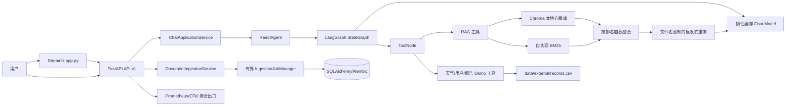

# 当前工程状态

## 审计范围与结论

本页记录 2026-08-02 对 `main` 分支工作区的实测结果。工作区仍保留用户未提交修改：`README.md` 被修改、两份 `docs/rag_quality_*.md` 被删除，`AGENT.md`、`todo.md` 未跟踪。本轮不覆盖或恢复这些内容；本页只描述已提交代码和实际执行结果。

当前项目是 Streamlit 演示客户端加 FastAPI API-first 服务、LangGraph Agent、本地 RAG、SQLAlchemy/Alembic 持久化和可观测性基线。API、文档入库任务、JWT/RBAC、租户边界、Prometheus/OTel 配置和 Compose profile 已有代码与测试，但仍不是已完成生产栈：Docker API 镜像构建、PostgreSQL/Redis/Qdrant/Celery 全链路、真实 OTLP backend、外部依赖漏洞和 Python 3.10 clean install 仍未在当前环境完成验收。

## 运行环境与依赖

- 初始审计 shell 的解释器为 Python 3.13.13；该环境混用全局 site-packages 与 `.local_deps/`，不作为受支持运行环境。
- 受支持开发版本由 `.python-version` 固定为 Python 3.10.20；当前执行环境是 Python 3.13，`scripts/check_environment.py` 因版本不符而失败，不能把本机结果当作 Python 3.10 验收。
- `requirements-dev.txt` 在运行依赖上固定 pytest、Ruff、Mypy、Coverage 和 pip-audit；`scripts/check_environment.py` 会拒绝非 Python 3.10、未精确固定、缺失或版本不一致的直接依赖。
- `requirements.lock` 和 `requirements-dev.lock` 固定传递依赖，包含直接认证依赖 `PyJWT==2.13.0`；当前已执行 `pip check`，但 Python 3.10 clean install 仍需 CI/受支持解释器验证。
- 目标环境普通导入 `app` 不再加载 Agent、模型、RAG 或 Chroma；Streamlit 执行 `main()` 后才构建 Agent，RAG 服务可用单飞后台任务预加载 Chroma，首次检索等待显式超时并传播失败。
- 旧 `.local_deps/` 目录仍存在但已不再由评测/报告脚本自动插入 `sys.path`；初始行为曾覆盖目标环境中的正确二进制包并导致 RAGAS 导入失败。
- Python 3.13 下环境检查失败；支持矩阵固定 Python 3.10，不能用本机解释器替代 CI 验收。
- `pypdf`、Streamlit、Pillow、LangChain、LangGraph、LangChain-Chroma、ChromaDB、LangChain-OpenAI、LangChain-HuggingFace、Sentence Transformers 和 Transformers 已分批升级，并通过 PDF、UI、Agent 图编译、HuggingFace adapter 导入与临时 Chroma 写入/检索回归；pip-audit 从 84 条/13 包下降到 3 条/3 包。剩余漏洞不能用忽略规则伪装通过。

## 当前架构与核心调用链

### 在线问答链路

1. `app.py` 把 Streamlit 执行封装在 `main()`；普通 Python import 不加载业务模块，Streamlit 首次 session 才创建 `ReactAgent`。
2. `ReactAgent` 首次显式构造时通过缓存工厂创建聊天模型；测试可直接注入 fake model 和工具列表。
3. 导入 `agent.tools.agent_tools` 不再加载 RAG 模块；首次调用 `rag_summarize` 才创建并缓存 `RagSummarizeService`。
4. `RagSummarizeService.__init__` 不扫描文档或写入 Chroma；首次检索通过有界单飞后台加载任务执行，等待显式超时并传播失败，仍是进程内本地索引。
5. `ReactAgent` 创建 `agent -> tools -> agent` 的 LangGraph 循环；每次执行传入默认 10 的 `recursion_limit`，并累计限制默认最多 5 次工具调用。超限批次不会执行，递归上限异常转换为固定终止消息；全流程 deadline 和取消传播仍未实现。
6. 模型按工具调用结果继续循环。普通模型调用是同步 `invoke`；两类 provider 共享 120 秒默认超时，OpenAI-compatible 还显式设置最多 2 次 SDK 重试。
7. FastAPI SSE 通过 `ChatApplicationService` 发送稳定的 metadata/token/completed/error 事件，客户端断开和超时有测试；Streamlit 仍保留逐字符演示路径，不代表上游 token streaming。
8. FastAPI 可注入内存或 SQLAlchemy conversation repository；数据库配置时 lifespan 逆序释放 repository，Streamlit 默认仍只保留当前进程 session state。

### RAG 链路

1. 知识文件来自 `data/` 下的 TXT/PDF，运行时同步加载，处理过的文件哈希记录在 `md5.txt`。
2. Dense 路径使用 Chroma + 延迟加载的本地 Hugging Face embedding。
3. Sparse 路径使用仓库自实现的 BM25 公式和中英文 tokenization。
4. 当前“混合检索”按 `weight / rank` 合并两路结果，不是标准分数归一化，也不是带 `rrf_k` 的正式 RRF 实现。
5. `LightweightEvidenceReranker` 依据原排名、内容 token/字符重合排序，不读取来源文件名或评测标签；离线 `source_recall` 仍只在评测阶段计算，不能反向影响排序。
6. 生成链将问题和全文片段拼入 Prompt，要求模型返回 `【资料N】`。引用验证目前只检查编号是否落在文档数组范围内，不验证结论是否被被引片段支持。

### 模型和工具链路

- `utils.settings.Settings` 集中读取并校验应用环境、日志级别、模型 provider/密钥/传输、Agent 最大步骤/工具次数以及未来 API 的 host/port/CORS；密钥使用 `SecretStr`，生产环境拒绝通配 CORS。
- `model.factory` 通过可注入的 `Settings` 构建 OpenAI-compatible 或仓库自定义 Anthropic-compatible 同步适配器；`MODEL_PROVIDER` 为规范变量，旧 `LLM__PROVIDER` 仍可兼容读取。
- `model.factory` 暴露缓存的惰性访问函数，模块导入不再加载业务 YAML 或创建聊天/嵌入模型；`ReactAgent`、`RagSummarizeService` 和 `VectorStoreService` 均支持显式依赖注入。
- RAG/Chroma/Prompt/Agent YAML 使用 `yaml.safe_load` 和禁止未知字段的 Pydantic schema；数值范围、URL、文件/目录及跨字段关系启动即校验，旧 dict 接口继续兼容。
- YAML 中的 Chroma 持久化目录、数据、MD5、Prompt 和 CSV 路径统一相对项目根目录解析为绝对路径，不再依赖启动 cwd；配置仍在首次相关模块加载时读取，完整 composition-root 加载留到 FastAPI 阶段。
- 模型请求默认验证 TLS；企业私有 CA 只能通过 `MODEL_CA_BUNDLE` 指向已有 PEM 文件，非法路径启动即失败，不提供关闭验证的开关。
- 工具包括本地 RAG、静态天气、随机位置、随机用户 ID、当前月份和本地 CSV 报告数据；API 可注入 JWT authenticator/audit sink，开发模式仍允许显式 `x-tenant-id`，高风险工具审批和副作用幂等仍未完成。
- `agent/tools/middleware.py` 在当前 LangChain 版本下可以导入，但没有接入当前 Agent；已有脱敏 metadata 测试，正式接线仍需单独验证白名单和运行时边界。

### 评测链路

1. `scripts/evaluate_rag.py` 读取 YAML 与 JSONL 数据集。
2. 可选择 Chroma hybrid 或不依赖 embedding 的 BM25；答案可来自 LLM、参考答案或本地抽取器。
3. 本地指标按来源标签（仅离线 `expected_sources`）或预期关键词判定相关性，并计算若干启发式/代理指标；这些标签不进入重排。
4. RAGAS 默认关闭；显式启用时要求 `--ack-external-judge`，minimal 模式仍会向外部评审发送问题、回答和参考答案，需要业务数据出境审批。
5. 结果写入被 `.gitignore` 排除的 `output/`，仍可能包含问题、答案、参考答案、召回全文、元数据和本机路径；不得把本地 artifact 当作可提交报告。

## 能力矩阵

| 能力 | 当前状态 | 证据或说明 |
|---|---|---|
| Streamlit UI | 已实现且普通导入无业务资源副作用 | `app.py`；实际启动后首次 RAG 调用仍同步初始化 Chroma |
| 基础 LangGraph Agent | 已实现 Demo | `agent/react_agent.py` |
| 工具调用 | 已实现有界 Demo | 每次 Agent 执行默认最多请求 5 次工具；无权限/幂等边界 |
| Chroma 向量检索 | 已实现且依赖已安装 | 首次 RAG 工具调用仍同步初始化并可能入库 |
| BM25 检索 | 已实现并可离线运行 | `rag/simple_bm25.py` |
| 启发式重排 | 已实现无来源名特征的确定性 baseline | `rag/reranker.py`、`docs/evaluation/retrieval-leakage.md` |
| RAG 回归样本 | 有 28 条主集和 6 条 focus 集，但未版本化/冻结 | `data/evaluation/*.jsonl` |
| FastAPI / API v1 / SSE | 已实现聊天、基础 SSE、内存会话和启动生命周期边界 | `src/app/main.py` 提供应用工厂、request ID、liveness/readiness、`POST /api/v1/chat`、SSE、可注入的进程内 conversation repository 和资源关闭；`python -m src.app.server` 可启动 |
| PostgreSQL / Alembic | 部分实现 | SQLAlchemy conversation/document/job repository、Alembic migration、readiness 和重启恢复测试已存在；当前 Docker/PostgreSQL 端到端未验收 |
| Redis / Celery | 未实现 | 无依赖、worker 或任务状态机 |
| Qdrant / hybrid filter | 未实现 | 当前仅本地 Chroma |
| LangGraph checkpoint | 未实现 | `graph.compile()` 无 checkpointer |
| 用户/会话持久化 | 部分实现 | FastAPI 可选 SQLAlchemy 会话和入库 job 持久化；Streamlit 默认仍为进程内 session |
| JWT / RBAC | 部分实现 | `JWTAuthenticator`、稳定 401/403、tenant 一致性和安全审计已测试；审批/完整角色策略仍有限 |
| 多租户隔离 | 部分实现 | API conversation/document/job/retrieval 路径有 tenant filter；Streamlit/本地工具和跨服务部署仍非完整隔离 |
| OpenTelemetry | 部分实现 | API 有 W3C `traceparent`、HTTP/Agent/LLM/RAG/工具/当前进程 Worker SDK span、有界本地 exporter 和可选 timeout-bounded OTLP gRPC exporter；生产强制 HTTPS；尚无 OTLP Collector/backend，重启任务不保留 parent context |
| Prometheus / metrics endpoint | 部分实现 | `/metrics` 与 `/metrics/prometheus` 暴露有界 HTTP/模型网关/Worker 聚合指标，生产要求 `METRICS_TOKEN`；RAG/工具专用 metrics 和真实 scrape 尚未完成 |
| Docker Compose | 部分实现 | API 基础服务、`observability` profile（OTel Collector/Prometheus/Grafana）和 provisioning artifact 已配置；数据库、Redis、Worker 等完整生产栈仍缺失 |
| CI | 部分实现 | 已有质量、依赖审计和 Docker build workflow 配置；远端 runner 尚未执行确认 |
| 压测 | 部分实现 | `scripts/run_load_smoke.py` 支持 fake API 10 请求/并发 2；不是生产压测，暂无 Locust/k6 |

## 当前复核基线（2026-08-02）

以下结果来自本次工作区实际执行；用户未提交文件仍未纳入提交或恢复。

| 命令 | 实际结果 |
|---|---|
| `python -m pytest -q` | 通过：342 passed，26 subtests |
| `coverage run -m pytest -q` / `coverage report` | 通过：342 passed，26 subtests；总覆盖率 63% |
| `python -m ruff format --check .` | 通过：233 个 Python 文件已格式化 |
| `python -m ruff check .` | 通过 |
| `python -m mypy agent rag model evaluation utils scripts src/app app.py` | 通过：96 个源码文件 |
| `python scripts/scan_secrets.py` | 通过：Secret scan OK |
| `python -m pip check` | 通过：No broken requirements found |
| 外部调用 timeout 定向审计 | 通过：51 passed，6 subtests；未发现需立即补齐的生产 timeout 缺口 |
| Job claim/recovery 定向审计 | 通过：14 passed；唯一 claim、queued 恢复、running orphan fail 已验证，heartbeat/lease 未实现 |
| PostgreSQL/container 集成 | 阻塞：`docker info` 超时；Compose/migration 静态 5 passed | Docker daemon 外部状态不可用，未宣称 PostgreSQL 容器或跨 worker 并发通过 |
| `python scripts/run_deterministic_regression.py` | 通过并生成 deterministic summary |
| `python scripts/run_red_team_regression.py` | 通过：4/4 |
| `python scripts/run_load_smoke.py --requests 10 --concurrency 2` | 通过：fake API smoke，错误率 0 |
| `python -m evaluation.dataset_manifest` | 通过：28 samples，SHA-256 `e69c930f...f45b5c7` |
| `python -m pip_audit -r requirements.txt --format json` | 失败：3 个无可用修复版本漏洞（ChromaDB/RAGAS/DiskCache）；未使用 ignore |
| `python scripts/check_environment.py --requirements requirements-dev.txt` | 失败：当前 Python 3.13，不符合 Python 3.10 支持矩阵 |
| `docker compose config --quiet` / observability config | 通过：静态配置 |
| Observability isolated health | 通过：Collector/Prometheus/Grafana 各 HTTP 200；不含 API 端到端 scrape |
| Docker API build / Docker Desktop | 未通过：BuildKit daemon EOF，随后 Docker Desktop unable to start/超时 |

## 历史审计结果（已过期，不作为当前状态）

| 命令 | 结果 | 分类与说明 |
|---|---|---|
| `python --version` | 成功：3.13.13 | 当前环境 |
| `python -m pip check` | 成功：No broken requirements found | 只检查全局已安装分发，不能发现 `.local_deps` 混用或未安装的 requirements |
| `python -m pip install --dry-run --ignore-installed -r requirements.txt` | 失败 | 依赖/环境问题：Python 3.13 下 NumPy 约束冲突 |
| `python -m unittest discover -s tests -v` | 成功：25/25 | 仅现有单元测试 |
| `python -m pytest -q` | 成功：25/25 | 与 unittest 覆盖相同测试集 |
| `python -m compileall -q agent rag model evaluation utils scripts tests` | 成功 | 仅语法编译，不证明导入或运行正确 |
| `python -c "import app"` | 失败 | 环境问题：`streamlit` 未安装 |
| 使用 `.local_deps` 导入 `agent.react_agent` | 失败 | 历史审计结果；`.local_deps` 已不再由脚本注入，受支持环境改为 `ics` |
| 使用 `.local_deps` 导入 `agent.tools.middleware` | 失败 | 历史审计结果；当前受支持环境下 `agent.tools.middleware` 可导入但未接线 |
| `python scripts/scan_secrets.py` | 成功 | 扫描当前源码；未发现疑似有效凭证 |
| `python scripts/scan_secrets.py --include-private-env` | 失败：1 条 | 本地 `.env` 有疑似真实凭证；文件已忽略且未进入 Git，建议轮换 |
| Git 历史 blob 脱敏扫描 | 成功 | 三个可达提交中未发现当前规则可识别的凭证 |
| `python -m ruff check .` / `ruff format --check` | 未执行成功 | 工具未安装 |
| `python -m black --check .` | 未执行成功 | 工具未安装 |
| `python -m mypy .` | 未执行成功 | 工具未安装 |
| `python -m pip_audit -r requirements.txt` | 未执行成功 | 工具未安装 |
| `python -m coverage ...` | 未执行成功 | 工具未安装 |
| 离线 BM25 全量评测 | 成功：28/28 | 未调用 LLM/RAGAS；产物见 `output/audit_baseline_offline/20260801_131255/` |

阶段 1 后续验证使用 Python 3.10.20 `ics` 环境：

| 命令 | 结果 | 分类与说明 |
|---|---|---|
| `python scripts/check_environment.py --requirements requirements.txt` | 成功 | Python 3.10，20 个直接运行依赖精确匹配，`pip check` 成功 |
| `python scripts/check_environment.py --requirements requirements-dev.txt` | 成功 | 28 个直接运行/开发依赖精确匹配 |
| `pip install --dry-run --ignore-installed -r requirements-dev.lock` | 成功 | Python 3.10 clean dry-run，锁定的传递依赖可解析 |
| `python -m pytest -q` | 成功：165 passed，23 subtests | 包含依赖隔离、配置/路径、惰性初始化、RAG 显式加载/后台单飞/超时、冻结 regression schema、Recall@K/MRR/NDCG 确定性手算、regression report 版本/完整性/Git 元数据、quality gate 通过/失败/阈值校验、deterministic BM25 summary、Qdrant point 归一化与 baseline/candidate 对比、迁移 artifact/候选回退门禁、ingestion job 幂等/状态/取消/超时/retry、progress/attempt/cancel_requested API 与协作取消、上传文件名/MIME/大小/编码/PDF 签名校验、原子安全落盘/路径隔离、验证→落盘→job 串联、content hash 文档去重/版本元数据、metadata 状态与 job 联动、SQLAlchemy document/job repository 跨实例恢复、持久化组合根与 service 重启查询、文档/job API contract、DATABASE_URL API 跨实例恢复、持久化 job 取消/恢复/孤儿失败、RRF 手算/去重/稳定排序、RRF adapter 配置切换、统一 RetrievalResult tenant/index 契约、Cross-Encoder adapter 候选上限/超时/降级、Qdrant adapter scope/ready/timeout/batch/alias/rollback/cleanup smoke、FastAPI 健康边界/Chat API/SSE/内存会话/取消/生命周期/会话查询/统一错误/租户隔离、SQLAlchemy repository、Alembic migration、迁移索引与 EXPLAIN smoke、repository 组合根、数据库 URL/readiness、事务/并发、API 重启恢复、乐观版本冲突、API 冲突契约、数据库连接池配置、user/status/agent_runs schema、Agent run 生命周期、幂等键去重、Agent run 分页过滤、Agent 上限、模型适配器、PDF/UI、LangGraph/Chroma 兼容和子进程安全测试 |
| `python -m ruff check .` | 成功 | 仓库 `pyproject.toml` 固定精确规则集，全仓零诊断 |
| `python -m ruff format --check .` | 成功：68 files already formatted | 已完成全仓 Python 格式基线 |
| `python -m mypy agent rag model evaluation utils scripts tests app.py` | 成功：59 source files | 仓库配置固定 Python 3.10、缺失类型依赖和包基线规则 |
| `python -m coverage run -m pytest -q && coverage report` | 成功：42% | 仅统计源码、启用 branch coverage；`fail_under=41` 已设置为当前真实基线 |
| `python -m pip_audit -r requirements.txt` | 失败：3 条/3 包 | 剩余涉及 `chromadb`、`ragas` 和 `diskcache`；未使用忽略规则 |
| 最终依赖修复后 `python -m pytest -q` | 成功：254 passed，23 subtests | 按 `requirements.txt` 补齐并对齐 LangGraph/LangChain/Chroma/Streamlit；secret scan、compileall、应用 import smoke、`git diff --check` 同步通过 |
| 本轮增量验收 | 成功：167 passed，23 subtests | 新增 `IngestionWorker.recover_queued()` queued 任务原 job_id 恢复、tenant 隔离与 running orphan 不重复执行测试；上方 165 条为审计时历史基线 |

## 可复现指标基线

本节中的早期离线评测数字保留用于审计追溯，不代表当前提交的质量提升；当前可复核的测试、覆盖率、红队和 fake load 结果见上方“当前复核基线”。

审计时执行的是 `--retriever bm25 --no-generate --no-ragas`。答案直接取参考答案，因此只有检索类数字可作为当前实现的 smoke 观测；答案 F1、相似度、引用和正确性不能作为模型质量。

| 指标 | 当前值 | 可用性说明 |
|---|---:|---|
| 测试数量 / 通过率 | 165 / 100% | 覆盖环境/配置/路径、惰性初始化、RAG 显式加载/后台单飞/超时、冻结 regression schema、Recall@K/MRR/NDCG 确定性手算、regression report 版本/完整性/Git 元数据、quality gate 通过/失败/阈值校验、deterministic BM25 summary、Qdrant point 归一化与 baseline/candidate 对比、迁移 artifact/候选回退门禁、ingestion job 幂等/状态/取消/超时/retry、progress/attempt/cancel_requested API 与协作取消、上传文件名/MIME/大小/编码/PDF 签名校验、原子安全落盘/路径隔离、验证→落盘→job 串联、content hash 文档去重/版本元数据、metadata 状态与 job 联动、SQLAlchemy document/job repository 跨实例恢复、持久化组合根与 service 重启查询、文档/job API contract、DATABASE_URL API 跨实例恢复、持久化 job 取消/恢复/孤儿失败、RRF 手算/去重/稳定排序、RRF adapter 配置切换、统一 RetrievalResult tenant/index 契约、Cross-Encoder adapter 候选上限/超时/降级、Qdrant adapter scope/ready/timeout/batch/alias/rollback/cleanup smoke、FastAPI 健康边界/Chat API/SSE/内存会话/取消/生命周期/会话查询/统一错误/租户隔离、SQLAlchemy repository、Alembic migration、迁移索引与 EXPLAIN smoke、repository 组合根、数据库 URL/readiness、事务/并发、API 重启恢复、乐观版本冲突、API 冲突契约、数据库连接池配置、user/status/agent_runs schema、Agent run 生命周期、幂等键去重、Agent run 分页过滤、模型传输、PDF/UI、LangGraph/Chroma 兼容和子进程安全；仍没有完整 Agent/API/RAG 集成覆盖 |
| 主评测集样本 | 28 | 非冻结、无 dataset version |
| Focus 评测集样本 | 6 | 非隐藏集 |
| 标准 Recall@1/3/5/10 | 尚未测量 | 当前 `retrieval_recall=0.754252` 是关键词组覆盖率，不是标准 Recall@K |
| MRR | 0.857143（历史值） | 旧产物的 top-3 BM25 + 启发式重排结果，不能作为当前无泄漏 baseline |
| Source recall | 0.678571（历史值） | 旧产物的离线来源标签指标；当前仍可计算，但不参与重排 |
| Citation validity | 已拆分格式指标 | `answer_citation_validity` 只校验编号范围；`answer_citation_support` 是词元重合 proxy，不是 entailment |
| 平均响应延迟 | 尚未测量 | runner 未记录耗时 |
| p95 延迟 | 尚未测量 | runner 未记录逐样本耗时 |
| 每请求 token | 尚未测量 | provider usage 未统一采集 |
| 每请求成本 | 尚未测量 | 无价格快照和 usage 记录 |

README 中的评测表能在本地未跟踪的旧产物找到同值，但产物包含绝对路径、未记录 Git commit/dirty state、未版本化数据集，且生成时的旧重排实现使用来源文件名做特征。因此这些历史数值不能作为独立、无泄漏的质量提升证据；当前代码已删除该特征，需用冻结数据集重新生成可采信报告。

## 主要技术债与安全风险

完整清单见 [TECH_DEBT.md](TECH_DEBT.md)。优先级最高的风险是：

1. 当前运行依赖仍有 3 条已知漏洞记录，涉及 `chromadb`、`ragas` 和 `diskcache`；当前公开索引未给出兼容的直接升级修复版本，pip-audit 门禁必须保持失败并阻止发布。
2. Python 3.13 不在支持矩阵；当前环境检查因此失败，Python 3.10 clean install 仍需 CI/受支持解释器复核。
3. Agent 步骤和工具调用已有代码级上限，但请求没有全流程 deadline/cancellation，工具副作用也没有幂等控制。
4. 随机用户身份与本地报告数据没有认证、授权和租户隔离。
5. 历史评测曾使用来源文件名，当前重排已移除该特征；README 中旧质量提升数字仍不能视为独立证据，需等待新 artifact。
6. RAG 服务构造已不再扫描/入库；首次 RAG 检索由单飞后台任务执行并受超时约束，API readiness、取消传播和入库 worker 关闭已有基线，但真实外部向量服务仍未纳入部署验收。
7. 日志中可能记录工具参数、消息正文或供应商原始错误，缺少脱敏。

## 测试、可观测性、部署和数据状态

- 测试：当前 pytest 为 342 passed、26 subtests，覆盖 API/SSE/断开、配置/路径、RAG/Agent、SQLAlchemy/Alembic、入库恢复/关闭/删除竞态、持久化 rebuild idempotency/claim-before-worker、Blue/Green 验证超时、JWT/租户、OTel/Prometheus/Worker metrics、Chat timeout/cancellation、REQUEST_TIMEOUT_SECONDS、提示词/模型错误脱敏、无泄漏重排、引用支持代理、评测逐样本耗时/错误门禁、红队和评测辅助；源码分支覆盖率为 63%。真实 provider、PostgreSQL 容器和生产负载仍未验证。
- 可观测性：request ID、W3C traceparent、HTTP/Agent/LLM/RAG/工具/Worker span、有界 Prometheus JSON/text 指标、METRICS_TOKEN、OTLP HTTPS 配置和脱敏 JSON API access log 已实现；Collector/backend 端到端传输和业务日志全面脱敏仍有限制。
- 部署：FastAPI 应用工厂、liveness/readiness、SSE、优雅关闭和 Compose observability profile 已有静态/隔离健康验证；API 镜像构建被 Docker daemon EOF/无法启动阻塞，完整生产栈未验收。
- 持久化：Chroma 和 MD5 文件是本地运行状态；会话与 Agent 状态只在内存；CSV 是演示数据。没有事务、迁移、备份恢复或多副本一致性方案。

## 最可能被面试官质疑的问题

1. README 的历史提升数字如何排除文件名泄漏、开发集调参和参考答案复用？当前已通过移除来源名特征降低一项风险，但旧 artifact 仍不可追溯，需重跑冻结评测。
2. 为什么叫“流式”但模型并未 token streaming，而是完整块再逐字符 sleep？
3. Agent 如何防止无限工具循环、超时和重复副作用？步骤和工具次数已有确定性上限；全流程 deadline、取消与副作用幂等仍未实现。
4. 随机 user ID 如何代表真实登录用户，如何防止读取其他人的报告？当前没有安全边界。
5. 如何部署、扩容和恢复会话？当前首次 RAG 请求仍写本地 Chroma，session 只在单进程内存。
6. 企业私有 CA 如何接入而不关闭 TLS？当前通过显式 PEM 路径创建验证客户端，路径无效时 fail-fast。
7. 72 个环境/配置/路径/惰性初始化/RAG 显式加载/Agent 上限/模型适配/PDF/UI/LangGraph/Chroma 兼容测试为何能证明 Agent/RAG 主链可靠？当前不能证明。

## 当前是否适合继续自动修改

适合继续做小步、测试先行的改造，但前提是：

- 保留并避开当前用户未提交修改；
- 在受支持 Python 3.10 环境复核 clean install 和 CI；
- 先修复依赖漏洞、首次 RAG 同步入库和全流程 deadline/cancellation；
- 继续以 fake Agent 和本地集成测试推进，单独建立 PostgreSQL/Qdrant/Celery/真实 OTLP 的容器验收目标，不把静态 Compose 配置等同于生产可用。
