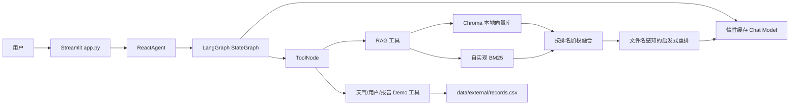

# 当前工程状态

## 审计范围与结论

本页记录 2026-08-01 对 `main` 分支工作区的实测结果。审计开始时分支相对 `origin/main` ahead 1，且已经存在用户未提交修改：`README.md` 被修改、两份 `docs/rag_quality_*.md` 被删除，`AGENT.md`、`todo.md` 与 `output/` 未跟踪。本轮不覆盖或恢复这些内容。

当前项目是一个可以运行部分离线评测的 Streamlit + LangGraph + 本地 RAG Demo，但不是 API-first、可持久化、可观测或多租户的工程级服务。FastAPI、PostgreSQL、Redis、Celery、Qdrant、认证授权和部署体系均尚未在仓库代码中实现。

## 运行环境与依赖

- 初始审计 shell 的解释器为 Python 3.13.13；该环境混用全局 site-packages 与 `.local_deps/`，不作为受支持运行环境。
- 受支持开发版本现由 `.python-version` 固定为 Python 3.10.20；本机 `ics` 环境已验证 18 个直接运行依赖与 `requirements.txt` 精确一致，`app` 可以导入。
- `requirements-dev.txt` 在运行依赖上固定 pytest、Ruff、Mypy、Coverage 和 pip-audit；`scripts/check_environment.py` 会拒绝非 Python 3.10、未精确固定、缺失或版本不一致的直接依赖。
- 当前只有直接依赖和开发工具精确固定，尚无完整的跨平台 transitive lock；因此不能把它描述为完全可重复的供应链锁定。
- 目标环境普通导入 `app` 不再加载 Agent、模型、RAG 或 Chroma；Streamlit 执行 `main()` 后才构建 Agent，首次调用 RAG 工具时才同步初始化 Chroma 和扫描知识文件。
- 旧 `.local_deps/` 目录仍存在但已不再由评测/报告脚本自动插入 `sys.path`；初始行为曾覆盖目标环境中的正确二进制包并导致 RAGAS 导入失败。
- Python 3.13 下执行完整依赖 dry-run 失败：`langchain-community==0.3.31` 要求 NumPy 2.x，而 `langchain-chroma==0.1.4` 在该解释器组合下要求 NumPy 1.x。
- pip-audit 对当前运行依赖报告 13 个包共 84 条已知漏洞记录；其中 LangChain/LangGraph 修复版本涉及大版本迁移，必须单独升级和回归，不能用忽略规则伪装通过。

## 当前架构与核心调用链

### 在线问答链路

1. `app.py` 把 Streamlit 执行封装在 `main()`；普通 Python import 不加载业务模块，Streamlit 首次 session 才创建 `ReactAgent`。
2. `ReactAgent` 首次显式构造时通过缓存工厂创建聊天模型；测试可直接注入 fake model 和工具列表。
3. 导入 `agent.tools.agent_tools` 不再加载 RAG 模块；首次调用 `rag_summarize` 才创建并缓存 `RagSummarizeService`。
4. `RagSummarizeService.__init__` 仍会同步创建 Chroma 客户端、扫描文档、按 MD5 判断并可能解析、切分、嵌入和写入向量库，然后构建 retriever。该 I/O 已离开 import 阶段，但仍会阻塞首次 RAG 请求。
5. `ReactAgent` 创建 `agent -> tools -> agent` 的 LangGraph 循环；每次执行传入默认 10 的 `recursion_limit`，并累计限制默认最多 5 次工具调用。超限批次不会执行，递归上限异常转换为固定终止消息；全流程 deadline 和取消传播仍未实现。
6. 模型按工具调用结果继续循环。普通模型调用是同步 `invoke`；两类 provider 共享 120 秒默认超时，OpenAI-compatible 还显式设置最多 2 次 SDK 重试。
7. `execute_stream` 使用 LangGraph 的 value stream，把每轮最新消息的完整内容作为块返回；UI 再逐字符 `sleep(0.01)` 模拟流式输出。这不是上游 token streaming。
8. Streamlit 只把消息保存在当前进程 session state 中，而且后续调用 Agent 时只提交当前问题，不会把 UI 中显示的历史消息传给 Agent。

### RAG 链路

1. 知识文件来自 `data/` 下的 TXT/PDF，运行时同步加载，处理过的文件哈希记录在 `md5.txt`。
2. Dense 路径使用 Chroma + 延迟加载的本地 Hugging Face embedding。
3. Sparse 路径使用仓库自实现的 BM25 公式和中英文 tokenization。
4. 当前“混合检索”按 `weight / rank` 合并两路结果，不是标准分数归一化，也不是带 `rrf_k` 的正式 RRF 实现。
5. `LightweightEvidenceReranker` 依据原排名、内容 token/字符重合以及来源文件名中的类别提示排序。来源文件名同时用于评测标签，导致评测泄漏。
6. 生成链将问题和全文片段拼入 Prompt，要求模型返回 `【资料N】`。引用验证目前只检查编号是否落在文档数组范围内，不验证结论是否被被引片段支持。

### 模型和工具链路

- `utils.settings.Settings` 集中读取并校验应用环境、日志级别、模型 provider/密钥/传输、Agent 最大步骤/工具次数以及未来 API 的 host/port/CORS；密钥使用 `SecretStr`，生产环境拒绝通配 CORS。
- `model.factory` 通过可注入的 `Settings` 构建 OpenAI-compatible 或仓库自定义 Anthropic-compatible 同步适配器；`MODEL_PROVIDER` 为规范变量，旧 `LLM__PROVIDER` 仍可兼容读取。
- `model.factory` 暴露缓存的惰性访问函数，模块导入不再加载业务 YAML 或创建聊天/嵌入模型；`ReactAgent`、`RagSummarizeService` 和 `VectorStoreService` 均支持显式依赖注入。
- RAG/Chroma/Prompt/Agent YAML 使用 `yaml.safe_load` 和禁止未知字段的 Pydantic schema；数值范围、URL、文件/目录及跨字段关系启动即校验，旧 dict 接口继续兼容。
- YAML 中的 Chroma 持久化目录、数据、MD5、Prompt 和 CSV 路径统一相对项目根目录解析为绝对路径，不再依赖启动 cwd；配置仍在首次相关模块加载时读取，完整 composition-root 加载留到 FastAPI 阶段。
- 模型请求默认验证 TLS；企业私有 CA 只能通过 `MODEL_CA_BUNDLE` 指向已有 PEM 文件，非法路径启动即失败，不提供关闭验证的开关。
- 工具包括本地 RAG、静态天气、随机位置、随机用户 ID、当前月份和本地 CSV 报告数据。没有认证上下文、租户边界、审批或幂等控制。
- `agent/tools/middleware.py` 没有接入当前 Agent，且其导入依赖与锁定的 LangChain API 不兼容。

### 评测链路

1. `scripts/evaluate_rag.py` 读取 YAML 与 JSONL 数据集。
2. 可选择 Chroma hybrid 或不依赖 embedding 的 BM25；答案可来自 LLM、参考答案或本地抽取器。
3. 本地指标按来源文件名或预期关键词判定相关性，并计算若干启发式/代理指标。
4. RAGAS 默认关闭；显式启用时要求 `--ack-external-judge`，minimal 模式仍会向外部评审发送问题、回答和参考答案，需要业务数据出境审批。
5. 结果写入 `output/`，包含问题、答案、参考答案、召回全文、元数据和本机绝对路径。此前该目录未被 `.gitignore` 排除。

## 能力矩阵

| 能力 | 当前状态 | 证据或说明 |
|---|---|---|
| Streamlit UI | 已实现且普通导入无业务资源副作用 | `app.py`；实际启动后首次 RAG 调用仍同步初始化 Chroma |
| 基础 LangGraph Agent | 已实现 Demo | `agent/react_agent.py` |
| 工具调用 | 已实现有界 Demo | 每次 Agent 执行默认最多请求 5 次工具；无权限/幂等边界 |
| Chroma 向量检索 | 已实现且依赖已安装 | 首次 RAG 工具调用仍同步初始化并可能入库 |
| BM25 检索 | 已实现并可离线运行 | `rag/simple_bm25.py` |
| 启发式重排 | 已实现但存在标签泄漏 | `rag/reranker.py` |
| RAG 回归样本 | 有 28 条主集和 6 条 focus 集，但未版本化/冻结 | `data/evaluation/*.jsonl` |
| FastAPI / API v1 / SSE | 未实现 | 无 API package、路由或 schema |
| PostgreSQL / Alembic | 未实现 | 无依赖、模型或 migration |
| Redis / Celery | 未实现 | 无依赖、worker 或任务状态机 |
| Qdrant / hybrid filter | 未实现 | 当前仅本地 Chroma |
| LangGraph checkpoint | 未实现 | `graph.compile()` 无 checkpointer |
| 用户/会话持久化 | 未实现 | 仅 Streamlit 进程内 session state |
| JWT / RBAC | 未实现 | 无认证授权层 |
| 多租户隔离 | 未实现 | 数据、向量、缓存和工具均无 tenant context |
| OpenTelemetry | 未实现 | 无 tracing 依赖或 instrumentation |
| Prometheus / metrics endpoint | 未实现 | 无指标采集 |
| Docker Compose | 未实现 | 无 Docker/Compose 文件 |
| CI | 未实现 | 无 `.github/workflows` |
| 压测 | 未实现 | 无 Locust/k6 场景 |

## 基线命令与真实结果

| 命令 | 结果 | 分类与说明 |
|---|---|---|
| `python --version` | 成功：3.13.13 | 当前环境 |
| `python -m pip check` | 成功：No broken requirements found | 只检查全局已安装分发，不能发现 `.local_deps` 混用或未安装的 requirements |
| `python -m pip install --dry-run --ignore-installed -r requirements.txt` | 失败 | 依赖/环境问题：Python 3.13 下 NumPy 约束冲突 |
| `python -m unittest discover -s tests -v` | 成功：25/25 | 仅现有单元测试 |
| `python -m pytest -q` | 成功：25/25 | 与 unittest 覆盖相同测试集 |
| `python -m compileall -q agent rag model evaluation utils scripts tests` | 成功 | 仅语法编译，不证明导入或运行正确 |
| `python -c "import app"` | 失败 | 环境问题：`streamlit` 未安装 |
| 使用 `.local_deps` 导入 `agent.react_agent` | 失败 | 环境冲突：LangGraph 1.2.0 需要当前路径中不存在的新 `langchain-core` API |
| 使用 `.local_deps` 导入 `agent.tools.middleware` | 失败 | 代码/依赖不兼容：LangChain 0.3.30 无 `AgentState` 导出 |
| `python scripts/scan_secrets.py` | 成功 | 扫描当前源码；未发现疑似有效凭证 |
| `python scripts/scan_secrets.py --include-private-env` | 失败：1 条 | 本地 `.env` 有疑似真实凭证；文件已忽略且未进入 Git，建议轮换 |
| Git 历史 blob 脱敏扫描 | 成功 | 三个可达提交中未发现当前规则可识别的凭证 |
| `python -m ruff check .` / `ruff format --check` | 未执行成功 | 工具未安装 |
| `python -m black --check .` | 未执行成功 | 工具未安装 |
| `python -m mypy .` | 未执行成功 | 工具未安装 |
| `python -m pip_audit -r requirements.txt` | 未执行成功 | 工具未安装 |
| `python -m coverage ...` | 未执行成功 | 工具未安装 |
| 离线 BM25 全量评测 | 成功：28/28 | 未调用 LLM/RAGAS；产物见 `output/audit_baseline_offline/20260801_131255/` |

阶段 1 后续验证使用 Python 3.10.20 `ics` 环境：

| 命令 | 结果 | 分类与说明 |
|---|---|---|
| `python scripts/check_environment.py --requirements requirements.txt` | 成功 | Python 3.10，18 个直接运行依赖精确匹配，`pip check` 成功 |
| `python scripts/check_environment.py --requirements requirements-dev.txt` | 成功 | 23 个直接运行/开发依赖精确匹配 |
| `pip install --dry-run --ignore-installed -r requirements-dev.txt` | 成功 | Python 3.10 可解析；输出同时证明传递依赖仍会漂移，不能替代 lock |
| `python -m pytest -q` | 成功：64 passed，17 subtests | 包含依赖隔离、环境/YAML schema、非根 cwd 路径、惰性初始化、Agent 上限和模型适配器测试 |
| Ruff lint/format（本目标涉及文件） | 成功 | 类型化 YAML、路径工具及其测试均通过 |
| `python -m ruff check .` | 失败：49 项 | 本目标涉及文件已通过；其余既有代码仍包含导入顺序、异常处理、时区等债务 |
| `python -m ruff format --check .` | 失败：22 个文件待格式化 | 本目标涉及文件已格式化；全仓机械改写留给独立目标 |
| Mypy（本目标涉及文件） | 成功 | 使用 `--explicit-package-bases`；全仓类型门禁仍未建立 |
| Coverage（本目标涉及文件） | 成功：94% | `utils/config_handler.py`、`utils/path_tool.py` 与配置测试；不是全仓覆盖率 |
| `python -m pip_audit -r requirements.txt` | 失败：84 条/13 包 | 真实安全基线；未忽略，进入阶段 1 下一修复目标 |

## 可复现指标基线

审计时执行的是 `--retriever bm25 --no-generate --no-ragas`。答案直接取参考答案，因此只有检索类数字可作为当前实现的 smoke 观测；答案 F1、相似度、引用和正确性不能作为模型质量。

| 指标 | 当前值 | 可用性说明 |
|---|---:|---|
| 测试数量 / 通过率 | 64 / 100% | 新增环境/依赖隔离、集中配置、YAML schema/路径、惰性初始化、Agent 上限与模型传输安全测试；仍没有完整 Agent/API/RAG 集成覆盖 |
| 主评测集样本 | 28 | 非冻结、无 dataset version |
| Focus 评测集样本 | 6 | 非隐藏集 |
| 标准 Recall@1/3/5/10 | 尚未测量 | 当前 `retrieval_recall=0.754252` 是关键词组覆盖率，不是标准 Recall@K |
| MRR | 0.857143 | top-3 BM25 + 启发式重排；相关性标签受来源文件名捷径影响 |
| Source recall | 0.678571 | 24 个带来源标签的样本；重排直接使用来源名称，结果有泄漏风险 |
| Citation validity | 尚未有效测量 | 此次答案为参考答案；现有实现只校验引用编号范围 |
| 平均响应延迟 | 尚未测量 | runner 未记录耗时 |
| p95 延迟 | 尚未测量 | runner 未记录逐样本耗时 |
| 每请求 token | 尚未测量 | provider usage 未统一采集 |
| 每请求成本 | 尚未测量 | 无价格快照和 usage 记录 |

README 中的评测表能在本地未跟踪的旧产物找到同值，但产物包含绝对路径、未记录 Git commit/dirty state、未版本化数据集，且改进方案使用来源文件名做重排特征。因此这些数值不能作为独立、无泄漏的质量提升证据。

## 主要技术债与安全风险

完整清单见 [TECH_DEBT.md](TECH_DEBT.md)。优先级最高的风险是：

1. 当前运行依赖存在 84 条已知漏洞记录，部分修复需要 LangChain/LangGraph 大版本迁移。
2. 依赖集合在 Python 3.13 环境不可解，且尚无完整 transitive lock/空环境重建证明。
3. Agent 步骤和工具调用已有代码级上限，但请求没有全流程 deadline/cancellation，工具副作用也没有幂等控制。
4. 随机用户身份与本地报告数据没有认证、授权和租户隔离。
5. 重排使用评测来源文件名，README 质量提升不能视为独立证据。
6. 首次 RAG 工具调用仍会同步扫描/入库并写本地状态，多 Worker 竞态和 readiness 尚未解决。
7. 日志中可能记录工具参数、消息正文或供应商原始错误，缺少脱敏。

## 测试、可观测性、部署和数据状态

- 测试：64 个单元测试集中在环境/YAML 配置、路径、惰性初始化、Agent 上限、模型传输/协议转换、评测辅助函数和 secret scanner。Agent 业务路由、RAG 核心、文档入库、UI、取消与并发仍没有自动化测试。
- 可观测性：普通文本日志写控制台和每日文件；没有 request ID、trace、metrics 或字段脱敏。
- 部署：只有本地 Streamlit 命令；没有 API 服务、进程模型、容器、健康检查、优雅关闭或 CI。
- 持久化：Chroma 和 MD5 文件是本地运行状态；会话与 Agent 状态只在内存；CSV 是演示数据。没有事务、迁移、备份恢复或多副本一致性方案。

## 最可能被面试官质疑的问题

1. README 的提升数字如何排除文件名泄漏、开发集调参和参考答案复用？当前无法排除。
2. 为什么叫“流式”但模型并未 token streaming，而是完整块再逐字符 sleep？
3. Agent 如何防止无限工具循环、超时和重复副作用？步骤和工具次数已有确定性上限；全流程 deadline、取消与副作用幂等仍未实现。
4. 随机 user ID 如何代表真实登录用户，如何防止读取其他人的报告？当前没有安全边界。
5. 如何部署、扩容和恢复会话？当前首次 RAG 请求仍写本地 Chroma，session 只在单进程内存。
6. 企业私有 CA 如何接入而不关闭 TLS？当前通过显式 PEM 路径创建验证客户端，路径无效时 fail-fast。
7. 64 个环境/配置/路径/惰性初始化/Agent 上限/模型适配测试为何能证明 Agent/RAG 主链可靠？当前不能证明。

## 当前是否适合继续自动修改

适合继续做小步、测试先行的改造，但前提是：

- 保留并避开当前用户未提交修改；
- 先建立干净、可复现的 Python 3.10/3.11 开发环境和开发工具链；
- 先修复依赖漏洞、首次 RAG 同步入库和全流程 deadline/cancellation；
- 将 FastAPI 阶段限定在无数据库的可替换接口与 fake Agent 测试，不同时引入 PostgreSQL、Qdrant 或 Celery。
