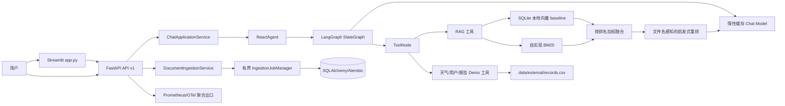

# 当前工程状态

## 审计范围与结论

本页记录 2026-08-02 对 `main` 分支工作区的实测结果。工作区仍保留用户未提交修改：`README.md` 被修改、两份 `docs/rag_quality_*.md` 被删除，`AGENT.md`、`todo.md` 未跟踪。本轮不覆盖或恢复这些内容；本页只描述已提交代码和实际执行结果。

当前项目是 Streamlit 演示客户端加 FastAPI API-first 服务、LangGraph Agent、SQLite 本地 baseline/Qdrant Hybrid RAG、PostgreSQL/Alembic 持久化和可观测性栈。Compose 中 PostgreSQL、迁移、Qdrant、精简 API、Collector、Prometheus、Grafana 和带 Badger 持久卷的 Jaeger 已完成真实启动与端到端验收；`workers` profile 的 Redis 7.4/Celery 独立 worker 已真实完成上传、解析、确定性 dense+sparse 写入、候选验证和租户级 alias 切换。默认依赖漏洞已收口；真实语义 embedding、生产容量和受管 trace backend 仍待完成。

## 运行环境与依赖

- 初始审计 shell 的解释器为 Python 3.13.13；该环境混用全局 site-packages 与 `.local_deps/`，不作为受支持运行环境。
- 受支持开发版本由 `.python-version` 固定为 Python 3.10.20；当前执行环境是 Python 3.13，`scripts/check_environment.py` 因版本不符而失败，不能把本机结果当作 Python 3.10 验收。
- `requirements-dev.txt` 同时引用 `requirements.txt` 与 `requirements-api.txt`，显式包含 API 组合根所需的 `uvicorn==0.52.0`，并固定 pytest、pytest-asyncio、Ruff、Mypy、types-PyYAML、Coverage 和 pip-audit；`scripts/check_environment.py` 会拒绝非 Python 3.10、未精确固定、缺失或版本不一致的直接依赖。
- `requirements.lock` 和 `requirements-dev.lock` 固定传递依赖，包含直接认证依赖 `PyJWT==2.13.0`；Python 3.10.20 锁定环境与远端 CI 已完成 clean-install/环境门禁验证。
- 目标环境普通导入 `app` 不再加载 Agent、模型、RAG 或本地向量库；Streamlit 执行 `main()` 后才构建 Agent，RAG 服务可用单飞后台任务预加载 SQLite baseline，首次检索等待显式超时并传播失败。
- 旧 `.local_deps/` 目录仍存在但已不再由评测/报告脚本自动插入 `sys.path`；初始行为曾覆盖目标环境中的正确二进制包并导致 RAGAS 导入失败。
- Python 3.13 下环境检查失败；支持矩阵固定 Python 3.10，不能用本机解释器替代 CI 验收。
- `pypdf`、Streamlit、Pillow、LangChain、LangGraph、LangChain-OpenAI、LangChain-HuggingFace、Sentence Transformers 和 Transformers 已固定；本地向量 baseline 已迁移到 SQLite，默认锁不再安装 ChromaDB、RAGAS、Datasets 或 DiskCache。`pip-audit -r requirements.txt` 实测无已知漏洞。

## 当前架构与核心调用链

### 在线问答链路

1. `app.py` 把 Streamlit 执行封装在 `main()`；普通 Python import 不加载业务模块，Streamlit 首次 session 才创建 `ReactAgent`。
2. `ReactAgent` 首次显式构造时通过缓存工厂创建聊天模型；测试可直接注入 fake model 和工具列表。
3. 导入 `agent.tools.agent_tools` 不再加载 RAG 模块；首次调用 `rag_summarize` 才创建并缓存 `RagSummarizeService`。
4. `RagSummarizeService.__init__` 不扫描文档或写入本地 SQLite；首次检索通过有界单飞后台加载任务执行，等待显式超时并传播失败。可注入 FastAPI 的 RAG 服务由 lifespan 启动后台加载，readiness 在加载中/失败时失败关闭；默认工具缓存仍是进程内本地索引。
5. `ReactAgent` 创建 `agent -> tools -> agent` 的 LangGraph 循环；每次执行传入默认 10 的 `recursion_limit`，并累计限制默认最多 5 次工具调用。application service、Agent 节点和工具副作用前检查统一 deadline/cancellation guard；已经进入的同步外部调用仍只能依靠各自 timeout，Python 线程不能被安全强杀。
6. 模型按工具调用结果继续循环。普通模型调用是同步 `invoke`；两类 provider 共享 120 秒默认超时，OpenAI-compatible 还显式设置最多 2 次 SDK 重试。
7. FastAPI SSE 通过 `ChatApplicationService` 发送稳定的 metadata/token/completed/error 事件，metadata 返回 conversation ID，客户端断开和超时有测试；Streamlit 可通过 `STREAMLIT_MODE=http` 消费该 SSE 并复用会话 ID，默认仍是进程内兼容模式，不代表上游 token streaming。
8. FastAPI 可注入内存或 SQLAlchemy conversation repository；数据库配置时 lifespan 逆序释放 repository，Streamlit 默认仍只保留当前进程 session state。

### RAG 链路

1. 知识文件来自 `data/` 下的 TXT/PDF，运行时同步加载，处理过的文件哈希记录在 `md5.txt`。
2. Dense 路径使用 SQLite 本地向量 baseline + 延迟加载的本地 Hugging Face embedding；生产多租户路径使用 Qdrant。
3. Sparse 路径使用仓库自实现的 BM25 公式和中英文 tokenization。
4. 当前“混合检索”按 `weight / rank` 合并两路结果，不是标准分数归一化，也不是带 `rrf_k` 的正式 RRF 实现。
5. `LightweightEvidenceReranker` 依据原排名、内容 token/字符重合排序，不读取来源文件名或评测标签；离线 `source_recall` 仍只在评测阶段计算，不能反向影响排序。
6. 生成链将问题和全文片段拼入 Prompt，要求模型返回 `【资料N】`。引用验证目前只检查编号是否落在文档数组范围内，不验证结论是否被被引片段支持。

### 模型和工具链路

- `utils.settings.Settings` 集中读取并校验应用环境、日志级别、模型 provider/密钥/传输、Agent 最大步骤/工具次数以及未来 API 的 host/port/CORS；密钥使用 `SecretStr`，生产环境拒绝通配 CORS。
- `model.factory` 通过可注入的 `Settings` 构建 OpenAI-compatible 或仓库自定义 Anthropic-compatible 同步适配器；`MODEL_PROVIDER` 为规范变量，旧 `LLM__PROVIDER` 仍可兼容读取。
- `model.factory` 暴露缓存的惰性访问函数，模块导入不再加载业务 YAML 或创建聊天/嵌入模型；`ReactAgent`、`RagSummarizeService` 和 `VectorStoreService` 均支持显式依赖注入。
- RAG/本地向量/Prompt/Agent YAML 使用 `yaml.safe_load` 和禁止未知字段的 Pydantic schema；数值范围、URL、文件/目录及跨字段关系启动即校验，旧 dict 接口继续兼容。
- YAML 中的 SQLite 向量、数据、MD5、Prompt 和 CSV 路径统一相对项目根目录解析为绝对路径，不再依赖启动 cwd；配置仍在首次相关模块加载时读取，完整 composition-root 加载留到 FastAPI 阶段。
- 模型请求默认验证 TLS；企业私有 CA 只能通过 `MODEL_CA_BUNDLE` 指向已有 PEM 文件，非法路径启动即失败，不提供关闭验证的开关。
- 工具包括本地 RAG、静态天气、随机位置、随机用户 ID、当前月份和本地 CSV 报告数据；API 可注入 JWT authenticator/audit sink，开发模式仍允许显式 `x-tenant-id`，高风险工具审批和副作用幂等仍未完成。
- `agent/tools/middleware.py` 已按锁定 LangGraph 版本接入 ReactAgent 的 ToolNode sync/async wrapper；日志只写工具名、参数键/类型和异常类型，仍不写原始参数或正文。

### 评测链路

1. `scripts/evaluate_rag.py` 读取 YAML 与 JSONL 数据集。
2. 可选择 SQLite hybrid 或不依赖 embedding 的 BM25；答案可来自 LLM、参考答案或本地抽取器。
3. 本地指标按来源标签（仅离线 `expected_sources`）或预期关键词判定相关性，并计算若干启发式/代理指标；这些标签不进入重排。
4. RAGAS 默认关闭；显式启用时要求 `--ack-external-judge`，minimal 模式仍会向外部评审发送问题、回答和参考答案，需要业务数据出境审批。
5. 结果写入被 `.gitignore` 排除的 `output/`，仍可能包含问题、答案、参考答案、召回全文、元数据和本机路径；不得把本地 artifact 当作可提交报告。

## 能力矩阵

| 能力 | 当前状态 | 证据或说明 |
|---|---|---|
| Streamlit UI | 已实现且普通导入无业务资源副作用 | `app.py`；默认 local 兼容模式，也可通过 `STREAMLIT_MODE=http` 调用 FastAPI SSE；实际启动后首次 RAG 调用仍可能初始化本地 SQLite |
| 基础 LangGraph Agent | 已实现 Demo | `agent/react_agent.py` |
| 工具调用 | 已实现有界 Demo | 每次 Agent 执行默认最多请求 5 次工具；无权限/幂等边界 |
| SQLite 本地向量检索 | 已实现离线 baseline | `rag/local_vector_store.py` 提供持久化、scope filter、相似度检索和 LangChain retriever；生产多租户检索使用 Qdrant |
| BM25 检索 | 已实现并可离线运行 | `rag/simple_bm25.py` |
| 启发式重排 | 已实现无来源名特征的确定性 baseline | `rag/reranker.py`、`docs/evaluation/retrieval-leakage.md` |
| RAG 回归样本 | 有 28 条主集和 6 条 focus 集，但未版本化/冻结 | `data/evaluation/*.jsonl` |
| FastAPI / API v1 / SSE | 已实现聊天、基础 SSE、内存会话和启动生命周期边界 | `src/app/main.py` 提供应用工厂，`src/app/server.py:build_server_app()` 在显式 server 启动时延迟构造 Agent，并提供 request ID、liveness/readiness、可注入 RAG 的 lifespan 单飞加载、`POST /api/v1/chat`、SSE、可注入的进程内 conversation repository 和资源关闭；`python -m src.app.server` 可启动真实组合根 |
| PostgreSQL / Alembic | 已实现当前阶段 | Compose PostgreSQL 16、一次性 Alembic migration、会话/文档/job/审批 repository、readiness、重启恢复和真实容器集成均已验证；当前 schema head 为 `0012_add_ingestion_job_leases` |
| Redis / Celery | 已实现真实跨进程入库链路 | `workers` profile 真实完成 PostgreSQL job → Redis → Celery → 共享上传卷 → Qdrant；JSON contract、late ack、worker-lost、lease/fencing、有限 retry/timeout/jitter 和幂等 point upsert 已测试；默认 hash embedding 仅是无模型工程 baseline |
| Qdrant / hybrid filter | 已实现当前阶段 | Compose Qdrant 1.18.3 healthy；真实 dense+sparse/RRF 查询强制 tenant/index 并覆盖 document/product/language/effective-date filter；SQLite/BM25 baseline 保留 |
| LangGraph checkpoint | 已实现当前阶段 | `PostgresSaver` 由应用生命周期管理，tenant/conversation 映射为稳定 thread ID；持久化中断、审批恢复和重启恢复均有 fake/真实 PostgreSQL 测试 |
| 用户/会话持久化 | 部分实现 | FastAPI 可选 SQLAlchemy 会话和入库 job 持久化；Streamlit 默认仍为进程内 session |
| JWT / RBAC | 已实现当前边界 | 生产组合根从 `JWT_SECRET/JWT_ISSUER/JWT_AUDIENCE` 自动接入；tenant 一致性、审计和稳定 401/403 已测试；文档/索引/取消/run 变更限定 operator/admin，审批限定 approver/admin |
| 多租户隔离 | 部分实现 | API conversation/document/job/retrieval 路径有 tenant filter；Streamlit/本地工具和跨服务部署仍非完整隔离 |
| OpenTelemetry | 已实现本地持久化 backend 边界 | W3C `traceparent`、HTTP/Agent/LLM/RAG dense/sparse/fusion/rerank/工具/Worker span 与 timeout-bounded OTLP gRPC 已接线；Collector → Jaeger Badger trace 查询已实测；生产仍需受管 backend/retention |
| Prometheus / metrics endpoint | 已实现当前阶段 | `/metrics` 与 `/metrics/prometheus` 暴露有界 HTTP/模型/RAG/工具/Worker 聚合指标；真实 Prometheus target 为 up，Grafana health 正常；进程重启会归零 |
| Docker Compose | 已实现当前里程碑 | PostgreSQL、migration、Qdrant、精简 API 和 `observability` profile 已配置；API、live/ready/OpenAPI、Prometheus scrape、Collector trace、Grafana health 均真实验证 |
| CI | 已实现当前里程碑 | run `30739365944` 全部通过：依赖、Compose/迁移、PostgreSQL/Qdrant、格式、Lint、Mypy、全量测试、评测、质量门禁和完整依赖审计均成功；此前缺少 `uvicorn` 的收集错误已修复 |
| 压测 | 部分实现 | `scripts/run_load_smoke.py` 支持 fake API 10 请求/并发 2；不是生产压测，暂无 Locust/k6 |

## 当前复核基线（2026-08-02）

以下结果来自本次工作区实际执行；用户未提交文件仍未纳入提交或恢复。

| 命令 | 实际结果 |
|---|---|
| `python -m pytest -q --basetemp output/pytest-stage4-full` | 通过：427 passed，6 skipped，26 subtests；当前 shell 为 Python 3.13 |
| 容器集成测试 | 通过：5 passed | Python 3.10 API 镜像连接真实 PostgreSQL 16/Qdrant 1.18.3，验证恢复、并发 claim 和 hybrid 隔离 |
| `python -m ruff format --check .` | 通过：278 个 Python 文件已格式化 |
| `python -m ruff check .` | 通过 |
| `python -m mypy agent rag model evaluation utils scripts src app.py` | 通过：113 个源码文件 |
| `python -m mypy tests` | 通过：119 个测试源码文件 |
| `python scripts/scan_secrets.py` | 通过：Secret scan OK |
| `python -m pip check` | 通过：No broken requirements found |
| 外部调用 timeout 定向审计 | 通过：51 passed，6 subtests；未发现需立即补齐的生产 timeout 缺口 |
| Job claim/recovery 定向审计 | 通过 | 唯一 claim、queued 恢复、heartbeat/lease/fencing、过期 reclaim 与 stale generation 拒绝已验证 |
| PostgreSQL/container 集成 | 通过 | PostgreSQL healthy，migration exit 0，API healthy；live/ready/OpenAPI 均 200；真实 PostgreSQL checkpoint/审批重启和双 worker 唯一 claim 共 4 个集成测试通过 |
| `python scripts/run_deterministic_regression.py` | 通过并生成 deterministic summary |
| `python scripts/run_red_team_regression.py` | 通过：4/4 |
| `python scripts/run_load_smoke.py --requests 10 --concurrency 2` | 通过：fake API smoke，错误率 0 |
| `python -m evaluation.dataset_manifest` | 通过：28 samples，SHA-256 `e69c930f...f45b5c7` |
| `python -m pip_audit -r requirements.txt --format json` | 通过：No known vulnerabilities found；默认依赖已移除 ChromaDB/RAGAS/DiskCache |
| PostgreSQL backup/restore drill | 通过：60 个 dump 对象，恢复库 Alembic head `0012_add_ingestion_job_leases`，11 个 public tables |
| fake capacity baseline | 通过：100 请求/并发 10，0 错误；吞吐 548.62 req/s，p50 15.84 ms，p95 25.66 ms | 仅本地 fake ASGI smoke，不是生产容量结论 |
| `python scripts/run_worker_ingestion_smoke.py --deadline-seconds 60` | 通过 | Python 3.10 容器真实完成 API → PostgreSQL → Redis → Celery → 共享卷 → Qdrant；document/index job completed、document active、`model_calls=0` |
| `python scripts/check_environment.py --requirements requirements-dev.txt` | 失败：当前 Python 3.13，不符合 Python 3.10 支持矩阵 |
| `docker compose config --quiet` / observability config | 通过：静态配置 |
| Observability stack E2E | 通过：API、Collector、Prometheus、Grafana 均 healthy；Prometheus target up，Collector 收到 API trace batches |
| Docker API build / Docker Desktop | 未通过：BuildKit daemon EOF，随后 Docker Desktop unable to start/超时 |

## 历史审计结果（已过期，不作为当前状态）

| 命令 | 结果 | 分类与说明 |
|---|---|---|
| `python --version` | 成功：3.13.13 | 当前环境 |
| `python -m pip check` | 成功：No broken requirements found | 只检查全局已安装分发，不能发现 `.local_deps` 混用或未安装的 requirements |
| `python -m pip install --dry-run --ignore-installed -r requirements.txt` | 失败 | 依赖/环境问题：Python 3.13 下 NumPy 约束冲突 |
| `python -m unittest discover -s tests -v` | 成功：25/25 | 仅现有单元测试 |
| `python -m pytest -q` | 成功：25/25 | 与 unittest 覆盖相同测试集 |
| `python -m compileall -q agent rag model evaluation utils scripts tests` | 成功 | 仅语法编译，不证明导入或运行正确 |
| `python -c "import app"` | 失败 | 环境问题：`streamlit` 未安装 |
| 使用 `.local_deps` 导入 `agent.react_agent` | 失败 | 历史审计结果；`.local_deps` 已不再由脚本注入，受支持环境改为 `ics` |
| 使用 `.local_deps` 导入 `agent.tools.middleware` | 失败 | 历史审计结果；当前受支持环境下 `agent.tools.middleware` 可导入但未接线 |
| `python scripts/scan_secrets.py` | 成功 | 扫描当前源码；未发现疑似有效凭证 |
| `python scripts/scan_secrets.py --include-private-env` | 失败：1 条 | 本地 `.env` 有疑似真实凭证；文件已忽略且未进入 Git，建议轮换 |
| Git 历史 blob 脱敏扫描 | 成功 | 三个可达提交中未发现当前规则可识别的凭证 |
| `python -m ruff check .` / `ruff format --check` | 未执行成功 | 工具未安装 |
| `python -m black --check .` | 未执行成功 | 工具未安装 |
| `python -m mypy .` | 未执行成功 | 工具未安装 |
| `python -m pip_audit -r requirements.txt` | 未执行成功 | 工具未安装 |
| `python -m coverage ...` | 未执行成功 | 工具未安装 |
| 离线 BM25 全量评测 | 成功：28/28 | 未调用 LLM/RAGAS；产物见 `output/audit_baseline_offline/20260801_131255/` |

阶段 1 后续验证使用 Python 3.10.20 `ics` 环境：

| 命令 | 结果 | 分类与说明 |
|---|---|---|
| `python scripts/check_environment.py --requirements requirements.txt` | 成功 | Python 3.10，20 个直接运行依赖精确匹配，`pip check` 成功 |
| `python scripts/check_environment.py --requirements requirements-dev.txt` | 成功 | 34 个直接运行/开发依赖精确匹配，包含 API 入口 `uvicorn` |
| `pip install --dry-run --ignore-installed -r requirements-dev.lock` | 成功 | Python 3.10 clean dry-run，锁定的传递依赖可解析 |
| `python -m pytest -q` | 成功：165 passed，23 subtests | 包含依赖隔离、配置/路径、惰性初始化、RAG 显式加载/后台单飞/超时、冻结 regression schema、Recall@K/MRR/NDCG 确定性手算、regression report 版本/完整性/Git 元数据、quality gate 通过/失败/阈值校验、deterministic BM25 summary、Qdrant point 归一化与 baseline/candidate 对比、迁移 artifact/候选回退门禁、ingestion job 幂等/状态/取消/超时/retry、progress/attempt/cancel_requested API 与协作取消、上传文件名/MIME/大小/编码/PDF 签名校验、原子安全落盘/路径隔离、验证→落盘→job 串联、content hash 文档去重/版本元数据、metadata 状态与 job 联动、SQLAlchemy document/job repository 跨实例恢复、持久化组合根与 service 重启查询、文档/job API contract、DATABASE_URL API 跨实例恢复、持久化 job 取消/恢复/孤儿失败、RRF 手算/去重/稳定排序、RRF adapter 配置切换、统一 RetrievalResult tenant/index 契约、Cross-Encoder adapter 候选上限/超时/降级、Qdrant adapter scope/ready/timeout/batch/alias/rollback/cleanup smoke、FastAPI 健康边界/Chat API/SSE/内存会话/取消/生命周期/会话查询/统一错误/租户隔离、SQLAlchemy repository、Alembic migration、迁移索引与 EXPLAIN smoke、repository 组合根、数据库 URL/readiness、事务/并发、API 重启恢复、乐观版本冲突、API 冲突契约、数据库连接池配置、user/status/agent_runs schema、Agent run 生命周期、幂等键去重、Agent run 分页过滤、Agent 上限、模型适配器、PDF/UI、LangGraph/Chroma 兼容和子进程安全测试 |
| `python -m ruff check .` | 成功 | 仓库 `pyproject.toml` 固定精确规则集，全仓零诊断 |
| `python -m ruff format --check .` | 成功：68 files already formatted | 已完成全仓 Python 格式基线 |
| `python -m mypy agent rag model evaluation utils scripts tests app.py` | 成功：59 source files | 仓库配置固定 Python 3.10、缺失类型依赖和包基线规则 |
| `python -m coverage run -m pytest -q && coverage report` | 成功：42% | 仅统计源码、启用 branch coverage；`fail_under=41` 已设置为当前真实基线 |
| `python -m pip_audit -r requirements.txt` | 失败：3 条/3 包 | 剩余涉及 `chromadb`、`ragas` 和 `diskcache`；未使用忽略规则 |
| 最终依赖修复后 `python -m pytest -q` | 成功：254 passed，23 subtests | 按 `requirements.txt` 补齐并对齐 LangGraph/LangChain/Chroma/Streamlit；secret scan、compileall、应用 import smoke、`git diff --check` 同步通过 |
| 本轮增量验收 | 成功：167 passed，23 subtests | 新增 `IngestionWorker.recover_queued()` queued 任务原 job_id 恢复、tenant 隔离与 running orphan 不重复执行测试；上方 165 条为审计时历史基线 |

## 可复现指标基线

本节中的早期离线评测数字保留用于审计追溯，不代表当前提交的质量提升；当前可复核的测试、覆盖率、红队和 fake load 结果见上方“当前复核基线”。

审计时执行的是 `--retriever bm25 --no-generate --no-ragas`。答案直接取参考答案，因此只有检索类数字可作为当前实现的 smoke 观测；答案 F1、相似度、引用和正确性不能作为模型质量。

| 指标 | 当前值 | 可用性说明 |
|---|---:|---|
| 测试数量 / 通过率 | 165 / 100% | 覆盖环境/配置/路径、惰性初始化、RAG 显式加载/后台单飞/超时、冻结 regression schema、Recall@K/MRR/NDCG 确定性手算、regression report 版本/完整性/Git 元数据、quality gate 通过/失败/阈值校验、deterministic BM25 summary、Qdrant point 归一化与 baseline/candidate 对比、迁移 artifact/候选回退门禁、ingestion job 幂等/状态/取消/超时/retry、progress/attempt/cancel_requested API 与协作取消、上传文件名/MIME/大小/编码/PDF 签名校验、原子安全落盘/路径隔离、验证→落盘→job 串联、content hash 文档去重/版本元数据、metadata 状态与 job 联动、SQLAlchemy document/job repository 跨实例恢复、持久化组合根与 service 重启查询、文档/job API contract、DATABASE_URL API 跨实例恢复、持久化 job 取消/恢复/孤儿失败、RRF 手算/去重/稳定排序、RRF adapter 配置切换、统一 RetrievalResult tenant/index 契约、Cross-Encoder adapter 候选上限/超时/降级、Qdrant adapter scope/ready/timeout/batch/alias/rollback/cleanup smoke、FastAPI 健康边界/Chat API/SSE/内存会话/取消/生命周期/会话查询/统一错误/租户隔离、SQLAlchemy repository、Alembic migration、迁移索引与 EXPLAIN smoke、repository 组合根、数据库 URL/readiness、事务/并发、API 重启恢复、乐观版本冲突、API 冲突契约、数据库连接池配置、user/status/agent_runs schema、Agent run 生命周期、幂等键去重、Agent run 分页过滤、模型传输、PDF/UI、LangGraph/Chroma 兼容和子进程安全；仍没有完整 Agent/API/RAG 集成覆盖 |
| 主评测集样本 | 28 | 非冻结、无 dataset version |
| Focus 评测集样本 | 6 | 非隐藏集 |
| 标准 Recall@1/3/5/10 | 尚未测量 | 当前 `retrieval_recall=0.754252` 是关键词组覆盖率，不是标准 Recall@K |
| MRR | 0.857143（历史值） | 旧产物的 top-3 BM25 + 启发式重排结果，不能作为当前无泄漏 baseline |
| Source recall | 0.678571（历史值） | 旧产物的离线来源标签指标；当前仍可计算，但不参与重排 |
| Citation validity | 已拆分格式指标 | `answer_citation_validity` 只校验编号范围；`answer_citation_support` 是词元重合 proxy，不是 entailment |
| 平均响应延迟 | 尚未测量 | runner 未记录耗时 |
| p95 延迟 | 尚未测量 | runner 未记录逐样本耗时 |
| 每请求 token | 尚未测量 | provider usage 未统一采集 |
| 每请求成本 | 尚未测量 | 无价格快照和 usage 记录 |

README 中的评测表能在本地未跟踪的旧产物找到同值，但产物包含绝对路径、未记录 Git commit/dirty state、未版本化数据集，且生成时的旧重排实现使用来源文件名做特征。因此这些历史数值不能作为独立、无泄漏的质量提升证据；当前代码已删除该特征，需用冻结数据集重新生成可采信报告。

## 主要技术债与安全风险

完整清单见 [TECH_DEBT.md](TECH_DEBT.md)。优先级最高的风险是：

1. 默认运行依赖的 `pip-audit` 已通过且不再安装 `chromadb`、`ragas`、`diskcache`；可选 `requirements-ragas-lite.txt` 仍须隔离审计和数据出境审批。
2. Python 3.13 不在支持矩阵；当前 shell 环境检查因此失败，但 Python 3.10 锁定依赖、远程环境门禁和集成测试已通过。
3. Agent 步骤和工具调用已有代码级上限，但请求没有全流程 deadline/cancellation，工具副作用也没有幂等控制。
4. 随机用户身份与本地报告数据没有认证、授权和租户隔离。
5. 历史评测曾使用来源文件名，当前重排已移除该特征；README 中旧质量提升数字仍不能视为独立证据，需等待新 artifact。
6. RAG 服务构造已不再扫描/入库；首次 RAG 检索由单飞后台任务执行并受超时约束，API readiness、取消传播和入库 worker 关闭已有基线，但真实外部向量服务仍未纳入部署验收。
7. 日志中可能记录工具参数、消息正文或供应商原始错误，缺少脱敏。

## 测试、可观测性、部署和数据状态

- 测试：当前 shell 使用仓库专用 basetemp 实测 431 passed、6 skipped、26 subtests；真实 Anthropic-compatible 合成租户模拟已完成 5/5 smoke 和 30 次受控批次（29/30 词项匹配、0 泄漏），美元成本仍需 provider billing 对账。真实客户数据、生产负载和语义质量未验证。
- 可观测性：request ID、W3C traceparent、HTTP/Agent/LLM/RAG/工具/Worker span、有界 Prometheus JSON/text 指标、METRICS_TOKEN、OTLP HTTPS 配置和脱敏 JSON API access log 已实现；开发 Collector → Jaeger Badger backend 端到端传输和 trace 查询已验证，生产仍需受管 retention/认证。
- 部署：Compose PostgreSQL、Qdrant、migration、精简 API 和 observability profile 已真实 healthy，并完成 scrape/OTLP 验收；完整生产栈未完成。
- 持久化：会话、Agent checkpoint、审批和入库任务已进入 PostgreSQL/Alembic；默认本地 baseline 使用 SQLite，生产检索使用 Qdrant。备份恢复已演练，多副本一致性仍未验证。

## 最可能被面试官质疑的问题

1. README 的历史提升数字如何排除文件名泄漏、开发集调参和参考答案复用？当前已通过移除来源名特征降低一项风险，但旧 artifact 仍不可追溯，需重跑冻结评测。
2. 为什么叫“流式”但模型并未 token streaming？当前 FastAPI/Streamlit 只传递 Agent 完整 chunks，Streamlit 已不再逐字符 sleep；HTTP/SSE 模式已可选接入，但上游 token streaming、取消和背压仍未验证。
3. Agent 如何防止无限工具循环、超时和重复副作用？步骤/工具次数、全流程 deadline、协作式取消、持久化审批和幂等状态机已有确定性边界；限制是无法强杀已进入的同步外部调用。
4. 随机 user ID 如何代表真实登录用户，如何防止读取其他人的报告？当前没有安全边界。
5. 如何部署、扩容和恢复会话？当前首次 RAG 请求仍写本地 Chroma，session 只在单进程内存。
6. 企业私有 CA 如何接入而不关闭 TLS？当前通过显式 PEM 路径创建验证客户端，路径无效时 fail-fast。
7. 72 个环境/配置/路径/惰性初始化/RAG 显式加载/Agent 上限/模型适配/PDF/UI/LangGraph/Chroma 兼容测试为何能证明 Agent/RAG 主链可靠？当前不能证明。

## 四里程碑最终验收补充（2026-08-02）

- 提交 `d71156d` 已推送到 `origin/main`，中文标签为 `里程碑四-发布闭环超时与测试门禁修正`；此前三个里程碑也各有中文标签并已推送。
- 远端 GitHub Actions run `30739759294` 的 Docker build、Compose 配置/迁移、PostgreSQL/Qdrant 集成、格式、Lint、源码/测试 Mypy、全量测试、覆盖率、数据集、deterministic/red-team/load/quality gate、完整依赖审计和 artifact 清理均通过。
- 默认依赖安全门禁已解除旧 ChromaDB/RAGAS/DiskCache 阻塞；可选 RAGAS 仍不进入默认 CI，需单独审计和数据出境审批。

## 当前自动修改范围（四里程碑已收口）

适合继续做小步、测试先行的改造，但前提是：

- 保留并避开当前用户未提交修改；
- 在受支持 Python 3.10 环境复核 clean install 和 CI（已完成，后续依赖变更仍需重复）；
- 先修复依赖漏洞、首次 RAG 同步入库和全流程 deadline/cancellation；
- 继续以 fake Agent 和本地集成测试推进；PostgreSQL/Qdrant/Celery/真实 OTLP 已有容器 E2E，但仍不得把本地 smoke 扩大为生产容量或质量结论。
