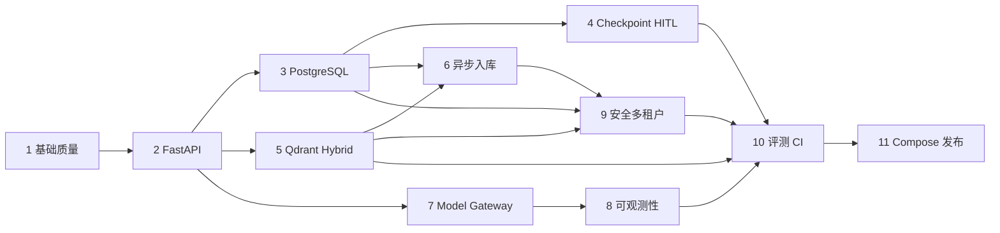

# 工程级 Agentic RAG 渐进升级执行计划

- 状态：Active
- 建立日期：2026-08-01
- 当前阶段：阶段 2（FastAPI 服务化）
- 依据：根目录 `AGENT.md`、`todo.md` 与真实代码审计
- 当前约束：保留用户未提交修改；默认测试不调用付费模型；每阶段独立验收和回滚

## 目标与范围裁决

`todo.md` 从 FastAPI 到发布准备包含八个大阶段。根目录 `AGENT.md` 对本轮设置了更严格边界：先审计、建立基线、补充工程文档和计划，只允许轻量配置、路径或文档修复。因此本轮交付阶段 1 的文档/基线部分，不在同一批变更中假装完成 FastAPI。

下一批实现从阶段 1 剩余的依赖、TLS、配置、上限和测试工具开始；这些前置项通过后才进入阶段 2 FastAPI。后续 11 个阶段覆盖 `todo.md` 的全部目标：

## 全局实施规则

- 路由、UI 回调和 Celery task 只负责协议/调度，不承载核心业务逻辑。
- 任何网络、模型、数据库、向量库和 parser 调用都有连接/读取或任务超时。
- Agent step、query rewrite、工具次数、重试和任务 attempt 都由程序设置上限。
- 副作用操作使用持久化幂等键和状态机；文档只宣称 at-least-once + 业务幂等。
- tenant context 是所有 repository/cache/retriever/job 方法的必填参数。
- 新行为先有 fake/本地测试；live provider 测试必须显式开关和数据出境确认。
- 不从 README 反推实现；每次验收从代码、测试、命令输出和 artifact 取证。
- 每阶段结束检查完整 diff，不混入下一阶段框架或无用途组件。

## 阶段 1：基础质量和项目规范

### 目标

让项目在声明的 Python 版本中可重复安装、导入、静态检查和离线验证；消除会影响所有后续阶段的 TLS、路径、全局副作用和无限执行风险。

### 涉及模块和文件

- 根配置：`requirements*.txt`，后续新增 `pyproject.toml` 或约束/锁文件、统一命令入口。
- 配置/模型：`utils/config_handler.py`、`utils/path_tool.py`、`model/factory.py`。
- Agent/RAG：`agent/react_agent.py`、`agent/tools/agent_tools.py`、`rag/rag_service.py`、`rag/vector_store.py`。
- 测试：现有 `tests/`，逐步分为 unit/import/integration/evaluation。
- 文档：`docs/CURRENT_STATE.md`、`docs/ARCHITECTURE.md`、ADR、执行计划、`docs/TECH_DEBT.md`。

### 可验证步骤与顺序

1. 已完成：记录 Git、依赖、调用链、测试、评测、安全和能力矩阵。
2. 已完成：忽略运行评测产物，修复 QUICKSTART 个人绝对路径。
3. 建立干净 Python 3.10 或 3.11 环境，确认 requirements 可解；选择并记录唯一支持矩阵。
4. 建立运行/开发依赖分组和可重复锁定方式，移除 `.local_deps` 的运行时 `sys.path` 注入。
5. 删除全局 TLS 禁用；增加 CA bundle 的显式、安全配置。
6. 引入集中、类型化 Settings，兼容现有 YAML；校验 timeout、max steps、路径和 URL。
7. 把 model、RAG 和工具从 import-time 单例改为 composition root 延迟构建；导入不写磁盘。
8. 在 Agent adapter 增加最大步骤、最大工具数和 deadline；不依赖 Prompt 执行限制。
9. 配置 formatter、lint、type check、coverage 和依赖审计，并提供一个真实可用的统一入口。

### 关键设计决策

- 先固定 Python/框架版本，再修改 LangGraph API；不在同一变更中升级大版本。
- Settings 允许旧 YAML 作为过渡输入，但环境变量、类型和范围只由一个对象解释。
- 依赖由应用工厂/composition root 构造，业务模块不保留 import-time 外部资源单例。

### 不应修改的范围

- 不引入 FastAPI 路由、数据库、Qdrant、Redis、Celery 或微服务。
- 不改变 RAG 算法指标或删除现有 baseline。
- 不覆盖当前 README 用户改动和已删除文档。

### 风险和兼容性

- 固定框架版本可能暴露未使用 middleware 与当前 API 不兼容；应删除或在目标版本上重写，不做兼容猜测。
- 延迟初始化会改变现有 import 副作用；保留显式 `create_*` 兼容函数并新增启动测试。
- TLS 修复可能让使用自签代理的开发环境失败；用受控 CA bundle 解决，不恢复全局跳过验证。

### 测试方案

- clean install/dry-run、核心模块 import、非根 cwd 路径测试。
- Settings 合法/非法值、环境覆盖和 secret 不回显。
- Agent 最大步骤、工具次数和 deadline 单元测试，全部使用 fake model/tool。
- import 不创建/修改 Chroma 或 MD5 文件的测试。
- formatter、lint、type check、unit tests、secret scan、dependency audit。

### 验收标准

- 声明的 Python 版本能从空环境安装；不依赖 `.local_deps`。
- `import app` 或新 composition module 不访问网络、不写索引且成功。
- TLS 默认验证；所有 Agent/工具循环有代码级上限。
- 统一质量命令真实可运行，默认不调用外部模型。

### 回滚方式

按子步骤独立提交；若依赖锁定或初始化改造回归，回滚该提交并保留审计文档。不得恢复 TLS 禁用；应回滚到最后安全版本并标记阻塞。

### 依赖阶段

无；后续所有阶段依赖本阶段。

### 面试讲解点

依赖可复现、composition root、import side effect、deadline 与 recursion limit、为什么 Prompt 不能充当执行上限。

## 阶段 2：FastAPI 服务化

### 目标

增加 API-first 服务层，同时保留 Streamlit 演示；建立稳定 schema、异常、request ID、健康检查和可取消 SSE。

### 涉及模块和文件

- 新增 `src/app/api/`、`src/app/application/chat.py`、`src/app/domain/conversations.py`。
- Agent adapter 包裹现有 `ReactAgent`；内存 conversation repository 作为明确的临时实现。
- `app.py` 增加 HTTP/SSE 客户端模式；新增 `docs/api/README.md` 和环境示例。

### 关键设计决策

- 应用工厂接收依赖覆盖，测试不加载真实模型/Chroma。
- 非流式与 SSE 共用 application service；路由不初始化模型、不运行复杂 Agent。
- SSE 使用稳定 JSON envelope，`completed` 最多一次；断开和 deadline 传播到 runner。
- readiness 检查配置和必要 adapter 的可用性；liveness 不访问昂贵依赖。

### 不应修改的范围

- 不增加 PostgreSQL、JWT、Qdrant 或 Celery。
- 不重写 Agent/RAG 算法；只增加 adapter 和边界。

### 风险和兼容性

- 同步 LangChain 调用可能阻塞事件循环；放入受控线程边界或提供异步 adapter，并限制并发。
- ASGI 取消与底层同步 SDK 取消语义不同；记录不能立即中止的限制。
- Streamlit 两种模式可能行为漂移；用 contract tests 校验事件/答案一致性。

### 测试方案

- 应用导入、liveness、readiness 成功/失败、schema 422、统一错误、request ID。
- SSE metadata/token/citation/tool/completed 正常流、中途错误、单次完成、Agent timeout 和客户端取消。
- fake Agent API 集成测试，断言不会构造真实 LLM。

### 验收标准

- FastAPI 可独立启动，Streamlit 仍可演示。
- 错误响应有稳定 code/request ID，不返回堆栈。
- 所有请求有 deadline；SSE 断开不继续无限工作。
- 路由无业务编排，API 测试不使用付费模型。

### 回滚方式

保留进程内 Streamlit feature flag；若 API 不稳定，回滚 API entrypoint，不回滚阶段 1 的边界和安全修复。

### 依赖阶段

依赖阶段 1。

### 面试讲解点

应用工厂、依赖注入、SSE vs WebSocket、ASGI cancellation、readiness vs liveness、稳定错误契约。

## 阶段 3：PostgreSQL 会话持久化

### 目标

用 PostgreSQL + Alembic 持久化 tenant、user、conversation、message 和 agent run；服务重启后可恢复会话。

### 涉及模块和文件

- `src/app/domain/` repository protocols 与实体。
- `src/app/infrastructure/postgres/` session factory、repository、unit of work。
- `migrations/` Alembic；API conversation endpoints。

### 关键设计决策

- UUID、UTC timestamp、tenant_id、状态、必要唯一约束和乐观版本。
- 每请求独立 session；外部模型/向量调用期间不持有数据库事务。
- repository 方法强制 tenant context，不让 route 自行拼 filter。

### 不应修改的范围

- 暂不加入 LangGraph checkpoint、审批、Qdrant 或 Redis cache。
- 不自动 `create_all` 代替 migration。

### 风险和兼容性

- 从内存会话迁移无可靠历史数据；将其声明为非迁移的开发数据。
- schema 变化和并发消息追加可能冲突；使用 migration rehearsal 与明确并发策略。

### 测试方案

- PostgreSQL 容器 migration upgrade/downgrade（仅对可逆 migration）。
- 会话创建、追加、排序、恢复、版本冲突、数据库错误映射。
- 跨 tenant 读取/写入负向测试；服务重启模拟。

### 验收标准

- API Worker 重启后读取相同 conversation/thread 映射。
- migration 可在空库和上一版本库重复执行。
- 所有会话查询默认 tenant 隔离，路由无 SQL。

### 回滚方式

应用可切回内存 repository 仅用于开发；生产回滚使用经演练的前一版本应用和兼容 migration，不删除用户数据。

### 依赖阶段

依赖阶段 2。

### 面试讲解点

repository/UoW、事务边界、Alembic、乐观并发、tenant-by-construction。

## 阶段 4：LangGraph checkpoint 与 Human-in-the-loop

### 目标

把自由 ReAct 逐步迁为显式、有界、版本化工作流；加入 PostgreSQL checkpoint、thread 恢复、工具幂等与高风险审批。

### 涉及模块和文件

- `src/app/agent/state.py`、`nodes/`、`workflow.py`、`policies.py`。
- checkpoint adapter、tool execution/approval repository 和 API。

### 关键设计决策

- 先按实际锁定 LangGraph 版本验证 checkpoint API。
- 工具执行保存标准化参数、risk、idempotency key 和状态机。
- 权限/风险策略在确定性代码中；模型不能绕过 interrupt。
- at-least-once 执行配合唯一键和结果复用，不宣称 exactly-once。

### 不应修改的范围

- 不同时引入复杂多 Agent、Kafka 或 GraphRAG。
- 不把每个 Prompt 步骤都建表；只持久化恢复和审计所需状态。

### 风险和兼容性

- workflow/state schema 升级可能无法读取旧 checkpoint；保存 workflow version 并提供迁移/安全失败。
- 超时后底层调用可能迟到；完成写入必须检查 run 状态和幂等键。

### 测试方案

- checkpoint 恢复、进程重启、最大 step/rewrite/tool 次数、全流程 deadline。
- 工具重复投递、并发审批、拒绝、过期、批准后恢复、越权审批。
- 故障状态可观察且不会继续副作用。

### 验收标准

- 服务重启可恢复安全状态；旧 workflow 不兼容时安全失败。
- 高风险工具未经审批不能执行；相同幂等键不重复产生业务副作用。
- 每个循环和重试有上限。

### 回滚方式

按 workflow version 保留上一编译图；暂停新 run，完成/迁移旧 run 后切回。数据库只做向后兼容扩展，审批记录不删除。

### 依赖阶段

依赖阶段 3；复用阶段 2 deadline/cancellation。

### 面试讲解点

checkpoint 内容、interrupt/resume、状态机版本、幂等与 exactly-once 边界。

## 阶段 5：Qdrant 混合检索和重排

### 目标

建立可插拔 Dense/Sparse/RRF/Cross-Encoder pipeline，并在无文件名泄漏的冻结数据集上与 Chroma/BM25 baseline 对比。

### 涉及模块和文件

- `src/app/rag/` protocols、result schema、fusion、reranker、selector。
- `src/app/infrastructure/qdrant/` collection/alias/filter adapter。
- `evaluation/datasets/regression/` 与消融 runner。

### 关键设计决策

- 统一结果含 chunk/document/tenant/document version/index version 和分阶段分数。
- Qdrant adapter 内强制 tenant/index filter；调用者不能省略。
- RRF 使用 rank 而不直接相加异构原始分数；参数和稳定 tie-break 可测试。
- Cross-Encoder 可关闭、有候选上限/批量/超时，失败明确降级并记录。

### 不应修改的范围

- 保留 Chroma/BM25 adapter 和原 baseline，直到新方案验收。
- 不用文件名、评测标签或 expected source 作为运行时相关性特征。

### 风险和兼容性

- embedding 维度和模型变化需要新 index；禁止混写。
- CPU reranker 可能增加 p95；设候选上限并单独测量。
- 数据集曾用于调参；新增冻结 regression/hidden 分离。

### 测试方案

- tenant/metadata/index version filter、空结果、Qdrant 不可用。
- RRF 手算、重复去重、单路为空、稳定排序。
- reranker timeout/明确降级/批量上限。
- 五组消融：baseline、dense、sparse、RRF、RRF+reranker。

### 验收标准

- baseline 和新实现走统一接口；任何向量查询带 tenant filter。
- 报告记录数据/commit/config/model/K/index/延迟，不编造提升。
- 运行时特征不含来源文件名捷径。

### 回滚方式

配置切回 Chroma/BM25 adapter；Qdrant active alias 不删除，候选 index 可丢弃。

### 依赖阶段

依赖阶段 2；tenant 强制隔离最终依赖阶段 9。建议在阶段 3 后执行。

### 面试讲解点

Dense/Sparse 互补、RRF、Bi-Encoder vs Cross-Encoder、数据泄漏和消融设计。

## 阶段 6：异步文档入库

### 目标

把上传、解析、切分、embedding、候选索引验证和 alias 切换移出请求进程，使用 Celery + Redis 实现可取消、有界、幂等流水线。

### 涉及模块和文件

- document/job API 与 application services。
- `src/app/workers/` Celery app、task、ingestion state machine。
- document/job/index metadata repository；Qdrant alias 管理。

### 关键设计决策

- 上传只校验、用不可预测 ID 保存、记录 job 并入队。
- 内容哈希 + parser/chunker/embedding/index version 定义复用边界。
- 有限指数退避 + jitter；永久错误不重试；task 有 soft/hard time limit。
- 蓝绿 index 验证成功后原子切 alias；旧 index 保留可回滚窗口。

### 不应修改的范围

- 不在 FastAPI Worker 中同步批量 embedding。
- 不使用用户文件名作为磁盘路径；不引入 Kafka。

### 风险和兼容性

- late ack/worker lost 造成重复投递；所有步骤必须可重入。
- parser 处理不可信文件可能资源耗尽；隔离、页数/大小/超时限制。
- alias 切换与 metadata 提交需可恢复协调，避免半完成。

### 测试方案

- 文件大小/MIME/扩展/路径穿越/压缩炸弹、重复上传。
- parser 超时/失败、embedding 429/永久错误、worker lost、重复投递、cancel。
- 部分批次、构建失败保持旧索引、切换、rollback、跨 tenant job。

### 验收标准

- 请求进程不执行长耗时入库；job 状态可查询。
- 重复任务不产生错误重复数据；所有重试/任务有上限和超时。
- 新索引失败不影响 active 查询。

### 回滚方式

停止消费新任务，切回旧 alias；保留 job/error 记录；回滚 Worker 代码但不删除上传和索引版本元数据。

### 依赖阶段

依赖阶段 3 和 5。

### 面试讲解点

Celery delivery semantics、幂等任务、文件安全、蓝绿索引和维度迁移。

## 阶段 7：Model Gateway、缓存、限流与降级

### 目标

从业务代码抽离供应商 SDK，统一模型请求/响应/usage/error，加入可测试路由、超时、有限重试、fallback、预算、Redis cache 和配额。

### 涉及模块和文件

- `src/app/domain/model.py` protocols/value objects。
- `src/app/infrastructure/models/` provider adapters。
- `src/app/application/model_gateway.py`、Redis cache/quota/rate limit。

### 关键设计决策

- 错误分类决定是否重试；400/认证/权限/内容确定性错误不重试。
- 每次请求有 deadline，provider timeout 不能超过剩余预算。
- cache key 包含 tenant、规范化 query、相关会话 hash、prompt/model/params/index/tool/locale。
- 个性化、权限和高风险工具请求默认不缓存。

### 不应修改的范围

- 不在 Prompt 中隐藏路由/配额规则。
- 不用进程内计数器宣称分布式限流。

### 风险和兼容性

- fallback 模型语义/工具能力不同；routing policy 必须验证 capability。
- cache 可能跨版本或跨租户返回旧数据；key 和失效机制先测试。
- 费用估算依赖价格版本；记录估算来源，不当作账单。

### 测试方案

- 正常、timeout、429 backoff、400 不重试、fallback、全失败、malformed output。
- budget/quota/concurrency、cache hit/miss/version invalidation/stampede、敏感不缓存。

### 验收标准

- 业务模块不直接初始化供应商 SDK；所有模型调用有 timeout 和有限重试。
- fallback、usage、估算成本和 cache 状态可追踪。
- cache/quota 不跨 tenant，多 Worker 下规则有效。

### 回滚方式

路由配置切回单一 adapter；禁用 cache/fallback；保留统一接口，避免业务重新依赖供应商对象。

### 依赖阶段

依赖阶段 2；完整 tenant/cache 依赖阶段 3 和 9。

### 面试讲解点

错误分类、deadline budgeting、circuit breaker、cache key、stampede、成本治理。

## 阶段 8：可观测性

### 目标

建立结构化脱敏日志、OpenTelemetry trace 与 Prometheus 指标，覆盖 API、Agent、RAG、LLM、工具和 Worker。

### 涉及模块和文件

- `src/app/observability/` logging、metrics、tracing。
- API middleware、Agent/RAG/Gateway/Worker instrumentation。
- 后续 `deploy/observability/` collector、Prometheus、Grafana、trace backend。

### 关键设计决策

- request/trace/tenant/conversation/run/job ID 作为日志字段；Prometheus 不使用高基数字段。
- 不记录 Authorization/Cookie/key/完整 Prompt/私有全文/PII。
- Worker 使用 trace context link/propagation；重试作为同一逻辑 job 的关联事件。

### 不应修改的范围

- 不把“组件能启动”等同于应用已传 trace/metrics。
- 不把 query、user_id、conversation_id、document_id 做 metric label。

### 风险和兼容性

- 过度 instrumentation 增加延迟和存储；采样、直方桶和属性白名单可配置。
- 异常对象可能含 provider 内容；记录前安全映射。

### 测试方案

- request ID/trace propagation、Worker link、脱敏日志捕获。
- 指标名称/label 白名单、SSE disconnect、timeout/retry/fallback、RAG 分段耗时。
- collector/Prometheus scrape 集成 smoke。

### 验收标准

- 一次请求可定位 Agent、检索、重排、LLM 和工具耗时。
- metrics 可抓取且无高基数/敏感 label；日志不含测试注入的 secret/PII。

### 回滚方式

关闭 exporter/降低采样；保留本地结构化日志。instrumentation 故障不得阻断主请求。

### 依赖阶段

依赖阶段 2 和 7；Worker 指标依赖阶段 6。

### 面试讲解点

trace/span 边界、context propagation、Prometheus cardinality、脱敏与可观测开销。

## 阶段 9：JWT/RBAC 与多租户安全

### 目标

建立认证、授权、tenant isolation、工具策略、PII 脱敏和审计日志；默认安全失败。

### 涉及模块和文件

- `src/app/security/` JWT validation、principal、RBAC/policy、redaction。
- 所有 PostgreSQL/Qdrant/Redis/job/tool repository 与 API dependencies。
- `docs/security/threat-model.md`、tenant isolation 说明。

### 关键设计决策

- 使用成熟 JWT 库，验证签名、issuer、audience、expiration；不自创密码算法。
- principal 显式携带 tenant/roles；repository 接口要求 tenant，不依赖路由记得过滤。
- 高风险工具 allowlist、参数 schema、审批和权限全部由程序检查。

### 不应修改的范围

- 不把 RBAC 规则散落在路由或 Prompt。
- 不用单元测试中的 SQLite 代替全部 PostgreSQL tenant 集成测试。

### 风险和兼容性

- 开启认证会破坏现有匿名 Demo；提供仅开发环境的明确 fake principal，生产环境禁止。
- tenant migration 若缺字段可能暴露旧数据；先回填/验证再加非空约束。

### 测试方案

- 缺 token、过期、错误 audience/issuer、角色不足、401/403 契约。
- DB/vector/cache/job/eval 全链跨 tenant 负向测试。
- Prompt injection、恶意工具参数、超次数、绕过审批、PII 日志脱敏。

### 验收标准

- 所有关键资源和缓存键绑定 tenant；跨租户测试默认拒绝。
- 高风险工具不能绕过授权/审批；日志、trace、metrics 无敏感内容。

### 回滚方式

不得在生产回滚为匿名开放；若认证发布失败，回滚整个版本或只保留受限维护入口。数据库 tenant 字段不删除。

### 依赖阶段

依赖阶段 3、5、6、7；复用阶段 8 审计能力。

### 面试讲解点

401 vs 403、tenant-by-construction、向量/缓存隔离、Prompt injection 与确定性授权。

## 阶段 10：自动评测和 CI

### 目标

建立版本化 dev/regression/hidden/red-team 数据集、统一评测 manifest、确定性质量门禁和 CI；补齐 API/Agent/RAG/安全回归。

### 涉及模块和文件

- `evaluation/datasets/`、runner、schema validator、reports。
- `tests/unit|integration|contract|evaluation/`。
- `.github/workflows/`、统一开发命令、artifact 上传。

### 关键设计决策

- 指标明确标注 deterministic/proxy/LLM judge/human label。
- run manifest 记录 commit、dirty state、dataset/config/prompt/workflow/index/model 版本、错误、延迟、token/cost。
- CI 默认只跑 fake/deterministic；live model/RAGAS 为手动 workflow，并要求外发确认。
- quality threshold 先基于无泄漏 baseline 设置，支持绝对值和相对回退。

### 不应修改的范围

- 不用 hidden set 调参；不把关键词命中命名为事实正确率。
- 不写死结果以通过门禁，不缓存错误的评测 artifact。

### 风险和兼容性

- 小样本波动会导致脆弱门禁；同时使用最小覆盖率、错误率和 paired regression。
- LLM judge 有非确定性/偏差；单独报告，不作为默认 CI 唯一门禁。

### 测试方案

- 数据 schema/版本/重复 ID/泄漏校验。
- Retrieval Recall@K/MRR/NDCG/source、generation grounding/citation/refusal、Agent route/tool/security。
- CI formatter、lint、type、unit/integration/migration/secret/dependency/Docker build。

### 验收标准

- 任何公开指标可追溯 artifact；deterministic CI 不调用付费模型。
- CI 能阻止明确质量回退、跨租户泄漏和 forbidden tool 执行。
- baseline/candidate 可由统一命令复现。

### 回滚方式

门禁阈值异常时回滚阈值配置而不删除失败结果；数据集版本只新增，不原地改写已发布版本。

### 依赖阶段

贯穿所有阶段，完整门禁依赖阶段 4、5、8、9。

### 面试讲解点

数据集分层、评测泄漏、paired regression、LLM-as-a-Judge 偏差、质量门禁设计。

## 阶段 11：Docker Compose、压测和发布文档

### 目标

提供可重复的本地多服务环境、健康检查、优雅关闭、备份恢复/事故手册、fake-model 压测和真实 release readiness 报告。

### 涉及模块和文件

- Dockerfiles、`compose.yaml`、`deploy/` observability/config/provisioning。
- API/Streamlit/Worker/PostgreSQL/Redis/Qdrant/OTel/Prometheus/Grafana/trace backend。
- load tests、operations/security/interview/release 文档。

### 关键设计决策

- 镜像不含密钥，尽量 non-root；配置按环境注入。
- healthcheck 区分 live/ready；依赖顺序不代替应用重试和 readiness。
- 压测默认 fake model，场景覆盖非流式、SSE、会话和 job；live 显式开关。

### 不应修改的范围

- 不声称 Compose 等于生产级编排或高并发证明。
- 不在没有真实命令/产物时填写 benchmark。

### 风险和兼容性

- Windows/Linux volume、字体和路径差异；CI 在 Linux 构建，文档覆盖 PowerShell。
- 资源较重；提供最小 profile 和可配置 limits。

### 测试方案

- clean build、Compose config/health、migration、API/SSE/job smoke。
- graceful shutdown、服务故障恢复、Qdrant/Redis/Postgres 短暂不可用。
- k6/Locust smoke 记录 users/spawn/duration/host/fake-live 和 p50/p95/p99/error。

### 验收标准

- 一条真实命令启动开发环境；所有服务有 healthcheck。
- 新用户按 README 能运行 fake smoke；无个人路径、密钥或本地数据进镜像。
- release readiness 中每项测试/指标都有命令、结果和 artifact，未执行项明确标注。

### 回滚方式

镜像/compose 使用版本 tag；保留上一套 migration-compatible 配置和 Qdrant alias；部署回滚不删除 volume。

### 依赖阶段

依赖阶段 10 和所有运行时基础设施阶段。

### 面试讲解点

容器健康与优雅关闭、故障恢复、压测边界、如何诚实证明或否定“高并发”。

## 当前阶段验收记录

截至 2026-08-01，本轮已完成：

- 全仓只读审计和 25 项测试基线。
- 28 条不调用 LLM/RAGAS 的 BM25 评测 smoke。
- 当前/目标架构、升级 ADR、技术债和本执行计划。
- 识别 Python 3.13 requirements 冲突、应用导入失败、TLS 禁用、Agent 无上限和评测泄漏。
- 轻量文档路径与评测产物忽略修复。
- 固定并验证 Python 3.10.20 与 18 个直接运行依赖；新增开发依赖、环境检查器及其 7 个单元测试。
- 建立 Ruff、Mypy、Coverage 和 pip-audit 工具版本；新增文件的格式、lint 和类型检查通过。
- 删除 5 个质量/评测脚本对 `.local_deps` 的隐式 `sys.path` 注入，并收窄会掩盖损坏安装的 RAGAS 测试跳过条件。
- 首次依赖审计发现 13 个包共 84 条已知漏洞记录，未使用忽略规则掩盖，列为下一修复目标。
- 删除全局 TLS 验证绕过；模型调用默认验证证书，支持显式私有 CA，并统一校验请求超时和 OpenAI-compatible 重试上限；完整测试 41 项通过。
- 新增集中、可注入的 Pydantic Settings，校验应用环境、日志、模型 provider/密钥/传输、Agent 最大步骤及未来 API 的 host/port/CORS；兼容 `LLM__PROVIDER`，生产环境拒绝通配 CORS；完整测试 48 项通过。
- 删除聊天模型、RAG 和 Chroma 的 import-time 构造；增加缓存惰性工厂和构造器注入，普通 `import app` 不加载业务资源，首次 RAG 调用才显式初始化；完整测试 53 项通过。
- 将 Settings 的 Agent 最大步骤接入 LangGraph `recursion_limit`，新增工具调用总数上限、超限批次拒绝和安全终止消息；fake model/graph 回归覆盖，完整测试 58 项通过。
- 四份业务 YAML 改为 `safe_load` + 严格 Pydantic schema，校验未知字段、范围、URL、路径和跨字段关系；Chroma/data/MD5/Prompt/CSV 路径统一锚定项目根并保留 dict 兼容接口；完整测试 64 项通过。
- 新增仓库级 `pyproject.toml`，全仓 64 个 Python 文件格式化、Ruff 零诊断、Mypy 55 个源码文件零错误；收窄宽泛异常、明确时区与本地子进程 1800 秒上限；65 个测试通过，源码 branch coverage 真实基线为 39%。
- 将 `pypdf` 从 5.1.0 升级到 6.14.2，并增加真实 PDF 加载兼容测试；pip-audit 从 84 条/13 包降至 49 条/12 包，66 个测试通过，剩余漏洞继续按兼容组处理。
- 将 Streamlit 从 1.40.1 升级到 1.54.0，并显式固定 Pillow 12.3.0；新增无外部模型调用的 AppTest 启动回归，pip-audit 降至 22 条/10 包，67 个测试通过。
- 将 LangChain/LangGraph 生态迁移到 LangChain 1.3.9、LangChain Core 1.4.7、LangGraph 1.2.10、LangChain-Chroma 1.1.0、ChromaDB 1.3.7、LangChain-OpenAI 1.1.14 和 LangChain-HuggingFace 1.2.2；保留与 RAGAS 0.4.3 兼容的 LangChain-Community 0.3.31；新增 middleware import、Agent 图编译和临时 Chroma 写入/检索兼容测试，完整测试 70 项通过，源码 branch coverage 为 40%，pip-audit 降至 8 条/4 包。
- 将 Sentence Transformers 从 3.3.1 升级到 5.2.0，并显式固定 Transformers 5.14.1；HuggingFace adapter 导入、clean dry-run、70 项测试、40% branch coverage、AppTest、secret scan 和离线 BM25 smoke 均通过，pip-audit 降至 3 条/3 包。
- 拆开 `RagSummarizeService` 构造与文档入库副作用，新增单飞 `start_document_loading()` 后台任务、显式超时和失败传播；74 项测试通过，源码 branch coverage 为 41%，AppTest、secret scan、离线 BM25 smoke 和 pip-audit 均按预期完成。
- 阶段 2 首个目标进行中：新增 FastAPI 应用工厂、request ID、liveness/readiness 和可注入检查；默认工厂不构造模型或 Chroma，API 边界测试使用 `TestClient` 和 fake readiness。
- 阶段 2 第二个目标完成：新增严格 `ChatRequest`/`ChatResponse`/`ErrorResponse`、可注入 `ChatApplicationService`、有限 timeout 和 `POST /api/v1/chat`；6 个 API 测试覆盖成功、422、未配置和 timeout 错误。
- 阶段 2 第三个目标完成：新增基础 SSE envelope（`metadata`/`token`/`completed`/`error`）和 `POST /api/v1/chat/stream`；fake Agent contract 测试确认完成事件最多一次，生产同步 Agent 的底层取消限制已记录。
- 阶段 2 第四个目标完成：新增线程安全进程内 `ConversationRepository`、严格可选 `conversation_id`、消息顺序追加和重用会话测试；服务重启丢失数据的限制明确留给阶段 3 PostgreSQL。
- 阶段 2 第五个目标完成：增加原生异步 Agent runner、取消原样传播和 SSE 断开检查；同步 Agent 的线程取消限制已保留并记录，9 个 API/取消测试通过。
- 阶段 2 第六个目标完成：新增 `python -m src.app.server` 启动入口、FastAPI lifespan 资源逆序关闭和启动 smoke；10 个 API/lifecycle 测试通过。
- 阶段 2 第七个目标完成：新增 `GET /api/v1/conversations/{conversation_id}` 只读查询和稳定 404 错误，11 个 API 测试通过；持久化仍留给阶段 3。
- 阶段 2 第八个目标完成：统一 422、HTTPException 和未处理异常为 `code/message/request_id` 契约，并验证不泄漏堆栈或供应商错误详情；13 个 API 测试通过。
- 阶段 2 第九个目标完成：将聊天、SSE、会话查询拆到 `src/app/api/routes.py`，`main.py` 仅保留工厂、健康检查、生命周期和错误中间件；既有 API contract tests 保持通过。
- 阶段 3 首个目标完成：进程内会话 repository 的创建、读取和追加均强制 `tenant_id`，API 从 `x-tenant-id` 注入上下文并新增跨租户拒绝测试；JWT/RBAC 和 PostgreSQL 留在后续目标。
- 阶段 3 第二个目标完成：新增 SQLAlchemy 会话/消息模型和 repository adapter，支持 PostgreSQL URL，SQLite 内存测试验证持久化顺序与 tenant 过滤；Alembic migration 和生产连接配置留在下一目标。
- 阶段 3 第三个目标完成：加入 Alembic 配置和首个 conversations/messages revision，SQLite 空库 upgrade/downgrade smoke 通过；生产 PostgreSQL 仅通过 `DATABASE_URL` 注入，未在默认测试中启动外部服务。
- 阶段 3 第四个目标完成：应用工厂支持 `chat_agent` + `DATABASE_URL` 组合根选择 SQLAlchemy 或内存 repository，并将创建的 repository 纳入 lifespan 关闭；默认无 agent/数据库时仍无外部副作用。
- 阶段 3 第五个目标完成：`DATABASE_URL` 支持矩阵校验，SQLAlchemy repository 提供 `SELECT 1` readiness，应用 readiness 自动使用数据库检查；无配置时仍保持内存模式。
- 阶段 3 第六个目标完成：SQLAlchemy append 增加角色/长度校验，非法消息不落库；SQLite 文件并发追加 20 条消息全部提交，事务边界测试通过。
- 阶段 3 第七个目标完成：API 集成测试执行 Alembic upgrade，使用两个独立 app/lifespan 实例验证 SQLite `DATABASE_URL` 下 conversation/message 跨重启恢复与 tenant 查询。
- 阶段 3 第八个目标完成：conversation 增加 version 字段与 Alembic 0002 revision，SQLAlchemy/内存 repository 支持 expected version 冲突检测；API 恢复测试验证消息版本为 2。
- 阶段 3 第九个目标完成：Chat API 接受 `expected_version`，stale 写入映射为 409 `conversation_conflict`，并新增客户端冲突 contract 测试。
- 阶段 3 第十个目标完成：集中校验数据库池大小、溢出、池等待、连接超时和隔离级别；PostgreSQL engine 接收这些参数，SQLite 路径保持兼容，并有参数 contract 测试。
- 阶段 3 第十一个目标完成：SQLAlchemy readiness 校验 `SELECT 1` 与 Alembic 当前 revision；migration head 为 ready，downgrade 或缺失版本为 not ready。
- 阶段 3 第十二个目标完成：Alembic 0003 增加 conversation user/status 和 agent_runs 表，API 重启恢复测试验证 user_id/status；默认请求兼容 local/active。
- 阶段 3 第十三个目标完成：增加 Agent run 创建、查询、状态更新和失败原因 API，限制状态集合并覆盖跨租户拒绝；Alembic 0004 增加 error 字段。
- 阶段 3 第十四个目标完成：Chat application service 自动关联 run_id，执行成功/冲突/超时/取消都会更新 run 状态，Chat 响应返回可查询的 run_id。
- 阶段 3 第十五个目标完成：Agent run 支持 tenant-scoped `Idempotency-Key`，重复 Chat 不创建第二条 run，Alembic 0005 增加唯一索引并通过 API contract 测试。
- 阶段 3 第十六个目标完成：集中定义 Agent run 状态跃迁，内存/SQLAlchemy/API 均拒绝终态回退，返回 `run_state_conflict`。
- 阶段 3 第十七个目标完成：Agent run 记录 started/completed 时间和 duration_ms，Alembic 0006 增加 timing 字段，API 查询返回耗时审计信息。
- 阶段 3 第十八个目标完成：增加 tenant-scoped Agent run 分页列表，支持状态和创建时间范围过滤，默认 limit 50、最大 100，避免无限制全表读取。
- 阶段 3 第十九个目标完成：为 Agent run 列表增加 tenant/status/time 复合索引，Alembic 0007 与 SQLite EXPLAIN smoke 验证查询使用索引，降低过滤分页退化为全表扫描的风险。
- 阶段 3 第二十个目标完成：新增独立 RRF 融合原语，按 rank 融合异构检索结果、去重并保持稳定 tie-break；保留现有加权 Hybrid baseline，后续再接入统一检索协议。
- 阶段 3 第二十一个目标完成：RRF 以显式 `fusion_strategy=rrf` 接入现有 Chroma/BM25 adapter，默认仍使用 weighted baseline，并增加 adapter smoke 测试与可配置 `rrf_k`。

阶段 1 已完成可在仓库内闭环的验收项：Python 3.10 传递依赖锁、clean dry-run、RAG 有界后台加载和 41% 覆盖率回归阈值。`chromadb`、`ragas`、`diskcache` 的 3 条上游漏洞仍使 pip-audit 失败，已记录为发布阻塞风险，不用 ignore 掩盖。现在自动开始阶段 2 的首个独立目标：建立不依赖真实模型的 FastAPI 应用工厂与 liveness/readiness 边界。
