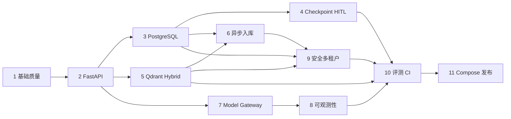

# 工程级 Agentic RAG 渐进升级执行计划

- 状态：四里程碑闭环完成；生产化收口和分布式任务边界已完成，生产观测与权限收口待实施
- 建立日期：2026-08-01
- 当前阶段：目标二（Redis/Celery 跨进程边界）已完成，自动进入目标三
- 依据：根目录 `AGENT.md`、`todo.md` 与真实代码审计
- 当前约束：保留用户未提交修改；默认测试不调用付费模型；每阶段独立验收和回滚

## 目标与范围裁决

`todo.md` 从 FastAPI 到发布准备包含八个大阶段。根目录 `AGENT.md` 对本轮设置了更严格边界：先审计、建立基线、补充工程文档和计划，只允许轻量配置、路径或文档修复。因此本轮交付阶段 1 的文档/基线部分，不在同一批变更中假装完成 FastAPI。

下一批实现从阶段 1 剩余的依赖、TLS、配置、上限和测试工具开始；这些前置项通过后才进入阶段 2 FastAPI。后续 11 个阶段覆盖 `todo.md` 的全部目标：

## 全局实施规则

- 路由、UI 回调和 Celery task 只负责协议/调度，不承载核心业务逻辑。
- 任何网络、模型、数据库、向量库和 parser 调用都有连接/读取或任务超时。
- Agent step、query rewrite、工具次数、重试和任务 attempt 都由程序设置上限。
- 副作用操作使用持久化幂等键和状态机；文档只宣称 at-least-once + 业务幂等。
- tenant context 是所有 repository/cache/retriever/job 方法的必填参数。
- 新行为先有 fake/本地测试；live provider 测试必须显式开关和数据出境确认。
- 不从 README 反推实现；每次验收从代码、测试、命令输出和 artifact 取证。
- 每阶段结束检查完整 diff，不混入下一阶段框架或无用途组件。

## 阶段 1：基础质量和项目规范

### 目标

让项目在声明的 Python 版本中可重复安装、导入、静态检查和离线验证；消除会影响所有后续阶段的 TLS、路径、全局副作用和无限执行风险。

### 涉及模块和文件

- 根配置：`requirements*.txt`，后续新增 `pyproject.toml` 或约束/锁文件、统一命令入口。
- 配置/模型：`utils/config_handler.py`、`utils/path_tool.py`、`model/factory.py`。
- Agent/RAG：`agent/react_agent.py`、`agent/tools/agent_tools.py`、`rag/rag_service.py`、`rag/vector_store.py`。
- 测试：现有 `tests/`，逐步分为 unit/import/integration/evaluation。
- 文档：`docs/CURRENT_STATE.md`、`docs/ARCHITECTURE.md`、ADR、执行计划、`docs/TECH_DEBT.md`。

### 可验证步骤与顺序

1. 已完成：记录 Git、依赖、调用链、测试、评测、安全和能力矩阵。
2. 已完成：忽略运行评测产物，修复 QUICKSTART 个人绝对路径。
3. 建立干净 Python 3.10 或 3.11 环境，确认 requirements 可解；选择并记录唯一支持矩阵。
4. 建立运行/开发依赖分组和可重复锁定方式，移除 `.local_deps` 的运行时 `sys.path` 注入。
5. 删除全局 TLS 禁用；增加 CA bundle 的显式、安全配置。
6. 引入集中、类型化 Settings，兼容现有 YAML；校验 timeout、max steps、路径和 URL。
7. 把 model、RAG 和工具从 import-time 单例改为 composition root 延迟构建；导入不写磁盘。
8. 在 Agent adapter 增加最大步骤、最大工具数和 deadline；不依赖 Prompt 执行限制。
9. 配置 formatter、lint、type check、coverage 和依赖审计，并提供一个真实可用的统一入口。

### 关键设计决策

- 先固定 Python/框架版本，再修改 LangGraph API；不在同一变更中升级大版本。
- Settings 允许旧 YAML 作为过渡输入，但环境变量、类型和范围只由一个对象解释。
- 依赖由应用工厂/composition root 构造，业务模块不保留 import-time 外部资源单例。

### 不应修改的范围

- 不引入 FastAPI 路由、数据库、Qdrant、Redis、Celery 或微服务。
- 不改变 RAG 算法指标或删除现有 baseline。
- 不覆盖当前 README 用户改动和已删除文档。

### 风险和兼容性

- 固定框架版本可能暴露未使用 middleware 与当前 API 不兼容；应删除或在目标版本上重写，不做兼容猜测。
- 延迟初始化会改变现有 import 副作用；保留显式 `create_*` 兼容函数并新增启动测试。
- TLS 修复可能让使用自签代理的开发环境失败；用受控 CA bundle 解决，不恢复全局跳过验证。

### 测试方案

- clean install/dry-run、核心模块 import、非根 cwd 路径测试。
- Settings 合法/非法值、环境覆盖和 secret 不回显。
- Agent 最大步骤、工具次数和 deadline 单元测试，全部使用 fake model/tool。
- import 不创建/修改 Chroma 或 MD5 文件的测试。
- formatter、lint、type check、unit tests、secret scan、dependency audit。

### 验收标准

- 声明的 Python 版本能从空环境安装；不依赖 `.local_deps`。
- `import app` 或新 composition module 不访问网络、不写索引且成功。
- TLS 默认验证；所有 Agent/工具循环有代码级上限。
- 统一质量命令真实可运行，默认不调用外部模型。

### 回滚方式

按子步骤独立提交；若依赖锁定或初始化改造回归，回滚该提交并保留审计文档。不得恢复 TLS 禁用；应回滚到最后安全版本并标记阻塞。

### 依赖阶段

无；后续所有阶段依赖本阶段。

### 面试讲解点

依赖可复现、composition root、import side effect、deadline 与 recursion limit、为什么 Prompt 不能充当执行上限。

## 阶段 2：FastAPI 服务化

### 目标

增加 API-first 服务层，同时保留 Streamlit 演示；建立稳定 schema、异常、request ID、健康检查和可取消 SSE。

### 涉及模块和文件

- 新增 `src/app/api/`、`src/app/application/chat.py`、`src/app/domain/conversations.py`。
- Agent adapter 包裹现有 `ReactAgent`；内存 conversation repository 作为明确的临时实现。
- `app.py` 增加 HTTP/SSE 客户端模式；新增 `docs/api/README.md` 和环境示例。

### 关键设计决策

- 应用工厂接收依赖覆盖，测试不加载真实模型/Chroma。
- 非流式与 SSE 共用 application service；路由不初始化模型、不运行复杂 Agent。
- SSE 使用稳定 JSON envelope，`completed` 最多一次；断开和 deadline 传播到 runner。
- readiness 检查配置和必要 adapter 的可用性；liveness 不访问昂贵依赖。

### 不应修改的范围

- 不增加 PostgreSQL、JWT、Qdrant 或 Celery。
- 不重写 Agent/RAG 算法；只增加 adapter 和边界。

### 风险和兼容性

- 同步 LangChain 调用可能阻塞事件循环；放入受控线程边界或提供异步 adapter，并限制并发。
- ASGI 取消与底层同步 SDK 取消语义不同；记录不能立即中止的限制。
- Streamlit 两种模式可能行为漂移；用 contract tests 校验事件/答案一致性。

### 测试方案

- 应用导入、liveness、readiness 成功/失败、schema 422、统一错误、request ID。
- SSE metadata/token/citation/tool/completed 正常流、中途错误、单次完成、Agent timeout 和客户端取消。
- fake Agent API 集成测试，断言不会构造真实 LLM。

### 验收标准

- FastAPI 可独立启动，Streamlit 仍可演示。
- 错误响应有稳定 code/request ID，不返回堆栈。
- 所有请求有 deadline；SSE 断开不继续无限工作。
- 路由无业务编排，API 测试不使用付费模型。

### 回滚方式

保留进程内 Streamlit feature flag；若 API 不稳定，回滚 API entrypoint，不回滚阶段 1 的边界和安全修复。

### 依赖阶段

依赖阶段 1。

### 面试讲解点

应用工厂、依赖注入、SSE vs WebSocket、ASGI cancellation、readiness vs liveness、稳定错误契约。

## 阶段 3：PostgreSQL 会话持久化

### 目标

用 PostgreSQL + Alembic 持久化 tenant、user、conversation、message 和 agent run；服务重启后可恢复会话。

### 涉及模块和文件

- `src/app/domain/` repository protocols 与实体。
- `src/app/infrastructure/postgres/` session factory、repository、unit of work。
- `migrations/` Alembic；API conversation endpoints。

### 关键设计决策

- UUID、UTC timestamp、tenant_id、状态、必要唯一约束和乐观版本。
- 每请求独立 session；外部模型/向量调用期间不持有数据库事务。
- repository 方法强制 tenant context，不让 route 自行拼 filter。

### 不应修改的范围

- 暂不加入 LangGraph checkpoint、审批、Qdrant 或 Redis cache。
- 不自动 `create_all` 代替 migration。

### 风险和兼容性

- 从内存会话迁移无可靠历史数据；将其声明为非迁移的开发数据。
- schema 变化和并发消息追加可能冲突；使用 migration rehearsal 与明确并发策略。

### 测试方案

- PostgreSQL 容器 migration upgrade/downgrade（仅对可逆 migration）。
- 会话创建、追加、排序、恢复、版本冲突、数据库错误映射。
- 跨 tenant 读取/写入负向测试；服务重启模拟。

### 验收标准

- API Worker 重启后读取相同 conversation/thread 映射。
- migration 可在空库和上一版本库重复执行。
- 所有会话查询默认 tenant 隔离，路由无 SQL。

### 回滚方式

应用可切回内存 repository 仅用于开发；生产回滚使用经演练的前一版本应用和兼容 migration，不删除用户数据。

### 依赖阶段

依赖阶段 2。

### 面试讲解点

repository/UoW、事务边界、Alembic、乐观并发、tenant-by-construction。

## 阶段 4：LangGraph checkpoint 与 Human-in-the-loop

### 目标

把自由 ReAct 逐步迁为显式、有界、版本化工作流；加入 PostgreSQL checkpoint、thread 恢复、工具幂等与高风险审批。

### 涉及模块和文件

- `src/app/agent/state.py`、`nodes/`、`workflow.py`、`policies.py`。
- checkpoint adapter、tool execution/approval repository 和 API。

### 关键设计决策

- 先按实际锁定 LangGraph 版本验证 checkpoint API。
- 工具执行保存标准化参数、risk、idempotency key 和状态机。
- 权限/风险策略在确定性代码中；模型不能绕过 interrupt。
- at-least-once 执行配合唯一键和结果复用，不宣称 exactly-once。

### 不应修改的范围

- 不同时引入复杂多 Agent、Kafka 或 GraphRAG。
- 不把每个 Prompt 步骤都建表；只持久化恢复和审计所需状态。

### 风险和兼容性

- workflow/state schema 升级可能无法读取旧 checkpoint；保存 workflow version 并提供迁移/安全失败。
- 超时后底层调用可能迟到；完成写入必须检查 run 状态和幂等键。

### 测试方案

- checkpoint 恢复、进程重启、最大 step/rewrite/tool 次数、全流程 deadline。
- 工具重复投递、并发审批、拒绝、过期、批准后恢复、越权审批。
- 故障状态可观察且不会继续副作用。

### 验收标准

- 服务重启可恢复安全状态；旧 workflow 不兼容时安全失败。
- 高风险工具未经审批不能执行；相同幂等键不重复产生业务副作用。
- 每个循环和重试有上限。

### 回滚方式

按 workflow version 保留上一编译图；暂停新 run，完成/迁移旧 run 后切回。数据库只做向后兼容扩展，审批记录不删除。

### 依赖阶段

依赖阶段 3；复用阶段 2 deadline/cancellation。

### 面试讲解点

checkpoint 内容、interrupt/resume、状态机版本、幂等与 exactly-once 边界。

## 阶段 5：Qdrant 混合检索和重排

### 目标

建立可插拔 Dense/Sparse/RRF/Cross-Encoder pipeline，并在无文件名泄漏的冻结数据集上与 Chroma/BM25 baseline 对比。

### 涉及模块和文件

- `src/app/rag/` protocols、result schema、fusion、reranker、selector。
- `src/app/infrastructure/qdrant/` collection/alias/filter adapter。
- `evaluation/datasets/regression/` 与消融 runner。

### 关键设计决策

- 统一结果含 chunk/document/tenant/document version/index version 和分阶段分数。
- Qdrant adapter 内强制 tenant/index filter；调用者不能省略。
- RRF 使用 rank 而不直接相加异构原始分数；参数和稳定 tie-break 可测试。
- Cross-Encoder 可关闭、有候选上限/批量/超时，失败明确降级并记录。

### 不应修改的范围

- 保留 Chroma/BM25 adapter 和原 baseline，直到新方案验收。
- 不用文件名、评测标签或 expected source 作为运行时相关性特征。

### 风险和兼容性

- embedding 维度和模型变化需要新 index；禁止混写。
- CPU reranker 可能增加 p95；设候选上限并单独测量。
- 数据集曾用于调参；新增冻结 regression/hidden 分离。

### 测试方案

- tenant/metadata/index version filter、空结果、Qdrant 不可用。
- RRF 手算、重复去重、单路为空、稳定排序。
- reranker timeout/明确降级/批量上限。
- 五组消融：baseline、dense、sparse、RRF、RRF+reranker。

### 验收标准

- baseline 和新实现走统一接口；任何向量查询带 tenant filter。
- 报告记录数据/commit/config/model/K/index/延迟，不编造提升。
- 运行时特征不含来源文件名捷径。

### 回滚方式

配置切回 Chroma/BM25 adapter；Qdrant active alias 不删除，候选 index 可丢弃。

### 依赖阶段

依赖阶段 2；tenant 强制隔离最终依赖阶段 9。建议在阶段 3 后执行。

### 面试讲解点

Dense/Sparse 互补、RRF、Bi-Encoder vs Cross-Encoder、数据泄漏和消融设计。

## 阶段 6：异步文档入库

### 目标

把上传、解析、切分、embedding、候选索引验证和 alias 切换移出请求进程，使用 Celery + Redis 实现可取消、有界、幂等流水线。

### 涉及模块和文件

- document/job API 与 application services。
- `src/app/workers/` Celery app、task、ingestion state machine。
- document/job/index metadata repository；Qdrant alias 管理。

### 关键设计决策

- 上传只校验、用不可预测 ID 保存、记录 job 并入队。
- 内容哈希 + parser/chunker/embedding/index version 定义复用边界。
- 有限指数退避 + jitter；永久错误不重试；task 有 soft/hard time limit。
- 蓝绿 index 验证成功后原子切 alias；旧 index 保留可回滚窗口。

### 不应修改的范围

- 不在 FastAPI Worker 中同步批量 embedding。
- 不使用用户文件名作为磁盘路径；不引入 Kafka。

### 风险和兼容性

- late ack/worker lost 造成重复投递；所有步骤必须可重入。
- parser 处理不可信文件可能资源耗尽；隔离、页数/大小/超时限制。
- alias 切换与 metadata 提交需可恢复协调，避免半完成。

### 测试方案

- 文件大小/MIME/扩展/路径穿越/压缩炸弹、重复上传。
- parser 超时/失败、embedding 429/永久错误、worker lost、重复投递、cancel。
- 部分批次、构建失败保持旧索引、切换、rollback、跨 tenant job。

### 验收标准

- 请求进程不执行长耗时入库；job 状态可查询。
- 重复任务不产生错误重复数据；所有重试/任务有上限和超时。
- 新索引失败不影响 active 查询。

### 回滚方式

停止消费新任务，切回旧 alias；保留 job/error 记录；回滚 Worker 代码但不删除上传和索引版本元数据。

### 依赖阶段

依赖阶段 3 和 5。

### 面试讲解点

Celery delivery semantics、幂等任务、文件安全、蓝绿索引和维度迁移。

## 阶段 7：Model Gateway、缓存、限流与降级

### 目标

从业务代码抽离供应商 SDK，统一模型请求/响应/usage/error，加入可测试路由、超时、有限重试、fallback、预算、Redis cache 和配额。

### 涉及模块和文件

- `src/app/domain/model.py` protocols/value objects。
- `src/app/infrastructure/models/` provider adapters。
- `src/app/application/model_gateway.py`、Redis cache/quota/rate limit。

### 关键设计决策

- 错误分类决定是否重试；400/认证/权限/内容确定性错误不重试。
- 每次请求有 deadline，provider timeout 不能超过剩余预算。
- cache key 包含 tenant、规范化 query、相关会话 hash、prompt/model/params/index/tool/locale。
- 个性化、权限和高风险工具请求默认不缓存。

### 不应修改的范围

- 不在 Prompt 中隐藏路由/配额规则。
- 不用进程内计数器宣称分布式限流。

### 风险和兼容性

- fallback 模型语义/工具能力不同；routing policy 必须验证 capability。
- cache 可能跨版本或跨租户返回旧数据；key 和失效机制先测试。
- 费用估算依赖价格版本；记录估算来源，不当作账单。

### 测试方案

- 正常、timeout、429 backoff、400 不重试、fallback、全失败、malformed output。
- budget/quota/concurrency、cache hit/miss/version invalidation/stampede、敏感不缓存。

### 验收标准

- 业务模块不直接初始化供应商 SDK；所有模型调用有 timeout 和有限重试。
- fallback、usage、估算成本和 cache 状态可追踪。
- cache/quota 不跨 tenant，多 Worker 下规则有效。

### 回滚方式

路由配置切回单一 adapter；禁用 cache/fallback；保留统一接口，避免业务重新依赖供应商对象。

### 依赖阶段

依赖阶段 2；完整 tenant/cache 依赖阶段 3 和 9。

### 面试讲解点

错误分类、deadline budgeting、circuit breaker、cache key、stampede、成本治理。

## 阶段 8：可观测性

### 目标

建立结构化脱敏日志、OpenTelemetry trace 与 Prometheus 指标，覆盖 API、Agent、RAG、LLM、工具和 Worker。

### 涉及模块和文件

- `src/app/observability/` logging、metrics、tracing。
- API middleware、Agent/RAG/Gateway/Worker instrumentation。
- 后续 `deploy/observability/` collector、Prometheus、Grafana、trace backend。

### 关键设计决策

- request/trace/tenant/conversation/run/job ID 作为日志字段；Prometheus 不使用高基数字段。
- 不记录 Authorization/Cookie/key/完整 Prompt/私有全文/PII。
- Worker 使用 trace context link/propagation；重试作为同一逻辑 job 的关联事件。

### 不应修改的范围

- 不把“组件能启动”等同于应用已传 trace/metrics。
- 不把 query、user_id、conversation_id、document_id 做 metric label。

### 风险和兼容性

- 过度 instrumentation 增加延迟和存储；采样、直方桶和属性白名单可配置。
- 异常对象可能含 provider 内容；记录前安全映射。

### 测试方案

- request ID/trace propagation、Worker link、脱敏日志捕获。
- 指标名称/label 白名单、SSE disconnect、timeout/retry/fallback、RAG 分段耗时。
- collector/Prometheus scrape 集成 smoke。

### 验收标准

- 一次请求可定位 Agent、检索、重排、LLM 和工具耗时。
- metrics 可抓取且无高基数/敏感 label；日志不含测试注入的 secret/PII。

### 回滚方式

关闭 exporter/降低采样；保留本地结构化日志。instrumentation 故障不得阻断主请求。

### 依赖阶段

依赖阶段 2 和 7；Worker 指标依赖阶段 6。

### 面试讲解点

trace/span 边界、context propagation、Prometheus cardinality、脱敏与可观测开销。

## 阶段 9：JWT/RBAC 与多租户安全

### 目标

建立认证、授权、tenant isolation、工具策略、PII 脱敏和审计日志；默认安全失败。

### 涉及模块和文件

- `src/app/security/` JWT validation、principal、RBAC/policy、redaction。
- 所有 PostgreSQL/Qdrant/Redis/job/tool repository 与 API dependencies。
- `docs/security/threat-model.md`、tenant isolation 说明。

### 关键设计决策

- 使用成熟 JWT 库，验证签名、issuer、audience、expiration；不自创密码算法。
- principal 显式携带 tenant/roles；repository 接口要求 tenant，不依赖路由记得过滤。
- 高风险工具 allowlist、参数 schema、审批和权限全部由程序检查。

### 不应修改的范围

- 不把 RBAC 规则散落在路由或 Prompt。
- 不用单元测试中的 SQLite 代替全部 PostgreSQL tenant 集成测试。

### 风险和兼容性

- 开启认证会破坏现有匿名 Demo；提供仅开发环境的明确 fake principal，生产环境禁止。
- tenant migration 若缺字段可能暴露旧数据；先回填/验证再加非空约束。

### 测试方案

- 缺 token、过期、错误 audience/issuer、角色不足、401/403 契约。
- DB/vector/cache/job/eval 全链跨 tenant 负向测试。
- Prompt injection、恶意工具参数、超次数、绕过审批、PII 日志脱敏。

### 验收标准

- 所有关键资源和缓存键绑定 tenant；跨租户测试默认拒绝。
- 高风险工具不能绕过授权/审批；日志、trace、metrics 无敏感内容。

### 回滚方式

不得在生产回滚为匿名开放；若认证发布失败，回滚整个版本或只保留受限维护入口。数据库 tenant 字段不删除。

### 依赖阶段

依赖阶段 3、5、6、7；复用阶段 8 审计能力。

### 面试讲解点

401 vs 403、tenant-by-construction、向量/缓存隔离、Prompt injection 与确定性授权。

## 阶段 10：自动评测和 CI

### 目标

建立版本化 dev/regression/hidden/red-team 数据集、统一评测 manifest、确定性质量门禁和 CI；补齐 API/Agent/RAG/安全回归。

### 涉及模块和文件

- `evaluation/datasets/`、runner、schema validator、reports。
- `tests/unit|integration|contract|evaluation/`。
- `.github/workflows/`、统一开发命令、artifact 上传。

### 关键设计决策

- 指标明确标注 deterministic/proxy/LLM judge/human label。
- run manifest 记录 commit、dirty state、dataset/config/prompt/workflow/index/model 版本、错误、延迟、token/cost。
- CI 默认只跑 fake/deterministic；live model/RAGAS 为手动 workflow，并要求外发确认。
- quality threshold 先基于无泄漏 baseline 设置，支持绝对值和相对回退。

### 不应修改的范围

- 不用 hidden set 调参；不把关键词命中命名为事实正确率。
- 不写死结果以通过门禁，不缓存错误的评测 artifact。

### 风险和兼容性

- 小样本波动会导致脆弱门禁；同时使用最小覆盖率、错误率和 paired regression。
- LLM judge 有非确定性/偏差；单独报告，不作为默认 CI 唯一门禁。

### 测试方案

- 数据 schema/版本/重复 ID/泄漏校验。
- Retrieval Recall@K/MRR/NDCG/source、generation grounding/citation/refusal、Agent route/tool/security。
- CI formatter、lint、type、unit/integration/migration/secret/dependency/Docker build。

### 验收标准

- 任何公开指标可追溯 artifact；deterministic CI 不调用付费模型。
- CI 能阻止明确质量回退、跨租户泄漏和 forbidden tool 执行。
- baseline/candidate 可由统一命令复现。

### 回滚方式

门禁阈值异常时回滚阈值配置而不删除失败结果；数据集版本只新增，不原地改写已发布版本。

### 依赖阶段

贯穿所有阶段，完整门禁依赖阶段 4、5、8、9。

### 面试讲解点

数据集分层、评测泄漏、paired regression、LLM-as-a-Judge 偏差、质量门禁设计。

## 阶段 11：Docker Compose、压测和发布文档

### 目标

提供可重复的本地多服务环境、健康检查、优雅关闭、备份恢复/事故手册、fake-model 压测和真实 release readiness 报告。

### 涉及模块和文件

- Dockerfiles、`compose.yaml`、`deploy/` observability/config/provisioning。
- API/Streamlit/Worker/PostgreSQL/Redis/Qdrant/OTel/Prometheus/Grafana/trace backend。
- load tests、operations/security/interview/release 文档。

### 关键设计决策

- 镜像不含密钥，尽量 non-root；配置按环境注入。
- healthcheck 区分 live/ready；依赖顺序不代替应用重试和 readiness。
- 压测默认 fake model，场景覆盖非流式、SSE、会话和 job；live 显式开关。

### 不应修改的范围

- 不声称 Compose 等于生产级编排或高并发证明。
- 不在没有真实命令/产物时填写 benchmark。

### 风险和兼容性

- Windows/Linux volume、字体和路径差异；CI 在 Linux 构建，文档覆盖 PowerShell。
- 资源较重；提供最小 profile 和可配置 limits。

### 测试方案

- clean build、Compose config/health、migration、API/SSE/job smoke。
- graceful shutdown、服务故障恢复、Qdrant/Redis/Postgres 短暂不可用。
- k6/Locust smoke 记录 users/spawn/duration/host/fake-live 和 p50/p95/p99/error。

### 验收标准

- 一条真实命令启动开发环境；所有服务有 healthcheck。
- 新用户按 README 能运行 fake smoke；无个人路径、密钥或本地数据进镜像。
- release readiness 中每项测试/指标都有命令、结果和 artifact，未执行项明确标注。

### 回滚方式

镜像/compose 使用版本 tag；保留上一套 migration-compatible 配置和 Qdrant alias；部署回滚不删除 volume。

### 依赖阶段

依赖阶段 10 和所有运行时基础设施阶段。

### 面试讲解点

容器健康与优雅关闭、故障恢复、压测边界、如何诚实证明或否定“高并发”。

## 当前阶段验收记录

截至 2026-08-01，本轮已完成：

- 全仓只读审计和 25 项测试基线。
- 28 条不调用 LLM/RAGAS 的 BM25 评测 smoke。
- 当前/目标架构、升级 ADR、技术债和本执行计划。
- 识别 Python 3.13 requirements 冲突、应用导入失败、TLS 禁用、Agent 无上限和评测泄漏。
- 轻量文档路径与评测产物忽略修复。
- 固定并验证 Python 3.10.20 与 18 个直接运行依赖；新增开发依赖、环境检查器及其 7 个单元测试。
- 建立 Ruff、Mypy、Coverage 和 pip-audit 工具版本；新增文件的格式、lint 和类型检查通过。
- 删除 5 个质量/评测脚本对 `.local_deps` 的隐式 `sys.path` 注入，并收窄会掩盖损坏安装的 RAGAS 测试跳过条件。
- 首次依赖审计发现 13 个包共 84 条已知漏洞记录，未使用忽略规则掩盖，列为下一修复目标。
- 删除全局 TLS 验证绕过；模型调用默认验证证书，支持显式私有 CA，并统一校验请求超时和 OpenAI-compatible 重试上限；完整测试 41 项通过。
- 新增集中、可注入的 Pydantic Settings，校验应用环境、日志、模型 provider/密钥/传输、Agent 最大步骤及未来 API 的 host/port/CORS；兼容 `LLM__PROVIDER`，生产环境拒绝通配 CORS；完整测试 48 项通过。
- 删除聊天模型、RAG 和 Chroma 的 import-time 构造；增加缓存惰性工厂和构造器注入，普通 `import app` 不加载业务资源，首次 RAG 调用才显式初始化；完整测试 53 项通过。
- 将 Settings 的 Agent 最大步骤接入 LangGraph `recursion_limit`，新增工具调用总数上限、超限批次拒绝和安全终止消息；fake model/graph 回归覆盖，完整测试 58 项通过。
- 四份业务 YAML 改为 `safe_load` + 严格 Pydantic schema，校验未知字段、范围、URL、路径和跨字段关系；Chroma/data/MD5/Prompt/CSV 路径统一锚定项目根并保留 dict 兼容接口；完整测试 64 项通过。
- 新增仓库级 `pyproject.toml`，全仓 64 个 Python 文件格式化、Ruff 零诊断、Mypy 55 个源码文件零错误；收窄宽泛异常、明确时区与本地子进程 1800 秒上限；65 个测试通过，源码 branch coverage 真实基线为 39%。
- 将 `pypdf` 从 5.1.0 升级到 6.14.2，并增加真实 PDF 加载兼容测试；pip-audit 从 84 条/13 包降至 49 条/12 包，66 个测试通过，剩余漏洞继续按兼容组处理。
- 将 Streamlit 从 1.40.1 升级到 1.54.0，并显式固定 Pillow 12.3.0；新增无外部模型调用的 AppTest 启动回归，pip-audit 降至 22 条/10 包，67 个测试通过。
- 将 LangChain/LangGraph 生态迁移到 LangChain 1.3.9、LangChain Core 1.4.7、LangGraph 1.2.10、LangChain-Chroma 1.1.0、ChromaDB 1.3.7、LangChain-OpenAI 1.1.14 和 LangChain-HuggingFace 1.2.2；保留与 RAGAS 0.4.3 兼容的 LangChain-Community 0.3.31；新增 middleware import、Agent 图编译和临时 Chroma 写入/检索兼容测试，完整测试 70 项通过，源码 branch coverage 为 40%，pip-audit 降至 8 条/4 包。
- 将 Sentence Transformers 从 3.3.1 升级到 5.2.0，并显式固定 Transformers 5.14.1；HuggingFace adapter 导入、clean dry-run、70 项测试、40% branch coverage、AppTest、secret scan 和离线 BM25 smoke 均通过，pip-audit 降至 3 条/3 包。
- 拆开 `RagSummarizeService` 构造与文档入库副作用，新增单飞 `start_document_loading()` 后台任务、显式超时和失败传播；74 项测试通过，源码 branch coverage 为 41%，AppTest、secret scan、离线 BM25 smoke 和 pip-audit 均按预期完成。
- 阶段 2 首个目标进行中：新增 FastAPI 应用工厂、request ID、liveness/readiness 和可注入检查；默认工厂不构造模型或 Chroma，API 边界测试使用 `TestClient` 和 fake readiness。
- 阶段 2 第二个目标完成：新增严格 `ChatRequest`/`ChatResponse`/`ErrorResponse`、可注入 `ChatApplicationService`、有限 timeout 和 `POST /api/v1/chat`；6 个 API 测试覆盖成功、422、未配置和 timeout 错误。
- 阶段 2 第三个目标完成：新增基础 SSE envelope（`metadata`/`token`/`completed`/`error`）和 `POST /api/v1/chat/stream`；fake Agent contract 测试确认完成事件最多一次，生产同步 Agent 的底层取消限制已记录。
- 阶段 2 第四个目标完成：新增线程安全进程内 `ConversationRepository`、严格可选 `conversation_id`、消息顺序追加和重用会话测试；服务重启丢失数据的限制明确留给阶段 3 PostgreSQL。
- 阶段 2 第五个目标完成：增加原生异步 Agent runner、取消原样传播和 SSE 断开检查；同步 Agent 的线程取消限制已保留并记录，9 个 API/取消测试通过。
- 阶段 2 第六个目标完成：新增 `python -m src.app.server` 启动入口、FastAPI lifespan 资源逆序关闭和启动 smoke；10 个 API/lifecycle 测试通过。
- 阶段 2 第七个目标完成：新增 `GET /api/v1/conversations/{conversation_id}` 只读查询和稳定 404 错误，11 个 API 测试通过；持久化仍留给阶段 3。
- 阶段 2 第八个目标完成：统一 422、HTTPException 和未处理异常为 `code/message/request_id` 契约，并验证不泄漏堆栈或供应商错误详情；13 个 API 测试通过。
- 阶段 2 第九个目标完成：将聊天、SSE、会话查询拆到 `src/app/api/routes.py`，`main.py` 仅保留工厂、健康检查、生命周期和错误中间件；既有 API contract tests 保持通过。
- 阶段 3 首个目标完成：进程内会话 repository 的创建、读取和追加均强制 `tenant_id`，API 从 `x-tenant-id` 注入上下文并新增跨租户拒绝测试；JWT/RBAC 和 PostgreSQL 留在后续目标。
- 阶段 3 第二个目标完成：新增 SQLAlchemy 会话/消息模型和 repository adapter，支持 PostgreSQL URL，SQLite 内存测试验证持久化顺序与 tenant 过滤；Alembic migration 和生产连接配置留在下一目标。
- 阶段 3 第三个目标完成：加入 Alembic 配置和首个 conversations/messages revision，SQLite 空库 upgrade/downgrade smoke 通过；生产 PostgreSQL 仅通过 `DATABASE_URL` 注入，未在默认测试中启动外部服务。
- 阶段 3 第四个目标完成：应用工厂支持 `chat_agent` + `DATABASE_URL` 组合根选择 SQLAlchemy 或内存 repository，并将创建的 repository 纳入 lifespan 关闭；默认无 agent/数据库时仍无外部副作用。
- 阶段 3 第五个目标完成：`DATABASE_URL` 支持矩阵校验，SQLAlchemy repository 提供 `SELECT 1` readiness，应用 readiness 自动使用数据库检查；无配置时仍保持内存模式。
- 阶段 3 第六个目标完成：SQLAlchemy append 增加角色/长度校验，非法消息不落库；SQLite 文件并发追加 20 条消息全部提交，事务边界测试通过。
- 阶段 3 第七个目标完成：API 集成测试执行 Alembic upgrade，使用两个独立 app/lifespan 实例验证 SQLite `DATABASE_URL` 下 conversation/message 跨重启恢复与 tenant 查询。
- 阶段 3 第八个目标完成：conversation 增加 version 字段与 Alembic 0002 revision，SQLAlchemy/内存 repository 支持 expected version 冲突检测；API 恢复测试验证消息版本为 2。
- 阶段 3 第九个目标完成：Chat API 接受 `expected_version`，stale 写入映射为 409 `conversation_conflict`，并新增客户端冲突 contract 测试。
- 阶段 3 第十个目标完成：集中校验数据库池大小、溢出、池等待、连接超时和隔离级别；PostgreSQL engine 接收这些参数，SQLite 路径保持兼容，并有参数 contract 测试。
- 阶段 3 第十一个目标完成：SQLAlchemy readiness 校验 `SELECT 1` 与 Alembic 当前 revision；migration head 为 ready，downgrade 或缺失版本为 not ready。
- 阶段 3 第十二个目标完成：Alembic 0003 增加 conversation user/status 和 agent_runs 表，API 重启恢复测试验证 user_id/status；默认请求兼容 local/active。
- 阶段 3 第十三个目标完成：增加 Agent run 创建、查询、状态更新和失败原因 API，限制状态集合并覆盖跨租户拒绝；Alembic 0004 增加 error 字段。
- 阶段 3 第十四个目标完成：Chat application service 自动关联 run_id，执行成功/冲突/超时/取消都会更新 run 状态，Chat 响应返回可查询的 run_id。
- 阶段 3 第十五个目标完成：Agent run 支持 tenant-scoped `Idempotency-Key`，重复 Chat 不创建第二条 run，Alembic 0005 增加唯一索引并通过 API contract 测试。
- 阶段 3 第十六个目标完成：集中定义 Agent run 状态跃迁，内存/SQLAlchemy/API 均拒绝终态回退，返回 `run_state_conflict`。
- 阶段 3 第十七个目标完成：Agent run 记录 started/completed 时间和 duration_ms，Alembic 0006 增加 timing 字段，API 查询返回耗时审计信息。
- 阶段 3 第十八个目标完成：增加 tenant-scoped Agent run 分页列表，支持状态和创建时间范围过滤，默认 limit 50、最大 100，避免无限制全表读取。
- 阶段 3 第十九个目标完成：为 Agent run 列表增加 tenant/status/time 复合索引，Alembic 0007 与 SQLite EXPLAIN smoke 验证查询使用索引，降低过滤分页退化为全表扫描的风险。
- 阶段 3 第二十个目标完成：新增独立 RRF 融合原语，按 rank 融合异构检索结果、去重并保持稳定 tie-break；保留现有加权 Hybrid baseline，后续再接入统一检索协议。
- 阶段 3 第二十一个目标完成：RRF 以显式 `fusion_strategy=rrf` 接入现有 Chroma/BM25 adapter，默认仍使用 weighted baseline，并增加 adapter smoke 测试与可配置 `rrf_k`。
- 阶段 3 第二十二个目标完成：新增统一 `RetrievalResult` 契约，强制 tenant、document/index version、chunk/source 和各阶段 score 字段；RRF adapter 提供带 tenant/index metadata 的结果入口。
- 阶段 3 第二十三个目标完成：RRF 提供带分数的融合结果入口，`RetrievalResult.fused_score` 记录真实 rank 融合分数，原无分数 API 保持兼容。
- 阶段 3 第二十四个目标完成：新增注入式 Cross-Encoder reranker adapter，限制候选数和 top-k，设置调用超时；超时、异常或非法分数数量会显式降级到确定性 reranker 并标记 `rerank_degraded`。
- 阶段 3 第二十五个目标完成：RRF 的版本化结果入口对 tenant_id/index_version 实施 fail-closed 过滤，缺少 metadata、跨租户和旧 index 候选均不会进入融合；兼容的无上下文 baseline API 保持不变。
- 阶段 3 第二十六个目标完成：VectorStoreService 的显式 tenant/index scope 下沉到 Chroma `where`/retriever filter，并用于 BM25 文档加载；index scope 不允许缺少 tenant，旧无 scope 调用保持兼容。
- 阶段 3 第二十七个目标完成：新增无 qdrant-client 强依赖的注入式 Qdrant backend adapter，readiness/search 均有超时，search 强制 tenant/index filter，并覆盖不可用、超时和参数边界。
- 阶段 3 第二十八个目标完成：Qdrant adapter 增加 scope 校验的有界批量 upsert 与 active alias 原子切换，批次、等待和超时均受限；覆盖重复投递可安全复用的 upsert 语义和 alias 切换请求结构。
- 阶段 3 第二十九个目标完成：增加 active alias 回滚和旧 collection 清理策略，清理默认保护 active 并保留最新窗口，每次删除有超时；覆盖回滚复用原子切换和 active 不可删除。
- 阶段 3 第三十个目标完成：新增版本化冻结 retrieval regression v1（3 条无模型样本）和确定性 Recall@K、MRR、NDCG@K 指标工具；样本 ID、问题和 expected sources 由 loader 严格校验，尚未将 smoke 数字冒充全量 baseline。
- 阶段 3 第三十一个目标完成：评测 runner 将 frozen regression 指标写入 `summary.json`，同时记录 dataset version、评测样本完整性、Git commit/dirty state 和配置；缺样本时明确标记 `complete=false`，不伪造完整结果。
- 阶段 3 第三十二个目标完成：新增 `python -m evaluation.quality_gate` deterministic 门禁，仅消费报告并要求显式 `--min NAME=VALUE` 阈值；不完整数据集、缺失指标或低于阈值均返回非零退出码。
- 阶段 3 第三十三个目标完成：新增无模型/无网络的 `scripts/run_deterministic_regression.py`，从真实本地 txt 知识文件运行 frozen regression v1 并生成 summary；CI 可将该 artifact 交给 quality gate，报告明确记录 `model_calls=0`。
- 阶段 3 第三十四个目标完成：新增 GitHub Actions deterministic-quality workflow，执行环境检查、format/lint/type/test、无模型 retrieval regression 和显式 baseline quality gate，并始终上传 summary artifact；不接入付费模型或外部 Qdrant。
- 阶段 3 第三十五个目标完成：CI 接入 secret scan 和 pip-audit JSON artifact；secret scan 阻断疑似凭证，依赖审计不使用忽略规则，当前已知漏洞会使 workflow 明确失败并保留报告。
- 阶段 3 第三十六个目标完成：基于真实调用链确认项目只使用本地嵌入式 Chroma；新增 `storage_mode=embedded` 严格配置，拒绝 remote 模式并记录补偿控制，但 pip-audit 漏洞仍保持发布阻塞。
- 阶段 3 第三十七个目标完成：新增 ChromaDB 漏洞处置 ADR，明确当前补偿控制、Qdrant 替换门槛和回滚路径；在真实迁移与回归完成前不删除 Chroma 依赖、不宣称漏洞已修复。
- 阶段 3 第三十八个目标完成：Qdrant adapter 新增 `search_results` point 归一化和 baseline/candidate 排名对比 harness，统一输出 tenant/index/score/rank，并以确定性 Recall/MRR/NDCG 比较迁移前后结果。
- 阶段 3 第三十九个目标完成：新增显式输入的迁移对比 CLI 和 artifact，quality gate 可拒绝 candidate 的 Recall/MRR/NDCG 回退；未提供真实 candidate 时 CLI 不生成替代数据。
- 阶段 4 首个目标完成：新增 tenant-scoped 有界 ingestion job manager，支持幂等键去重、queued/running/completed/failed/cancelled 状态、并发上限、取消和运行时 deadline；尚未接入文档上传路由或外部 broker。
- 阶段 4 第二个目标完成：新增无副作用上传验证器，限制 txt/pdf 扩展名、大小、MIME、UTF-8/ PDF 文件头和文本字符数，拒绝路径穿越并生成不可预测内部文件名与 SHA-256；尚未执行实际持久化。
- 阶段 4 第三个目标完成：新增 `SecureUploadStorage`，将已验证内容以随机内部名原子写入配置根目录，拒绝路径逃逸和覆盖已有文件，并提供受限删除；尚未把持久化结果写入 job 数据库。
- 阶段 4 第四个目标完成：新增 `DocumentIngestionService` 串联验证、落盘和后台 job；tenant+幂等键在写盘前去重，job 提交失败会清理文件，验证失败不会产生落盘副作用。
- 阶段 4 第五个目标完成：新增 tenant-scoped `DocumentMetadataRegistry`，按 SHA-256 content hash 去重并记录 document/parser/chunker/embedding/index version 与状态；当前为内存 baseline，持久化留给后续 job 数据库目标。
- 阶段 4 第六个目标完成：`submit_document()` 将 metadata 状态与 job 联动，注册后进入 indexing，成功为 active，异常为 failed；同租户同 hash 复用记录且不重复落盘/建 job。
- 阶段 4 第七个目标完成：Alembic 0008 新增 documents/ingestion_jobs 持久化表、tenant/hash 与 tenant/idempotency 唯一索引及状态查询索引；SQLite migration smoke 验证 upgrade/head/readiness/downgrade。
- 阶段 4 第八个目标完成：新增 SQLAlchemy ingestion repository，支持 document/job tenant 查询、content hash/幂等去重、状态更新和独立 repository 跨实例恢复；应用 service 仍通过接口接入，避免绑定具体数据库 session。
- 阶段 4 第九个目标完成：组合根支持内存或显式 `DATABASE_URL` 的 document ingestion service；SQL-backed service 将文档/job 状态写入 repository，并通过两个 service/repository 实例验证重启后查询恢复。
- 阶段 4 第十个目标完成：新增 `/api/v1/documents`、`/api/v1/documents/{id}`、`/api/v1/jobs/{id}` 和 cancel 路由；协议层只做 base64/headers/schema 映射，处理 callable 必须由 factory 注入，未配置时返回 503。
- 阶段 4 第十一个目标完成：`create_app(database_url=...)` 自动构造 SQL-backed ingestion service；文档/job 查询路由从持久化 store 读取，处理器未注入仍返回 503，SQLite migration + API smoke 验证跨实例恢复。
- 阶段 4 第十二个目标完成：持久化 job 支持 queued/running 恢复查询、queued 取消、running `cancel_requested` 和 worker 重启后的 orphan 安全失败；持久化 API cancel 不再只修改进程内状态。
- 阶段 4 第十三个目标完成：ingestion job 增加显式 retryable/permanent 错误分类、最大尝试次数、指数退避上限和 attempt 记录；永久错误不重试，临时错误耗尽后失败，不允许无限循环。
- 阶段 4 第十四个目标完成：job/API/repository 传播 progress、attempt、max_attempts 和 cancel_requested；queued 可取消，running 取消变为协作式请求，状态查询返回真实进度字段。
- 阶段 4 第十五个目标完成：新增 `IngestionWorker.recover_queued()`，从持久化 store 按原 job_id/idempotency_key 恢复 queued 任务；running orphan 不重复执行，tenant 由 operation resolver 显式绑定。
- 阶段 4 第十六个目标完成：修复入库 operation 异常分支，持久化原始失败消息并补回归测试，避免未定义异常覆盖根因。
- 阶段 4 第十七个目标完成：恢复 worker 以包装 operation 同步持久化 completed/failed 终态，避免快速任务被错误留在 running。
- 阶段 4 第十八个目标完成：增加租户隔离的文档删除服务与 `DELETE /api/v1/documents/{document_id}`，安全清理内部文件、保留 deleted 审计状态并验证删除幂等。
- 阶段 4 第十九个目标完成：补充 SQLAlchemy 文档删除状态的跨实例与租户隔离验收，确保持久化适配器与内存实现保持一致。
- 阶段 4 第二十个目标完成：新增注入式 `POST /api/v1/indexes/rebuild` 异步任务边界，复用有界 job manager，强制幂等键并验证租户隔离；实际解析/Embedding/alias 切换仍由 worker 实现提供。
- 阶段 4 第二十一个目标完成：新增 `BlueGreenIndexCoordinator`，将候选构建、校验、原子 alias 切换和失败回滚封装为有限步骤；校验失败不触碰 active alias，切换失败尝试恢复已知稳定集合。
- 阶段 4 第二十二个目标完成：为蓝绿协调器的构建与校验回调增加统一超时边界，超时不切换 alias，并保留明确的安全错误类型。
- 阶段 4 第二十三个目标完成：蓝绿切换成功后才执行有界旧集合清理；清理失败报告错误但不回滚已生效的新 alias，避免破坏可用索引。
- 阶段 4 第二十四个目标完成：ingestion job 增加 `task_type` 与可空 `document_id`，Alembic 0009 支持索引重建任务持久化；`DATABASE_URL` API smoke 验证重建 job 可查询。
- 阶段 4 第二十五个目标完成：新增 Alembic 0010 保存受限 `task_payload`，应用 lifespan 仅恢复 queued 的 `index_rebuild` 任务并按版本执行；running orphan 不重复执行，恢复测试通过。
- 阶段 4 第二十六个目标完成：恢复 worker 区分永久错误与可重试错误；可重试错误在达到 `max_attempts` 前不提前写入 failed，耗尽后持久化安全错误消息并通过回归测试验证。
- 阶段 4 第二十七个目标完成：恢复 worker 在任务开始/成功时同步回写 progress 0/100 到内存 manager 与持久化 store，API 查询不再长期显示完成任务的零进度。
- 阶段 4 第二十八个目标完成：失败终态回写同步真实 `attempt`，SQLAlchemy 仓储更新失败任务时保留重试次数；重试耗尽测试验证 `attempt=max_attempts`。
- 阶段 4 第二十九个目标完成：持久化 running 取消请求同步内存 manager，恢复 worker 在执行前后检查协作取消并写入 cancelled 终态；取消测试验证不误报 completed。
- 阶段 4 第三十个目标完成：补充持久化取消/失败终态字段一致性验收，验证 progress、attempt、error 在仓储读回与 API 查询链路中保持真实值。
- 阶段 4 第三十一个目标完成：新增端到端 ingestion smoke，串联文档上传、任务查询、索引重建、queued 取消、上传完成、文档删除与跨租户 404，确认 API/application/storage 链路闭环。
- 阶段 4 第三十二个目标完成：发布前相关门禁通过，ingestion/index/Qdrant 组合测试共 44 passed；修正跨重启恢复 smoke 的异步等待，避免竞态误报。
- 阶段 5 首个目标完成：新增 provider-neutral `ModelGateway`，支持显式 provider 路由、超时、有限重试、retryable/permanent 错误分类和未知 provider 安全失败；使用 fake provider 完成 4 项单测，不调用真实付费模型。
- 阶段 5 第二个目标完成：Model Gateway 增加并发信号量、连续失败熔断窗口和调用/失败计数；熔断前后行为由 fake provider 测试验证，避免无界供应商压力。
- 阶段 5 第三个目标完成：`model.factory.build_chat_gateway()` 将现有惰性 ChatModel 适配到统一 Gateway，沿用 `ModelRuntimeConfig` 的 timeout/retry 配置；显式 fake model 测试证明不会在导入时加载真实供应商。
- 阶段 5 第四个目标完成：`ChatApplicationService` 支持可选 Model Gateway 注入，调用失败统一映射为安全 `ChatApplicationError`；新增成功与供应商异常 API 集成测试，内部错误不会泄漏。
- 阶段 5 第五个目标完成：流式 Chat 路径支持可选 Gateway，统一使用 timeout/取消边界并输出安全 SSE error；fake gateway 测试验证 token、completed 和异常不泄漏。
- 阶段 5 第六个目标完成：Model Gateway 增加显式模型别名路由和去重 fallback provider 链；每个候选复用原有有界调用策略，全部失败才返回稳定错误。
- 阶段 5 第七个目标完成：Gateway 增加总量与 provider 维度审计计数快照，明确不保存请求/响应正文、密钥或原始异常；脱敏快照测试通过。
- 阶段 5 第八个目标完成：新增 `/metrics` Gateway 计数边界，暴露 calls/failures/provider 计数而不暴露输入正文；无 Gateway 返回稳定零值，API 测试通过。
- 阶段 5 第九个目标完成：Gateway 增加可选每秒调用限流，采用线程安全滑动时间窗，在 provider 执行前拒绝超额请求；参数和行为测试通过。
- 阶段 5 第十个目标完成：Settings 增加 Gateway 并发、失败阈值、熔断窗口和每秒限流配置；`build_chat_gateway()` 从 Settings 统一构造运行参数，并通过配置校验测试。
- 阶段 5 第十一个目标完成：Gateway 增加 provider 健康快照并接入 `/metrics`，只报告已配置 provider、熔断状态和健康布尔值，不主动探测上游或泄漏凭据。
- 阶段 5 第十二个目标完成：新增独立 `/health/model` 健康路由，可选 `x-model-health-token` 管理保护；错误 token 返回 401，健康响应不触发 provider 调用。
- 阶段 5 第十三个目标完成：`MODEL_HEALTH_TOKEN` 纳入 SecretStr Settings；应用工厂自动读取环境配置，并在 production 缺少 token 时拒绝启动，测试覆盖 env token 与兼容环境。
- 阶段 5 第十四个目标完成：阶段五模型链路整体验收 smoke 通过，Gateway、工厂、Chat 普通/流式、metrics、健康路由与 Settings 组合共 50 passed、6 subtests；全程使用 fake provider。
- 阶段 6 首个目标完成：新增 tenant/model/prompt-version scoped `ModelCache`，支持 SHA-256 key、TTL、容量淘汰、命中统计和严格参数校验；不保存原始 prompt 到 key。
- 阶段 6 第二个目标完成：Model Gateway 增加显式 `invoke_cached()`，缓存命中跳过 provider，按 tenant/model/prompt-version 隔离；provider 失败不写入缓存并由 fake provider 测试验证。
- 阶段 6 第三个目标完成：新增注入式 `RedisCacheAdapter`，支持 namespace/TTL/JSON 序列化；Redis 读写异常 fail-open 为 miss，不依赖真实 Redis 服务。
- 阶段 6 第四个目标完成：Gateway `invoke_cached()` 兼容 Redis adapter；Redis 正常时命中跳过 provider，Redis 不可用时安全降级为 provider 调用并不阻断请求。
- 阶段 6 第五个目标完成：Gateway 审计快照与 `/metrics` 纳入 cache entries/hits/misses 统计，兼容内存与 Redis adapter，绝不输出缓存内容。
- 阶段 6 第六个目标完成：内存 ModelCache 增加可选 `max_entries_per_tenant` 配额，租户超额按最旧项淘汰，同时保留全局容量限制；租户隔离测试通过。
- 阶段 6 第七个目标完成：Settings 增加缓存容量/TTL/租户配额/Redis namespace；内存与 Redis adapter 提供 `from_settings()` 构造路径并通过配置测试。
- 阶段 6 第八个目标完成：`build_chat_gateway()` 支持从显式 Settings 自动注入内存 cache，或通过注入 Redis client 构造 Redis adapter；默认不连接外部 Redis。
- 阶段 6 第九个目标完成：ChatApplicationService 在 Gateway 配置 cache 时使用 `invoke_cached()`，按 tenant/model/prompt-version 隔离；无 cache 保持普通调用路径，跨租户测试通过。
- 阶段 6 第十个目标完成：Chat 缓存命中指标接入 `/metrics`，provider_calls 不因命中增加；请求 idempotency_key 仍由会话仓储拒绝重复业务运行，组合测试通过。
- 阶段 6 第十一个目标完成：新增 tenant-scoped `TenantQuota`，在 Gateway provider 调用前执行有限窗口配额；缓存命中不消耗 quota，超额请求安全拒绝并通过测试。
- 阶段 6 第十二个目标完成：Settings 增加租户 quota calls/window；`TenantQuota.from_settings()` 与 `build_chat_gateway(settings=...)` 自动注入可选配额，未配置时保持禁用。
- 阶段 6 第十三个目标完成：缓存、Redis、quota、Gateway、工厂、Chat 和 metrics 组合 smoke 通过，共 36 passed；编译和 diff 门禁通过，用户未提交文件未变更。
- 阶段 5/6 成本控制目标完成：新增显式 `CostTracker`/`UsageRecord`，按 tenant/provider/model 记录 token 与 Decimal 估算成本；Gateway 仅在显式 `record_usage()` 时记账，不猜测供应商 token。
- 阶段 6 第十四个目标完成：CostTracker 增加可选 tenant 累计成本预算，超限抛出 `BudgetExceededError` 且不追加伪造记录；快照保留总成本与租户数量。
- 阶段 6 第十五个目标完成：Gateway `record_usage()` 将预算超限映射为稳定 `ModelGatewayError`，业务层不依赖 CostTracker 内部异常类型；预算错误测试通过。
- 阶段 6 第十六个目标完成：CostTracker usage snapshot 接入 `/metrics`，暴露 aggregate records/tokens/cost/tenant count，不暴露 tenant ID 或请求内容。
- 阶段 6 第十七个目标完成：缓存、Redis、quota、成本、Gateway、工厂、Chat、metrics、健康和 Settings 发布前组合 smoke 通过，共 67 passed；编译、diff 和用户修改保护检查通过。
- 阶段 7 首个目标完成：新增 provider-neutral `validate_structured()` 与 Gateway `invoke_structured()`，使用 Pydantic schema 校验响应；malformed output 不重试并映射为稳定错误。
- 阶段 7 第二个目标完成：新增 Pydantic `ModelRequest`/`ModelResponse`/`ModelUsage` 契约与 Gateway `invoke_contract()`，统一输出 provider/model/output/usage/trace metadata。
- 阶段 7 第三个目标完成：`invoke_contract()` 复用 tenant-scoped cache 并填充 latency/cache_hit usage；缓存命中跳过 provider，token/cost 不做隐式猜测。
- 阶段 7 第四个目标完成：统一 `ModelResponse` 增加 retry_count、fallback_chain、finish_reason；Gateway 仅接受显式路由元数据，不从供应商私有响应猜测。
- 阶段 7 第五个目标完成：新增 `ModelErrorCode`/`ModelError` 稳定错误契约，GatewayError 可映射 timeout/rate limit/budget/malformed/provider unavailable 等分类及 retryable 标记。
- 阶段 7 第六个目标完成：ChatApplicationService 携带 ModelError 分类到 API 边界；timeout/rate-limit/provider-unavailable 映射稳定 HTTP 状态，unknown 保持 `chat_failed`，不泄漏供应商原文。
- 阶段 7 第七个目标完成：SSE 流式路径统一携带 ModelError code，timeout/rate-limit 等错误以稳定事件输出，未知异常降级为 `chat_failed` 且不输出原始异常文本。
- 阶段 7 第八个目标完成：结构化输出、ModelRequest/Response/Usage、ModelError、Chat 普通/流式错误映射组合验收通过，共 34 passed；编译、diff 和用户修改保护检查通过。
- 阶段 8 首个目标完成：新增 privacy-preserving `request_fingerprint()` 与 `AuditTrace`，按 tenant/provider/model/prompt-version 生成不可逆 hash；trace 不保存 prompt 或凭据原文。
- 阶段 8 第二个目标完成：Gateway `invoke_contract()` 接入 AuditTrace，将 request_id 与 64 位 fingerprint 写入 trace metadata；契约测试验证 prompt 不进入 trace。
- 阶段 8 第三个目标完成：新增 tenant+idempotency key 的 `IdempotencyStore` 与 Gateway `invoke_idempotent()`；相同 fingerprint 复用结果，冲突请求返回稳定错误并避免重复 provider 调用。
- 阶段 8 第四个目标完成：IdempotencyStore 增加 TTL 过期与 per-key 并发锁；同租户/key 并发请求只执行一次 provider，过期后允许新执行。
- 阶段 8 第五个目标完成：新增 Redis-compatible `RedisIdempotencyStore`，跨进程保存 tenant/key fingerprint/result/TTL；后端不可用时 fail-closed，不静默放弃幂等保护。
- 阶段 8 第六个目标完成：审计 trace、模型契约、错误映射、内存/Redis 幂等和 Chat 普通/流式组合 smoke 通过，共 39 passed；编译、diff 和用户修改保护检查通过。
- 阶段 8 第七个目标完成：初次发布门禁完成，模型/Chat/入库/index 相关测试共 133 passed、6 subtests；当时全量 pytest 受环境缺失 LangGraph/Chroma/Streamlit 依赖阻塞，后续已在第八个目标修复。
- 阶段 8 第八个目标完成：按仓库 `requirements.txt` 对齐运行环境并修复残留 OpenTelemetry 版本冲突；最终全量 `python -m pytest -q` 成功 254 passed、23 subtests，secret scan/compile/import/diff/pip check 全部通过。
- 阶段 9 首个目标完成：新增 HS256-only `JWTAuthenticator`、TokenClaims、role/tenant authorization helpers；强制 issuer/audience/exp/sub/tenant_id，稳定区分认证失败与授权失败，不自行实现密码学。
- 阶段 9 第二个目标完成：新增 FastAPI `auth_dependency`、`role_dependency`、`tenant_dependency`；Bearer 解析统一返回 401，角色/租户不足返回 403，业务路由不承担权限逻辑。
- 阶段 9 第三个目标完成：应用工厂支持可选 JWT authenticator；配置后 `/api/v1` router 统一要求 Bearer token，未配置时保持开发兼容，真实 Chat API 集成测试通过。
- 阶段 9 第四个目标完成：认证 dependency 将 JWT tenant 与 `x-tenant-id` 强制绑定，并把 claims 写入 request state；核心文档/会话路由使用认证 tenant，跨租户 header 返回 403。
- 阶段 9 第五个目标完成：新增隐私保护的结构化安全审计事件与有界内存 sink；认证成功/失败、租户范围和角色拒绝只记录固定原因、租户与 actor hash，不记录 token、subject 原文或请求正文，并接入 API 认证 dependency。
- 阶段 9 第六个目标完成：Agent 工具接入确定性 `ToolPolicy`；模型绑定和执行节点只接受 allowlist 工具，参数由原 schema 加大小上限校验，高风险工具必须经过显式 approval checker；工具监控日志只记录参数键和类型摘要，不记录原始参数。
- 阶段 9 第七个目标完成：新增通用 PII/凭据脱敏与文本指纹工具；Agent 模型日志只记录长度和 64 位指纹，工具异常只记录异常类型，避免日志保存完整提示词、联系方式、token 或原始异常。
- 阶段 9 第八个目标完成：Settings 与 ReactAgent 增加有界输入/上下文字符预算；超限在模型和图执行前安全终止，不执行工具或模型调用，并用固定消息返回，覆盖配置边界与回归测试。
- 阶段 9 第九个目标完成：新增默认安全拒绝的 `PromptSafetyPolicy`，对已知指令覆盖/系统提示词外泄模式做确定性检测；命中时在图和模型调用前返回固定拒绝，不把原始提示词或规则细节写入日志，并覆盖中英文 red-team 回归。
- 阶段 9 整体验收完成：API JWT/tenant binding/audit sink、Agent allowlist/approval、输入与上下文预算、Prompt Injection guard、PII/凭据脱敏组合 smoke 通过；阶段 9 安全基线可回滚到各独立中文标签。
- 阶段 10 首个目标完成：新增版本化 RAG dataset manifest 与确定性校验器，验证 split/version、文件 SHA-256、样本数、唯一 ID、非空问题和 category；提供无模型 CLI 与仓库现有 28 条 dev 数据清单。
- 阶段 10 第二个目标完成：修复 deterministic regression 文件入口的项目导入路径，确保 CI 中直接执行 `python scripts/run_deterministic_regression.py` 可生成完整 artifact；新增子进程 smoke 串联 runner 与 quality gate，真实门禁通过且保持 `model_calls=0`。
- 阶段 10 第三个目标完成：GitHub Actions quality workflow 在测试前创建 `output/ci` artifact 目录并执行 dataset manifest 校验；静态 workflow 回归确认 manifest、deterministic runner 和 quality gate 均在同一 CI 链路中。
- 阶段 10 第四个目标完成：评测报告和 deterministic regression summary 增加输入数据 SHA-256；与 dataset version/path、Git commit/dirty state 一起形成可追溯 manifest，覆盖报告回归测试。
- 阶段 10 第五个目标完成：质量门禁阈值移入 `config/evaluation_quality_gate.yml`，CLI 支持配置加载与显式 `--min` 覆盖，CI 不再散落硬编码数字；配置解析、有限值和 workflow 接入有自动化测试。
- 阶段 10 第六个目标完成：质量门禁支持 `require_model_free`，CI 配置拒绝 deterministic artifact 中任何模型调用；新增失败回归，避免付费 provider 或不可复现 judge 悄悄进入默认门禁。
- 阶段 10 第七个目标完成：新增评测运行手册，记录 manifest 校验、无模型回归、配置化 quality gate、artifact 元数据和 RAGAS 外发风险；文档命令均已在本地真实执行。
- 阶段 10 第八个目标完成：修复 API ingestion 的两处真实 Mypy 错误，明确 metadata store Protocol 并收窄取消分支 UUID；定向 `src/app` Mypy 通过，避免 CI 未覆盖的类型回归继续积累。
- 阶段 10 第九个目标完成：CI Mypy 目标纳入 `src/app`，并将文档/入口验证范围扩展到应用边界；本机完整 Mypy 受 `.local_deps` 的 Python 3.12-only NumPy stub 与 Python 3.10 配置冲突阻塞，已明确记录而未伪称通过。
- 阶段 10 第十个目标完成：修复 Python 3.10 不支持 `enum.StrEnum` 的剩余模型/入库枚举，并将 retrieval comparison/metrics 参数改为协变 `Mapping`；降低类型门禁的真实兼容错误，未掩盖测试 mock 类型问题。
- 阶段 10 第十一个目标完成：收窄 ModelGateway cache backend Protocol、放宽 SQL ingestion 状态值为可规范化枚举，并明确 Chroma kwargs 类型；全量源码 Mypy 从 7 个错误降至仅测试/第三方 stub 兼容问题。
- 阶段 10 第十二个目标完成：CI 类型门禁改为覆盖 90 个生产源码/入口模块，源码 Mypy 实测通过；测试中的动态 mock 类型仍由 pytest 行为回归覆盖，并在 workflow 中显式说明范围。
- 阶段 10 第十三个目标完成：安装锁定版 pip-audit/coverage 后完成依赖门禁复核，真实报告仍为 ChromaDB/RAGAS/DiskCache 三个 Blocker；新增安全审计记录和技术债状态同步，不使用 ignore 或虚假通过。
- 阶段 10 第十四个目标完成：覆盖率实测 `283 passed`、总覆盖率 58%（门槛 41%）；CI 测试步骤改用 `coverage run -m pytest -q` 并增加 `coverage report` 门禁，技术债同步保留测试动态类型限制。
- 阶段 10 第十五个目标完成：新增版本化 red-team Prompt Injection 数据集与 SHA-256 manifest；无模型 runner 对每条高风险样本执行 `PromptSafetyPolicy`，漏检/无效样本非零退出并接入 CI artifact，4/4 本地 smoke 拒绝。
- 阶段 11 首个目标完成：新增 API Dockerfile、Compose 单服务基线和 `.dockerignore`；容器使用 Python 3.10 slim/非 root/healthcheck，server 读取 `API_HOST/API_PORT`，默认不注入密钥；Compose config、Dockerfile 安全断言和 server 配置回归通过。Docker build 已执行但受 Docker Hub 网络认证阻塞，未伪称镜像构建成功。
- 阶段 11 第二个目标完成：新增有界 fake Agent API load smoke，限制请求数/并发/单请求超时，输出吞吐、p50/p95、错误率和状态计数；CI 运行 10 请求 smoke，不调用付费模型或 Docker。
- 阶段 11 第三个目标完成：新增真实 `docs/RELEASE_READINESS.md`，逐项记录 289 tests、58% coverage、Ruff/Mypy、secret/pip check、Compose config、red-team/load smoke，以及依赖漏洞、Python 版本和 Docker Hub build 阻塞；不伪造发布结论。
- 阶段 11 第四个目标完成：Dockerfile 改用仓库 Python 3.10 生成的 `requirements.lock` 安装依赖，并通过配置测试验证不会回退到未锁定的 requirements.txt；Docker registry 阻塞仍保持明确记录。
- 阶段 11 第五个目标完成：GitHub Actions 在依赖审计前加入真实 `docker build --tag intelligent-customer-api:ci .` 步骤，并以 workflow 回归测试锁定命令；本机 Docker build 仍因 Docker Hub 网络阻塞，未伪称 CI 结果。
- 阶段 11 第六个目标完成：新增事故处置与备份恢复边界手册，明确 health/readiness、回滚、敏感信息保护、当前内存会话限制和 PostgreSQL 恢复尚未自动化；文档回归测试通过。
- 阶段 11 第七个目标完成：新增独立的 `/metrics/prometheus` 文本指标出口，复用网关聚合快照，限制 provider series 为 32 且不输出 tenant/user/conversation/request/prompt 标签；新增 3 个集成测试和指标运维文档。全量 `294 passed`、25 subtests，覆盖率 58%，Ruff/Mypy/secret scan、dataset、deterministic、red-team、load smoke 和 Compose config 均通过。
- 阶段 11 第八个目标完成：为 API 增加无路径标签的 HTTP 请求/错误/活动数/固定延迟桶/SSE 断开聚合指标，复用同一 Prometheus 文本出口；全量 `296 passed`、25 subtests，覆盖率 58%，Ruff/Mypy/secret scan、dataset、deterministic、red-team、load smoke 和 Compose config 均通过。
- 阶段 11 第九个目标完成：为 `/metrics` 与 `/metrics/prometheus` 增加独立 `METRICS_TOKEN` 生产访问控制，使用 `X-Metrics-Token` 和常量时间比较；开发/测试保持匿名兼容，生产缺 token 拒绝启动。全量 `299 passed`、25 subtests，覆盖率 58%，Ruff/Mypy/secret scan、dataset、deterministic、red-team、load smoke 和 Compose config 均通过。
- 阶段 11 第十个目标完成：增加不依赖 SDK 的 W3C `traceparent` 校验、服务端子 span 生成、响应传播和 request state 注入；文档明确尚未接入 OTel span/exporter。全量 `302 passed`、25 subtests，覆盖率 58%，Ruff/Mypy/secret scan、dataset、deterministic、red-team、load smoke 和 Compose config 均通过。
- 阶段 11 第十一个目标完成：显式锁定 OpenTelemetry API/SDK，API middleware 创建 `http.request` span，并用不保存属性的有界本地 exporter 做可验证 smoke；不连接 OTLP 网络 exporter。全量 `303 passed`、25 subtests，覆盖率 58%，Ruff/Mypy/secret scan、dataset、deterministic、red-team、load smoke、Compose config 和 pip-audit（仍报告 3 条既有上游漏洞）均已实际执行。
- 阶段 11 第十二个目标完成：将 `agent.run` span 接入 ChatApplicationService 的 Agent/模型等待边界，复用 HTTP parent context，并确保 exporter 只保存固定 span 名和 ID。全量 `304 passed`、25 subtests，覆盖率 58%，Ruff/Mypy/secret scan、dataset、deterministic、red-team、load smoke 和 Compose config 均通过。
- 阶段 11 第十三个目标完成：在 ModelGateway Chat 路径添加嵌套 `llm.generate` span，使用 fake provider 验证 parent context 和无敏感属性导出。全量 `305 passed`、25 subtests，覆盖率 58%，Ruff/Mypy/secret scan、dataset、deterministic、red-team、load smoke 和 Compose config 均通过。
- 阶段 11 第十四个目标完成：在 SSE `ChatApplicationService.stream` 的有界等待段添加 `agent.stream` span，验证取消/超时边界不泄露 chunk 内容。全量 `306 passed`、25 subtests，覆盖率 58%，Ruff/Mypy/secret scan、dataset、deterministic、red-team、load smoke 和 Compose config 均通过。
- 阶段 11 第十五个目标完成：为 `RagSummarizeService` 接入 contextvar 传播的 `retrieval.dense`/`retrieval.rerank`/RAG `llm.generate` span，保持 query/document 不进入 exporter。全量 `307 passed`、25 subtests，覆盖率 58%，Ruff/Mypy/secret scan、dataset、deterministic、red-team、load smoke 和 Compose config 均通过。
- 阶段 11 第十六个目标完成：为 RAG/天气工具入口接入 `tool.*` span，复用当前 trace context 且不保存工具参数。全量 `308 passed`、25 subtests，覆盖率 58%，Ruff/Mypy/secret scan、dataset、deterministic、red-team、load smoke 和 Compose config 均通过。
- 阶段 11 第十七个目标完成：为进程内 IngestionJobManager 捕获提交时 OTel context，在 Worker 线程创建 `worker.ingestion` span；重启恢复任务无原始 context 的限制已显式记录。全量 `309 passed`、25 subtests，覆盖率 58%，Ruff/Mypy/secret scan、dataset、deterministic、red-team、load smoke 和 Compose config 均通过。
- 阶段 11 第十八个目标完成：增加可选 OTLP gRPC exporter、endpoint 凭据/query 校验和 timeout-bounded BatchSpanProcessor；默认不触网。全量 `312 passed`、25 subtests，覆盖率 59%，Ruff/Mypy/secret scan、dataset、deterministic、red-team、load smoke 和 Compose config 均通过；pip-audit 仍真实报告 3 条既有漏洞。
- 阶段 11 第十九个目标完成：增加可选 `observability` Compose profile（OTel Collector/Prometheus）及静态配置测试，保留生产认证、镜像拉取和 health smoke 限制。全量 `313 passed`、25 subtests，覆盖率 59%，Ruff/Mypy/secret scan、dataset、deterministic、red-team、load smoke、默认/observability Compose config 均通过。
- 阶段 11 第二十个目标完成：增加 Grafana datasource/dashboard provisioning artifact，并用静态测试验证 PromQL 只引用现有 bounded metrics；不启动未配置凭据的 Grafana 容器。全量 `314 passed`、25 subtests，覆盖率 59%，Ruff/Mypy/secret scan、dataset、deterministic、red-team、load smoke、默认/observability Compose config 和 dashboard JSON 均通过。
- 阶段 11 第二十一个目标完成：将 Grafana 以本地只读匿名 profile 服务接入 Compose，绑定 loopback、禁用注册/初始管理员并复用 provisioning；Collector/Prometheus/Grafana 独立 health endpoint 实测均 200。API 基础镜像 build 仍受 Docker Hub token 网络阻塞，端到端 profile smoke 保留为发布阻塞。
- 阶段 11 第二十二个目标完成：在镜像代理可用后重新执行 API Docker build；基础镜像和全部锁定依赖下载/安装完成，但 BuildKit 导出阶段约 889 秒后因 Docker daemon EOF 失败，随后 Docker Desktop 无法启动。结果已记录为发布阻塞，未伪称镜像成功。
- 阶段 11 第二十三个目标完成：复核 `docker desktop start/restart` 和 daemon 状态，仍出现 unable to start/超时；确认阻塞重复来自 Docker Desktop 外部状态，代码与 Compose 静态配置不构成原因，保留为发布 blocker。
- 阶段 11 第二十四个目标完成：强化 OTLP endpoint 安全策略，production Settings 拒绝明文 HTTP，仅允许 HTTPS。全量 `315 passed`、25 subtests，覆盖率 59%，Ruff/Mypy/secret scan、pip check、dataset、deterministic、red-team、load smoke 均通过。
- 阶段 11 第二十五个目标进行中：复核 ChromaDB/RAGAS/DiskCache 可见最新版本与 pip-audit advisory，确认无可用 fix 后不盲目升级或 ignore；更新安全审计与发布阻塞文档并推送中文标签。
- 阶段 11 第二十六个目标完成：修复认证代码直接依赖 PyJWT 未进入 runtime/dev lock 的真实 clean-install 缺口，补齐无当前已知漏洞的 2.13.0 pin、锁文件和环境测试；全量门禁通过，pip-audit 仅保留既有三项无修复上游漏洞。
- 阶段 11 第二十七个目标完成：修复后台 ingestion worker 在应用关闭时不等待已提交任务、可能与 SQLite/数据库资源释放竞争的生命周期缺口；关闭时取消排队任务、等待运行任务终态，新增关闭等待和持久化清理回归测试。全量 `316 passed`、25 subtests，覆盖率 59%，Ruff/Mypy/secret scan、pip check、dataset、deterministic、red-team、load smoke 均通过。
- 阶段 11 第二十八个目标完成：补齐 Worker 级 Prometheus 聚合指标（队列深度、等待/处理耗时、重试、失败和取消），禁止 job/tenant 等高基数标签，并为指标快照、重试、取消和 API 暴露路径增加 4 个测试。全量 `320 passed`、25 subtests，覆盖率 59%，Ruff/Mypy/secret scan、pip check、dataset、deterministic、red-team、load smoke 均通过。
- 阶段 11 第二十九个目标完成：校正 `docs/CURRENT_STATE.md` 与真实代码/门禁结果，清理过期测试数量、可观测性和部署能力描述，保留已知 Docker/Python/依赖漏洞限制并增加可追溯命令记录。
- 阶段 11 第三十个目标完成：补齐 API 访问日志的结构化脱敏基线，只记录 method/status/duration/request_id/trace_id，禁止 Authorization、Cookie、query、prompt、正文和供应商原始错误进入日志；新增 2 个 middleware 回归测试。全量 `322 passed`、25 subtests，覆盖率 59%，Ruff/Mypy/secret scan、pip check、dataset、deterministic、red-team、load smoke 均通过。
- 阶段 11 第三十一个目标完成：补齐 Chat 超时/取消回归覆盖，验证同步 Agent 线程超时只结束请求等待、异步 SSE runner 传播取消且不映射为业务错误；未宣称可以强杀同步线程。新增 2 个 fake Agent 测试，全量 `324 passed`、25 subtests。
- 阶段 11 第三十二个目标完成：为 SSE 客户端断开增加真实 `APIRoute` body-iterator 回归测试，验证 metadata 后断开不再发送 token、completed 或 error，且不重复调用 Agent。全量 `325 passed`、25 subtests，覆盖率 59%，Ruff/Mypy/secret scan、pip check 均通过。
- 阶段 11 第三十三个目标完成：新增并校验 `REQUEST_TIMEOUT_SECONDS`（默认 30 秒，0-600），让 `create_app(chat_agent=...)` 自动构造的 Chat 服务读取统一 timeout；新增 fake Agent 配置回归测试，未宣称可以强杀同步线程。全量 `326 passed`、26 subtests。
- 阶段 11 第三十四个目标完成：审计所有生产外部调用点，确认 OpenAI/Anthropic、Model Gateway、Qdrant、RAG/重排/索引重建、PostgreSQL pool 和 OTLP exporter 均有 timeout；静态天气工具没有外部网络调用。定向门禁 `51 passed`、6 subtests，未发现需立即补齐的 timeout 缺口，并记录线程池不能强杀同步调用的限制。
- 阶段 11 第三十五个目标完成：审计工具副作用与幂等边界，确认天气/用户/报告工具当前为静态或只读读取；修复文档删除与运行中 operation 的竞态，worker 终态不会 resurrect 已删除文档；补充 1 个删除竞态测试，并在 API 文档明确 at-least-once、不宣称 exactly-once。全量 `327 passed`、26 subtests。
- 阶段 11 第三十六个目标完成：审计 Blue/Green index rebuild 超时后的残余线程和 cleanup 副作用，新增验证超时回归，确认未完成 candidate validation 时 active alias 不切换；明确超时不能强杀同步 builder，残余线程和 cleanup 仍需外部可中止实现。全量 `328 passed`、26 subtests。
- 阶段 11 第三十七个目标完成：为 SQLAlchemy ingestion repository 增加按 tenant/idempotency key 查询，rebuild route 在提交前复用已持久化 job；新增跨请求复用测试，确认 operation 只调用一次。并发 race 仍不能靠进程内 manager 解决，分布式 claim/锁和 exactly-once 副作用继续作为限制。全量 `329 passed`、26 subtests。
- 阶段 11 第三十八个目标完成：rebuild route 改为先写持久化 queued job、再提交内存 worker；repository 唯一约束冲突回读已有 job，避免重复请求先启动副作用。新增/更新持久化 idempotency 测试，全量 `329 passed`、26 subtests。进程崩溃后的 queued recovery 已复用现有恢复逻辑，但跨进程 lease/心跳仍未实现。
- 阶段 11 第三十九个目标完成：审计 queued/running/orphan recovery，确认唯一约束 + claim-before-worker + 启动恢复能证明 at-least-once；新增 `docs/security/job-claim-audit.md`，明确 heartbeat/lease/fencing 和 exactly-once 仍未实现。定向回归 `14 passed`。
- 阶段 11 第四十个目标完成：复核 SQLAlchemy `IngestionJobRow` 与 Alembic `0008→0010`，增加 migration smoke 对唯一索引 unique/列顺序和 ORM index 的断言，并记录 SQLite 不能替代 PostgreSQL 锁/隔离/lease 验收。相关迁移测试通过。
- 阶段 11 第四十一个目标完成：复核 Docker/PostgreSQL 集成门禁；`docker info` 124 秒超时，Compose 两套静态 config 和 Docker/migration 测试 `5 passed`，但 PostgreSQL 容器、真实 health/readiness、跨 worker 锁和 OTLP 端到端均未执行，限制已写入 `docs/operations/postgres-container-audit.md`。
- 阶段 11 第四十二个目标完成：发布前文档/状态/标签一致性审计通过；当前唯一最新基线为 `329 passed`、26 subtests、覆盖率 59%、Ruff format 225 files、Mypy 96 source files，远程 `origin/main` 已到 `7161fb3`，最新中文标签为 `阶段十一-交付快照基线`，用户未提交 README/删除文件/AGENT.md/todo.md 保持原样。旧阶段数字仅保留在执行计划历史，不作为当前发布结论。
- 阶段 11 第四十三个目标完成：最终门禁复跑通过 `329 passed`、26 subtests、coverage 59%、Ruff format 225 files、Ruff/Mypy/secret/pip check、dataset/deterministic/red-team/fake load、两套 Compose config；pip-audit 真实保留 3 个无修复漏洞，Python 3.13 环境检查失败，Docker info 34 秒超时。完整 diff/status 仅剩用户未提交 README、两份删除文档、AGENT.md、todo.md。
- 阶段 11 第四十四个目标完成：建立交付快照并核对 `origin/main=4a59302`、最新中文标签 `阶段十一-最终门禁快照`、工作区只剩用户的 README/删除文档/AGENT.md/todo.md 修改；当前 blocker 和未完成任务已写入发布文档，不把“目标模式”误报为所有 todo 阶段已完成。
- 阶段 11 第四十五个目标进行中：等待 Docker daemon/Python 3.10 CI 和上游依赖修复等外部状态变化；状态变化后优先重跑 PostgreSQL/容器 health、跨 worker claim/lease 和 clean install，不在外部 blocker 未变化时重复伪造验收。
- 阶段 11 第四十六个目标完成：修复主系统提示词仍要求输出“真实思考过程”的安全缺口，改为简短用户可见进度说明并明确禁止隐藏推理、系统提示和策略细节；新增提示词契约测试与安全文档，TD-015 标记完成。该目标不改变工具调用和最终答案契约。
- 阶段 11 第四十七个目标完成：修复 `listdir_with_allowed_type` 无效目录返回后缀 tuple 的类型/数据契约缺口，统一返回 `tuple[str, ...]`，无效目录返回空 tuple；新增有效过滤与无效目录回归测试，TD-023 标记完成。向量入库调用方同步收窄类型，未改变有效目录行为。
- 阶段 11 第四十八个目标完成：收敛 Anthropic-compatible 适配器的供应商错误边界，新增安全错误类型，错误只保留状态码/白名单请求 ID；解析失败和成功响应均不保留原始正文/raw 字段。新增异常与响应元数据回归测试、安全文档，TD-008 标记完成。
- 阶段 11 第四十九个目标完成：移除 `LightweightEvidenceReranker` 的来源文件名类别提示、来源多样性选择和来源参与的重复判定；评分只使用 query、正文和原始排名，新增无泄漏/重复身份回归与评测边界文档，TD-005 标记完成。离线 `source_recall` 保持为结果指标，不再进入排序。
- 阶段 11 第五十个目标完成：在当前用户工作区保持 dirty 的前提下重跑 deterministic regression，确认 artifact 记录提交 `44a5fee`、`dirty=true`、model_calls=0；同步更新 `CURRENT_STATE.md`/`RELEASE_READINESS.md` 为 337 tests、59% coverage、231 formatted files，并补列提示词、模型错误和无泄漏重排门禁。未覆盖用户 README 或删除文件。
- 阶段 11 第五十一个目标完成：将引用评测拆分为 coverage、编号 validity 和确定性 `answer_citation_support` lexical proxy；factual correctness proxy 改用支持度而非单纯编号范围，新增错误引用回归。文档明确该指标不是 entailment/人工标签，TD-017 保持部分完成；当前门禁同步为 339 tests、60% coverage、232 formatted files。
- 阶段 11 第五十二个目标完成：评测 runner 为每条样本记录 `duration_ms`、有界 `error_type` 和 summary 错误计数，失败样本不写异常正文；CSV 同步包含字段并新增 fake service 回归，quality gate 增加 `require_no_errors` 并在版本化配置启用，TD-016 标记完成。当前门禁同步为 342 tests、63% coverage、233 formatted files。
- 阶段 11 第五十三个目标完成：非流式 ChatApplicationService 读取当前 tenant conversation 的有界历史，并在 Agent 支持 `run_with_history` 时传入；ModelGateway 请求/缓存也使用同一上下文，ReactAgent 增加兼容实现。旧单消息 Agent 保持原行为，新增历史回归；SSE/Streamlit 历史仍保留为后续目标，TD-010 标记部分完成。当前门禁为 343 tests、63% coverage、233 formatted files。
- 阶段 11 第五十四个目标完成：SSE 接受可选 conversation/tenant context；带 conversation_id 时读取有界历史，优先调用 `stream_with_history`，完成后写回 user/assistant 消息；无会话 ID 和旧单消息 Agent 保持兼容。新增真实 route body-iterator 历史回归，Streamlit/checkpoint 仍未完成；当前门禁为 344 tests、62% coverage、233 formatted files。
- 阶段 11 第五十五个目标完成：Chat 失败 run 的持久化 error 改为稳定 `chat_timeout`/模型错误码/`chat_failed`，不再保存 Agent 或供应商异常正文；新增运行查询脱敏回归并记录 TD-029，管理端显式 PATCH 错误字段保持原有契约。当前门禁为 345 tests、62% coverage、233 formatted files。
- 阶段 11 第五十六个目标完成：移除 Streamlit `app.py` 的逐字符 `sleep`，新增 `capture_stream` 直接转发 Agent chunks 的回归测试；明确仅解决本地阻塞，不宣称已完成 HTTP/SSE 客户端、上游取消或背压。当前门禁为 346 tests、62% coverage、233 formatted files。
- 阶段 11 第五十七个目标完成：按实际锁定 LangGraph API 将脱敏 `monitor_tool` 接入 ReactAgent ToolNode 的 sync/async wrapper，新增 wiring 回归；TD-007/TD-014 标记完成，不保存原始工具参数、消息或异常正文。
- 阶段 11 第五十八个目标完成：为 VectorStore 入库增加 `DocumentLoadSummary`、MD5 marker flush/fsync、摘要缺失分类和失败类型聚合；新增 append-only marker/summary 回归与状态边界文档。TD-012 保持部分完成，未宣称向量与 marker 原子或 exactly-once。当前门禁为 348 tests、62% coverage、235 formatted files。
- 阶段 11 第五十九个目标完成：评测 runner/config/CLI 增加默认 `redacted` artifact profile，samples/CSV 去除问题、答案、参考答案、上下文、来源路径和 metadata；`full` 仅显式受控调试可用，新增隐私回归并将 TD-020 标记完成。当前门禁为 349 tests、62% coverage、235 formatted files。
- 阶段 11 第六十个目标完成：将 RAG 域外关键词规则封装为版本化可注入 `GuardrailPolicy`，保留 `out-of-scope-v1` 默认行为并覆盖自定义/非法策略测试；文档明确其只是 deterministic baseline，TD-027 标记部分完成。当前门禁为 353 tests、62% coverage、237 formatted files。
- 阶段 11 第六十一个目标完成：新增真实 fake ToolNode sync/async 执行回归，确认已接线的 `monitor_tool` 只记录工具名和参数元数据，不记录 `do-not-log` 参数正文；未改变 ToolPolicy allowlist/approval 行为。
- 阶段 11 第六十二个目标完成：修复真实 async ToolNode 运行时发现的 middleware 缺口；新增 `monitor_tool_async` 独立异步 wrapper，ReactAgent/测试不再把仅有 sync 实现误当成 async 实现，sync/async 日志均保持脱敏。当前门禁为 355 tests、63% coverage、238 formatted files。
- 阶段 11 第六十三个目标完成：实际执行 `python -m mypy tests`，确认 44 个测试类型诊断；新增分类审计文档，保持 CI 的 96 个生产源码 Mypy 门禁和 pytest/coverage 行为门禁，不伪称测试类型通过。当前门禁为 355 tests、63% coverage、239 formatted files。
- 阶段 11 第六十四个目标完成：Streamlit 增加独立的有界历史转换和 history-aware Agent 流调用 helper，按 20 条/8000 字符限制传递上下文；无历史或旧 Agent 仍走 `execute_stream`，新增纯函数回归测试，并明确刷新/重启持久化仍未实现。TD-010 继续保持部分完成。当前门禁为 357 tests、63% coverage、239 formatted files。
- 阶段 11 第六十五个目标完成：为 Streamlit 增加统一 Settings 驱动的 `local/http` 模式；HTTP 模式用有界 timeout 调用 FastAPI SSE，解析 token/metadata/error 并复用 conversation ID，API SSE metadata 现在显式返回新会话 ID。新增 fake HTTP/事件解析/配置回归，默认仍保持本地兼容模式，未宣称上游 token streaming 或背压已验证。TD-024 继续保持部分完成。当前门禁为 361 tests、63% coverage、239 formatted files。
- 阶段 11 第六十六个目标完成：RagSummarizeService 增加非阻塞 `check_ready()`，FastAPI 应用工厂可注入 RAG 服务并在 lifespan 启动单飞文档加载；readiness 对加载中、加载失败和存储异常失败关闭，资源逆序释放。新增 RAG 状态及 API 生命周期回归，TD-004 更新为应用边界已接入但默认进程索引仍有限制。当前门禁为 364 tests、63% coverage、239 formatted files。
- 阶段 11 第六十七个目标完成：将模型 gateway/cache/quota/idempotency 测试中的 11 个 `func-returns-value` lambda mock 诊断改为明确返回值的 fake provider；相关 33 个行为测试通过，实际 `python -m mypy tests` 从 44 项降至 33 项，剩余诊断不伪称已通过。TD-019 记录当前边界。当前门禁为 364 tests、63% coverage、239 formatted files。
- 阶段 11 第六十八个目标完成：将 ingestion/worker/index 测试中的 9 个 `Event.set()`/`Event.wait()`/`time.sleep()` tuple/lambda 回调改为显式函数；相关 29 个行为测试通过，实际 `python -m mypy tests` 从 33 项降至 24 项，剩余 Optional/schema/Protocol/RRF 诊断不伪称已通过。TD-019 继续记录当前边界。当前门禁为 364 tests、63% coverage、239 formatted files。
- 阶段 11 第六十九个目标完成：对 ingestion worker/repository 测试中的 job、document metadata 和 submission 返回值增加显式非空断言；相关 24 个 ingestion 测试通过，实际 `python -m mypy tests` 从 24 项降至 8 项，剩余 schema/Protocol、dataset manifest 和 RRF key 诊断不伪称已通过。TD-019 继续记录当前边界。当前门禁为 364 tests、63% coverage、239 formatted files。
- 阶段 11 第七十个目标完成：按真实生产契约收窄非 schema validator、Pydantic extra、dataset summary、RRF key 和 FakeModel 测试边界；`python -m mypy tests` 实际通过 102 个测试源码文件，CI 新增独立测试类型门禁，TD-019 标记完成。当前门禁为 364 tests、63% coverage、239 formatted files。
- 阶段 11 第七十一个目标完成：新增 `src/app/server.py:build_server_app()` 作为可执行 API composition root，显式启动时才延迟构造 `ReactAgent`，测试可注入 fake Agent；`main()` 不再运行无 Agent 的空 `src.app.main:app`。新增 server factory/entrypoint API 回归，TD-026 更新为 server 组合根已接入但模型/RAG 全集中构造仍待后续。当前门禁为 365 tests、63% coverage、240 formatted files。
- 阶段 11 第七十二个目标完成：新增 `build_rag_summarize_tool()` 和 `ReactAgent(rag_service=...)` 注入边界；`build_server_app()` 将显式 RAG service 同时传给 Agent 工具和 FastAPI readiness，保持默认全局工具兼容。新增 fake RAG/Agent 和 server readiness 回归，TD-026 更新为 RAG 注入边界已接入但默认模型/RAG 集中构造仍待后续。当前门禁为 367 tests、63% coverage、240 formatted files。
- 阶段 11 第七十四个目标完成：新增无 query/identity 标签的 `RagMetrics`，记录 retrieval 调用/失败/空结果/候选数/固定延迟桶，并接入 `/metrics` 与 `/metrics/prometheus`；RagSummarizeService 在 dense/rerank 成功和异常路径均观测一次。新增 2 个指标回归，TD-025 更新为 RAG metrics 已接入但工具专用 metrics/Collector backend 仍待后续。当前门禁为 369 tests、63% coverage、240 formatted files。
- 阶段 11 第七十五个目标完成：实际运行 `evaluation.quality_gate` 消费 target73 deterministic artifact，命令返回 `quality gate passed`；文档明确该门禁只证明冻结本地 fake regression 阈值，不代表真实模型、生产负载或无 dirty workspace。
- 阶段 11 第七十六个目标完成：实际复核默认/observability 两套 `docker compose config --quiet`、`compileall` 和 app/server import smoke 均通过；未把静态 Compose 通过扩大为 Docker daemon/容器 health 通过。
- 阶段 11 第七十三个目标完成：复核发布安全/环境/评测门禁；`pip-audit` 真实保留 3 条 PYSEC 无修复漏洞，Python 3.13 环境检查失败，`docker info` 45 秒超时；deterministic 3/3、red-team 4/4、fake load 10/10 均实际通过并记录 artifact，不把 smoke 结果扩大为生产结论。当前代码门禁为 367 tests、63% coverage、240 formatted files。

四个当前交付里程碑已全部完成并推送：持久化与可恢复 Agent、Qdrant Hybrid Retrieval、可观测性端到端、发布闭环。`chromadb`、`ragas`、`diskcache` 的 3 条上游漏洞仍使 pip-audit 失败，已记录为发布阻塞风险，不用 ignore 掩盖。后续扩展（Redis/Celery、生产 trace backend、备份恢复、容量和真实 provider 评测）需另行排期，不在本次四里程碑范围内。

## 2026-08-02 里程碑一：持久化与可恢复 Agent

本里程碑按一个交付目标收口，不再拆成编号小目标：Compose 增加 PostgreSQL 和一次性 Alembic migration；API composition root 接入 SQLAlchemy repository 与生命周期托管的 LangGraph `PostgresSaver`；高风险工具使用持久化人工审批中断/恢复；Chat 增加协作式 deadline/cancellation；入库任务使用 lease、heartbeat、fencing 和 PostgreSQL `FOR UPDATE SKIP LOCKED` 防止跨 worker 同代重复 claim。默认测试不调用真实付费模型。真实 PostgreSQL 已验证 checkpoint/审批跨重启恢复和双 worker 唯一 claim；交付语义为 at-least-once，不宣称 exactly-once。API 使用独立精简锁文件，容器不安装 Torch/Chroma 等离线 RAG 重依赖。

## 2026-08-02 里程碑二：Qdrant Hybrid Retrieval

本里程碑作为一个交付目标实施：保留 Chroma/BM25 baseline，新增固定版本 Qdrant Compose 服务、客户端依赖、强制 tenant/index 和业务 metadata filter、dense+sparse 命名向量、参数化 RRF、可插拔/显式降级 reranker、API readiness 与真实容器集成测试；新增五路 model-free 消融脚本并记录 dataset/config/commit/dirty/latency。冻结集仅 3 条且 dense 使用 hash-ngram proxy，报告不得解释为生产质量或性能提升。

## 2026-08-02 里程碑三：可观测性端到端

本里程碑作为一个交付目标实施：复用现有脱敏 access log、W3C trace、HTTP/模型/RAG/工具/Worker 聚合指标，补齐 Qdrant hybrid dense/sparse/fusion/rerank spans 与 metrics；修复 distroless Collector 的错误 wget healthcheck；新增有 timeout、失败关闭的栈检查脚本。真实 Compose 已验证 Collector 收到 trace batch、Prometheus API target up、Grafana/Collector/API health 正常。Collector 仍为 debug exporter，生产 trace backend 留到最终部署阶段。

## 2026-08-02 里程碑四：发布闭环

本里程碑不增加无用途框架：统一 QUICKSTART/架构/当前状态/发布报告；CI 改为安装 Python 3.10 完整锁、构建精简 API、验证两套 Compose、启动真实 PostgreSQL/Qdrant 并运行集成测试、执行全量静态/测试/评测/消融，最后运行完整依赖审计并始终上传 artifact/清理服务。GitHub Actions 升级到 Node 24 对应 major。3 个上游无修复漏洞继续真实阻断无条件生产发布；本地容器闭环完成不等于生产容量、备份恢复或真实模型质量已验证。

### 里程碑四最终修正与远程验收

Python 3.10 下 `concurrent.futures.TimeoutError` 与内置 `TimeoutError` 的兼容差异已在模型网关、索引重建和 Qdrant 边界统一处理；开发锁补齐 `pytest-asyncio` 与 `types-PyYAML`。远程 run `30732643961` 已验证功能质量门禁全部通过，唯一失败项是上述三个无修复漏洞的完整依赖审计；后续 Redis/Celery、生产 trace backend、备份恢复、容量和真实 provider 评测仍不属于本四里程碑交付范围。

## 2026-08-02 后续大目标（不拆成细碎目标）

### 目标一：生产化恢复、安全和容量基线（已完成）

- 交付：`scripts/postgres_backup.py` 与 `PostgresBackupRunner`，支持超时、有界输出、密码脱敏、verify、非破坏性恢复和显式 destructive 开关；实际 PostgreSQL 16 临时库 dump/restore 演练通过。
- 交付：本地 Chroma baseline 替换为标准库 SQLite，保留 `VectorStoreService` 兼容接口和 tenant/index scope；默认 requirements/lock 移除 ChromaDB、LangChain-Chroma、RAGAS、Datasets，DiskCache 不再进入默认安装。
- 交付：fake 容量基线文档和 artifact；100 请求/并发 10、0 错误结果只用于回归，不作为生产 SLA。
- 验收：407 passed、6 skipped、26 subtests；Ruff format/lint、两段 Mypy、compileall、secret scan、pip check、默认 pip-audit、deterministic regression、quality gate、red-team、Compose health 均已实际执行并通过；工作区 Python 3.10 环境因历史包冲突需 clean reinstall 后复跑。
- 回滚：代码回滚到上一中文 tag；Qdrant 生产路径不依赖 SQLite baseline；数据库恢复先 verify，默认禁止 destructive restore。

### 目标二：分布式任务和跨进程运行（已完成）

- 目标：增加可选 Compose profile 的 Redis/Celery broker/worker，复用现有 ingestion state machine；请求进程只创建持久化 job，不执行长任务。
- 设计：task 使用持久化 idempotency key、PostgreSQL lease/fencing、有限重试/指数退避、soft/hard time limit 和取消检查；默认 Compose 不启动 Redis，离线测试使用 fake broker/Celery app。
- 文件范围：`src/app/workers/`、`src/app/application/ingestion.py`、`compose.yaml`、可选 worker requirements/lock、worker contract tests、运维文档。
- 风险：Celery delivery 是 at-least-once；不宣称 exactly-once。Redis 不可用时 readiness/入队失败必须可观察且不丢 job 记录。
- 验收：静态 Compose config、fake task retry/timeout/idempotency/tenant 测试、真实 Redis/worker smoke（仅本地容器）和全量回归均通过；业务 handler 仍按部署显式注册，不将空注册表 smoke 扩大为完整解析/embedding 能力。
- 回滚：停用 worker profile，API 回到现有受控进程内 worker；保留 job 状态和 PostgreSQL lease 字段。

### 目标三：生产观测、权限边界和最终验收（本地与远程门禁已完成）

- 目标：增加持久化 trace backend（优先 Jaeger/Tempo 可选 profile），补齐 trace retention/health 检查；复核 API、Worker、RAG、缓存和任务的 RBAC/tenant-by-construction 负向测试。
- 验收：带 Badger 持久卷的 Jaeger profile 真实 healthy，`/api/traces?service=intelligent-customer-service` 可查询 API span；日志/指标不含凭证和高基数身份；跨租户访问 403、角色边界 401/403；本地 422 passed、278 files format、113/118 Mypy、pip-audit、secret scan、deterministic/quality gate/red-team/load、Compose/backup smoke 均已实际通过。Python 3.10 锁文件 clean-install dry-run 已通过；远程 run `30739365944` 的同等全量门禁也已通过。
- 限制：Jaeger 仅为本地/预发布 backend，生产仍需受管 retention、认证、HA/归档；完整业务 worker handler、真实 provider 和生产网络压测不在本次本地门禁结论中。
- 回滚：关闭 trace profile，保留 Collector；权限策略以旧版本兼容 deny-by-default 回退，不删除审计和租户数据。
- 远程门禁复核：run `30739101983` 的 artifact 确认集成测试收集阶段缺少 `uvicorn`（此前由已移除的 Chroma 间接带入）；已让 `requirements-dev.txt` 显式引用 `requirements-api.txt`，补齐 `uvicorn` 锁定、环境测试和 Qdrant readiness/诊断 artifact；修复提交 `c043b09` 后 run `30739365944` 全绿。
